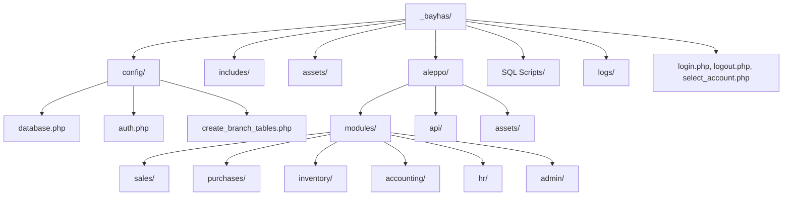
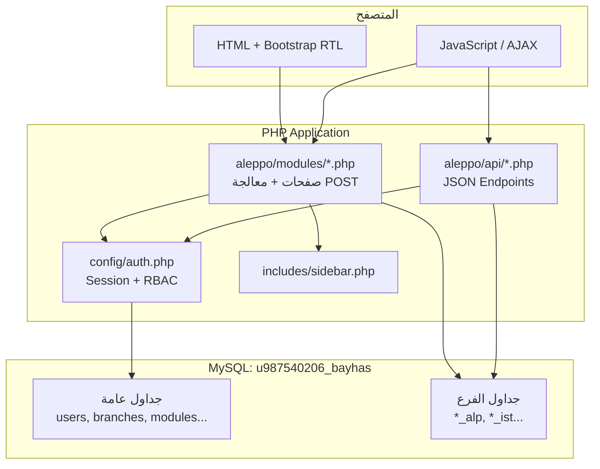
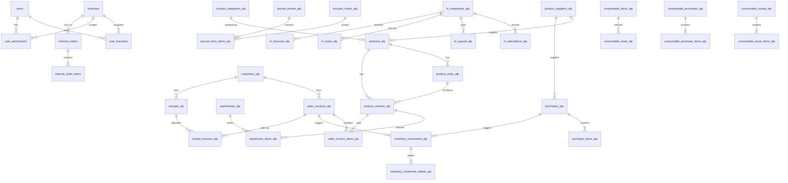
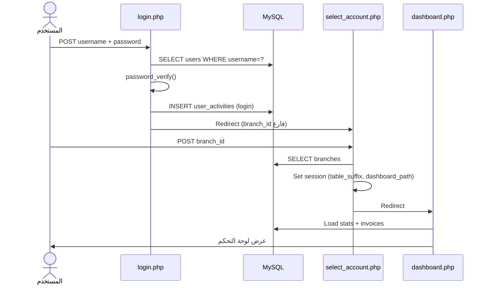
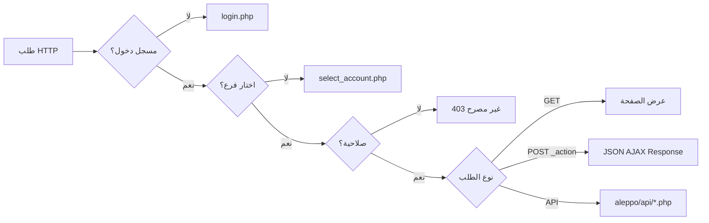
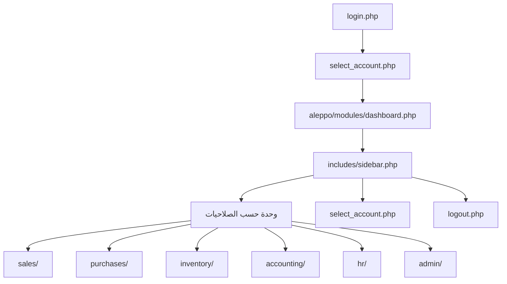
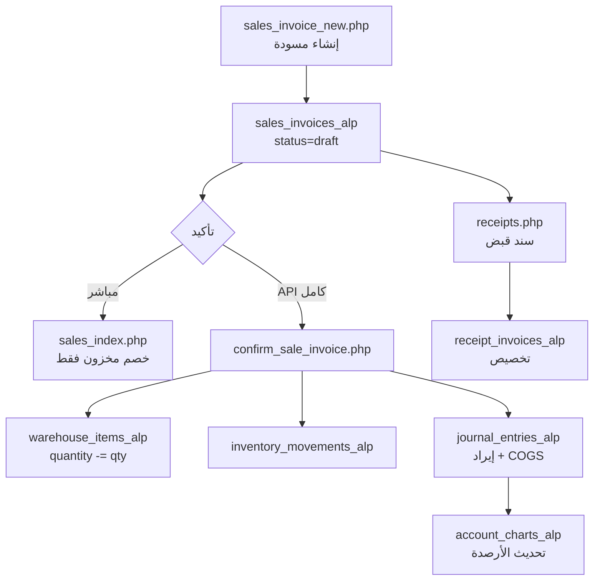

# FATORIZE (Bayhas)

نظام إدارة مالية ومحاسبية متعدد الفروع لشركة Bayhas — مبني بـ PHP الأصلي (Native PHP) بدون إطار عمل، مع واجهة HTML/CSS/JavaScript وقاعدة بيانات MySQL موحدة.

---

## وصف المشروع

**FATORIZE** هو نظام ERP (تخطيط موارد المؤسسة) موجّه لقطاع الملابس/التجزئة والمصانع. يدعم:

- إدارة فواتير المبيعات والمشتريات
- المخزون والمنتجات (موديلات، مقاسات، ألوان، باركود)
- المحاسبة (شجرة حسابات، قيود، سندات قبض، مصاريف)
- الموارد البشرية (موظفون، حضور، رواتب)
- المستهلكات والطلبات الداخلية بين الفروع
- صلاحيات دقيقة لكل مستخدم في كل فرع

**الفرع المُنفَّذ حالياً في الكود:** فرع حلب (`aleppo/`) فقط. قاعدة البيانات تُعرّف 5 فروع، لكن مجلدات `istanbul/` و`gaziantep/` و`lab/` و`alep_lab/` **غير موجودة** في المستودع.

---

## الغرض من المشروع

أتمتة العمليات التجارية والمحاسبية لشبكة فروع Bayhas (محلات تجزئة + معامل إنتاج) ضمن قاعدة بيانات واحدة، مع عزل بيانات كل فرع عبر لاحقة جداول (`table_suffix`) مثل `alp` لحلب و`ist` لاستنبول.

---

## التقنيات المستخدمة

| التقنية | الاستخدام |
|---------|-----------|
| PHP 7.2+ (Native) | منطق الأعمال، الصفحات، واجهات API |
| MySQL / MariaDB 11.x | تخزين البيانات |
| PDO | اتصال قاعدة البيانات (Prepared Statements) |
| HTML5 | هيكل الصفحات |
| CSS3 | تنسيق مخصص (`layout.css`) + أنماط مضمّنة |
| JavaScript (Vanilla) | AJAX، واجهات تفاعلية، sidebar |
| Bootstrap 5.3 RTL | إطار CSS للواجهة |
| Bootstrap Icons | أيقونات |
| خط Cairo (Google Fonts) | خط عربي |
| bcrypt | تشفير كلمات المرور |

**لا يُستخدم:** Laravel، Symfony، React، Vue، Node.js، أو أي MVC framework.

---

## هيكل المجلدات



### شجرة الملفات

```
_bayhas/
├── login.php                    # تسجيل الدخول
├── logout.php                   # تسجيل الخروج
├── select_account.php           # اختيار الفرع
├── reset_password.php           # أداة طوارئ لإعادة كلمة المرور (يجب حذفها)
├── u987540206_bayhas.sql        # نسخة احتياطية كاملة لقاعدة البيانات
├── config/
│   ├── database.php             # اتصال PDO
│   ├── auth.php                 # المصادقة والصلاحيات
│   ├── create_branch_tables.php # إنشاء جداول فرع جديد
│   └── setup_branches.sql       # سكربت إعداد الفروع
├── includes/
│   └── sidebar.php              # القائمة الجانبية الديناميكية
├── assets/
│   ├── css/layout.css           # تنسيق Sidebar + Topbar + المحتوى
│   └── images/                  # شعارات (SVG/PNG)
├── aleppo/                      # وحدات فرع حلب (الوحيدة المُنفَّذة)
│   ├── modules/
│   │   ├── dashboard.php
│   │   ├── sales/               # 3 ملفات
│   │   ├── purchases/           # 4 ملفات
│   │   ├── inventory/           # 9 ملفات
│   │   ├── accounting/          # 7 ملفات
│   │   ├── hr/                  # 4 ملفات (+ test_db.php)
│   │   └── admin/               # 3 ملفات
│   ├── api/                     # 5 نقاط API
│   └── assets/
│       ├── css/layout.css       # نسخة مكررة من assets/css/
│       └── js/attendance_patch.js
├── SQL Scripts/                 # نسخ إضافية من SQL
└── logs/
    └── php-error.log
```

**إجمالي الملفات في المشروع:** 53 ملفاً (43 ملف PHP).

---

## بنية النظام (System Architecture)



### نموذج تعدد الفروع

| المفهوم | التفاصيل |
|---------|----------|
| قاعدة بيانات واحدة | `u987540206_bayhas` |
| عزل البيانات | لاحقة `table_suffix` في أسماء الجداول (`products_alp`, `sales_invoices_ist`, ...) |
| مجلد الوحدات | كل فرع له مجلد (مثلاً `aleppo/` لـ `alp`) |
| الجلسة | `$_SESSION['table_suffix']`, `branch_id`, `branch_name`, `dashboard_path` |

| الفرع | `table_suffix` | مجلد الكود | الحالة |
|-------|----------------|------------|--------|
| فرع حلب | `alp` | `aleppo/` | **مُنفَّذ** |
| فرع استنبول | `ist` | `istanbul/` | غير موجود |
| فرع عنتاب | `gaz` | `gaziantep/` | غير موجود |
| معمل عنتاب | `lab` | `lab/` | غير موجود |
| معمل حلب | `alp_lab` | `alep_lab/` | غير موجود |

---

## نظرة عامة على قاعدة البيانات

قاعدة البيانات تحتوي على **58 جدولاً** في ملف SQL الرئيسي. تُقسَّم إلى:

### 1. جداول عامة (بدون لاحقة فرع)

| الجدول | الغرض | المفتاح الأساسي |
|--------|-------|-----------------|
| `users` | حسابات المستخدمين | `id` |
| `user_branches` | ربط المستخدم بالفروع المسموح بها | (`user_id`, `branch_id`) |
| `user_permissions` | صلاحيات المستخدم لكل فرع وقسم | `id` |
| `user_activities` | سجل تسجيل الدخول/الخروج | `id` |
| `branches` | تعريف الفروع وإعداداتها | `id` |
| `modules` | أقسام النظام للقائمة والصلاحيات | `id` |
| `currencies` | العملات المدعومة | `id` |
| `shipping_carriers` | شركات الشحن (عام) | `id` |
| `internal_orders` | طلبات داخلية بين الفروع | `id` |
| `internal_order_items` | بنود الطلبات الداخلية | `id` |

### 2. جداول خاصة بالفرع (`_*_alp` — نموذج حلب)

#### المنتجات والمخزون

| الجدول | الغرض |
|--------|-------|
| `products_alp` | كتالوج المنتجات (موديلات) |
| `product_categories_alp` | تصنيفات المنتجات |
| `product_sizes_alp` | مقاسات كل منتج + أسعار |
| `product_colors_alp` | ألوان المنتجات |
| `product_variants_alp` | تركيبات مقاس+لون + باركود |
| `product_suppliers_alp` | موردو المنتجات |
| `warehouses_alp` | المستودعات |
| `warehouse_items_alp` | أرصدة المخزون لكل variant |
| `inventory_movements_alp` | حركات المخزون الرئيسية |
| `inventory_movement_details_alp` | تفاصيل الحركات |

#### المبيعات والمشتريات

| الجدول | الغرض |
|--------|-------|
| `customers_alp` | العملاء |
| `sales_invoices_alp` | فواتير البيع |
| `sales_invoice_items_alp` | بنود فواتير البيع |
| `sales_returns_alp` | مردودات البيع |
| `sales_return_items_alp` | بنود مردودات البيع |
| `purchases_alp` | فواتير الشراء |
| `purchase_items_alp` | بنود فواتير الشراء |
| `purchase_returns_alp` | مردودات الشراء |
| `purchase_return_items_alp` | بنود مردودات الشراء |

#### المحاسبة

| الجدول | الغرض |
|--------|-------|
| `account_charts_alp` | شجرة الحسابات |
| `invoice_account_settings_alp` | ربط العمليات بالحسابات |
| `journal_entries_alp` | قيود اليومية |
| `journal_entry_items_alp` | بنود القيود |
| `receipts_alp` | سندات القبض |
| `receipt_invoices_alp` | تخصيص السندات على الفواتير |
| `expenses_alp` | المصاريف التشغيلية |
| `exchange_rates_alp` | أسعار الصرف |

#### المستهلكات

| الجدول | الغرض |
|--------|-------|
| `consumable_items_alp` | أصناف المستهلكات |
| `consumable_stock_alp` | مخزون المستهلكات |
| `consumable_movements_alp` | حركات المستهلكات |
| `consumable_purchases_alp` | فواتير شراء مستهلكات |
| `consumable_purchase_items_alp` | بنود شراء المستهلكات |
| `consumable_issues_alp` | أوامر صرف مستهلكات |
| `consumable_issue_items_alp` | بنود الصرف |
| `consumables_alp` | (قديم) أنواع مستهلكات بسيطة |
| `consumable_entries_alp` | (قديم) سجلات استهلاك |
| `consumable_sales_alp` | مبيعات مستهلكات |
| `consumable_sale_items_alp` | بنود مبيعات المستهلكات |

#### الموارد البشرية

| الجدول | الغرض |
|--------|-------|
| `hr_employees_alp` | بيانات الموظفين |
| `hr_attendance_alp` | سجل الحضور |
| `hr_payroll_alp` | كشوف الرواتب |
| `hr_loans_alp` | سلف الموظفين |
| `hr_bonuses_alp` | مكافآت الموظفين |
| `hr_promotions_alp` | ترقيات الموظفين |
| `public_holidays_alp` | العطل الرسمية |
| `employees_alp` | (قديم) جدول موظفين |
| `attendance_alp` | (قديم) حضور |
| `payroll_alp` | (قديم) رواتب |

#### الإنتاج (مُعرَّف في SQL — بدون صفحات PHP)

| الجدول | الغرض |
|--------|-------|
| `raw_materials_alp` | المواد الأولية |
| `raw_material_stock_alp` | مخزون المواد الأولية |
| `production_operations_alp` | عمليات الإنتاج |
| `production_entries_alp` | سجل الإنتاج |

#### أخرى

| الجدول | الغرض |
|--------|-------|
| `notifications_alp` | إشعارات المستخدمين |
| `shipping_carriers_alp` | (قديم) شركات شحن |

---

## علاقات قاعدة البيانات (ERD)



### قيود المفاتيح الأجنبية الرئيسية

تُطبَّق القيود على جداول `_alp` وتشمل على سبيل المثال:

- `product_variants_alp` → `products_alp`, `product_sizes_alp`
- `warehouse_items_alp` → `warehouses_alp`, `product_variants_alp`
- `sales_invoice_items_alp` → `sales_invoices_alp`
- `purchase_items_alp` → `purchases_alp`
- `journal_entry_items_alp` → `journal_entries_alp`
- `user_branches` → `users`, `branches`
- `user_permissions` → `users`, `branches`

---

## سير عمل التطبيق (Application Workflow)

### تدفق تسجيل الدخول



### تدفق الطلب (Request Flow)



### نمط AJAX الشائع

معظم صفحات الوحدات تتبع النمط:

1. `POST` مع حقل `_action` (مثل `save_invoice`, `confirm_invoice`)
2. الاستجابة: `{"ok": true/false, "msg": "...", "data": {...}}`
3. JavaScript في نفس الصفحة يُرسل `fetch()` أو `XMLHttpRequest`

### تدفق التنقل



---

## الميزات المُنفَّذة

| الميزة | الحالة | الملفات |
|--------|--------|---------|
| تسجيل الدخول | ✅ | `login.php` |
| تسجيل الخروج | ✅ | `logout.php` |
| اختيار الفرع | ✅ | `select_account.php` |
| لوحة التحكم | ✅ | `aleppo/modules/dashboard.php` |
| إدارة المستخدمين | ✅ | `admin/users.php` |
| إدارة الصلاحيات | ✅ | `admin/permissions.php` |
| إدارة الفروع | ✅ | `admin/branches.php` |
| فواتير البيع | ✅ | `sales/sales_index.php`, `sales_invoice_new.php` |
| إدارة العملاء | ✅ | `sales/customers.php` |
| فواتير الشراء | ✅ | `purchases/index.php`, `invoice_new.php`, `invoice_edit.php` |
| إدارة الموردين | ✅ | `purchases/suppliers.php` |
| كتالوج المنتجات | ✅ | `inventory/products.php`, `product_add.php`, `product_edit.php` |
| حركات المخزون | ✅ | `inventory/movements.php` (قراءة فقط) |
| المستهلكات | ✅ | `inventory/consumables.php` |
| شراء المستهلكات | ✅ | `inventory/consumable_purchases.php` |
| صرف المستهلكات | ✅ | `inventory/consumable_issues.php` |
| الطلبات الداخلية | ✅ | `inventory/internal_orders.php` |
| شجرة الحسابات | ✅ | `accounting/accounts.php` |
| القيود المحاسبية | ✅ | `accounting/journal.php` |
| سندات القبض | ✅ | `accounting/receipts.php` |
| المصاريف | ✅ | `accounting/expenses.php` |
| إعدادات الربط المحاسبي | ✅ | `accounting/account_settings.php` |
| إدارة العملات | ✅ | `accounting/currencies.php` |
| شركات الشحن | ✅ | `accounting/shipping_carriers.php` |
| الموظفون | ✅ | `hr/employees.php` |
| الحضور والانصراف | ✅ | `hr/attendance.php` |
| الرواتب | ✅ | `hr/payroll.php` + `api/payroll_api.php` |
| تأكيد فاتورة بيع (مخزون + GL) | ✅ | `api/confirm_sale_invoice.php` |
| تأكيد فاتورة شراء (مخزون + GL) | ✅ | `api/confirm_purchase_invoice.php` |
| مردودات البيع | ❌ | جداول SQL موجودة — لا صفحات |
| مردودات الشراء | ❌ | جداول SQL موجودة — لا صفحات |
| تقارير مالية | ❌ | مُعرَّف في `modules` — لا صفحة |
| كشف حساب عميل/مورد | ❌ | مُعرَّف في `modules` — لا صفحة |
| إدارة المستودع (صفحة مستقلة) | ❌ | مُعرَّف — لا صفحة |
| المواد الأولية / الإنتاج | ❌ | جداول SQL — لا صفحات |
| إشعارات | ⚠️ | جدول `notifications_alp` — لا واجهة مُتحقَّق منها |
| طباعة الفواتير | ⚠️ | modal طباعة في `purchases/index.php` فقط |
| باركود | ✅ | في `product_variants_alp` + بحث بالباركود في الفواتير |
| QR Code | ❌ | غير مُتحقَّق |
| تعدد اللغات | ❌ | عربي فقط (RTL) |
| رفع ملفات | ⚠️ | `image_path` في المنتجات — التنفيذ غير مُتحقَّق بالكامل |

---

## أدوار المستخدمين (User Roles)

يُخزَّن الدور في `users.role` كـ ENUM:

| الدور | الوصف |
|-------|-------|
| `admin` | صلاحية كاملة (`*`) — يتجاوز `user_permissions` |
| `accountant` | محاسب |
| `sales` | مبيعات |
| `purchases` | مشتريات |
| `warehouse` | مخازن |
| `user` | مستخدم عام (افتراضي) |

> **ملاحظة:** الأدوار تُستخدم للعرض في الواجهة. التحكم الفعلي يتم عبر `user_permissions` لكل فرع.

---

## المصادقة (Authentication)

| العنصر | التفاصيل |
|--------|----------|
| الآلية | جلسات PHP (`session_start()`) |
| التحقق من كلمة المرور | `password_verify()` مقابل bcrypt hash |
| متغيرات الجلسة | `user_id`, `username`, `full_name`, `role`, `branch_id`, `branch_name`, `table_suffix`, `dashboard_path`, `permissions` |
| الحماية | `checkLogin($pdo)` في `config/auth.php` |
| تسجيل النشاط | `user_activities` عند الدخول والخروج |

---

## الصلاحيات (Permissions)

### نموذج الصلاحيات

- الجدول: `user_permissions`
- المفتاح: `module_key` (يطابق `modules.key`)
- الإجراءات: `can_view`, `can_create`, `can_edit`, `can_delete`, `can_confirm`, `can_print`, `can_export`

### دوال PHP

```php
can('sales.invoices', 'view')      // هل يملك الإجراء؟
requirePermission('sales.invoices', 'create')  // يوقف التنفيذ بـ 403
buildSidebarMenu($pdo)             // يبني القائمة حسب الصلاحيات
```

### أقسام النظام (`modules`)

| القسم الأب | الأبناء (أمثلة) |
|------------|-----------------|
| `sales` | `sales.invoices`, `sales.invoices.new`, `sales.returns`, `sales.customers` |
| `purchases` | `purchases.invoices`, `purchases.returns`, `purchases.suppliers` |
| `inventory` | `inventory.products`, `inventory.warehouse`, `inventory.movements`, `inventory.consumables`, `inventory.internal_orders` |
| `finance` | `finance.accounts`, `finance.journal`, `finance.receipts`, `finance.expenses`, `finance.reports`, `finance.account_settings`, `finance.currencies`, `finance.shipping_carriers` |
| `crm` | `crm.customers`, `crm.customers.statement`, `crm.suppliers`, `crm.suppliers.statement` |
| `hr` | `hr.employees`, `hr.attendance`, `hr.payroll`, `hr.reports`, `hr.holidays` |
| `expenses` | `expenses.consumable_entries` |
| `production` | `production.raw_materials`, `production.operations`, `production.entries` |
| `admin` | `admin.users`, `admin.permissions`, `admin.settings`, `admin.branches` |

---

## وصف الصفحات

### صفحات الجذر

| الصفحة | الوظيفة |
|--------|---------|
| `login.php` | نموذج تسجيل دخول مع تحقق bcrypt |
| `select_account.php` | اختيار الفرع من الفروع المسموح بها |
| `logout.php` | إنهاء الجلسة |
| `reset_password.php` | أداة طوارئ — **يجب حذفها من الإنتاج** |

### وحدات فرع حلب

| المسار | الوظيفة |
|--------|---------|
| `dashboard.php` | إحصائيات يومية + آخر فواتير |
| `sales/sales_index.php` | قائمة فواتير البيع + تأكيد/إلغاء مخزون |
| `sales/sales_invoice_new.php` | إنشاء فاتورة بيع جديدة |
| `sales/customers.php` | CRUD العملاء |
| `purchases/index.php` | قائمة فواتير الشراء |
| `purchases/invoice_new.php` | فاتورة شراء جديدة |
| `purchases/invoice_edit.php` | تعديل مسودة شراء |
| `purchases/suppliers.php` | CRUD الموردين |
| `inventory/products.php` | قائمة المنتجات |
| `inventory/product_add.php` | إضافة منتج كامل |
| `inventory/product_edit.php` | تعديل منتج |
| `inventory/movements.php` | تقرير حركات (قراءة) |
| `inventory/internal_orders.php` | طلبات بين الفروع |
| `inventory/consumables.php` | أصناف المستهلكات |
| `inventory/consumable_purchases.php` | شراء مستهلكات |
| `inventory/consumable_issues.php` | صرف مستهلكات |
| `accounting/accounts.php` | شجرة الحسابات |
| `accounting/journal.php` | قيود يومية |
| `accounting/receipts.php` | سندات قبض |
| `accounting/expenses.php` | مصاريف |
| `accounting/account_settings.php` | ربط الحسابات بالعمليات |
| `accounting/currencies.php` | إدارة العملات |
| `accounting/shipping_carriers.php` | شركات الشحن |
| `hr/employees.php` | الموظفون |
| `hr/attendance.php` | الحضور + العطل |
| `hr/payroll.php` | واجهة الرواتب |
| `admin/users.php` | المستخدمون |
| `admin/permissions.php` | مصفوفة الصلاحيات |
| `admin/branches.php` | إعدادات الفروع |

### نقاط API

| المسار | الإجراءات | المصادقة |
|--------|-----------|----------|
| `api/confirm_sale_invoice.php` | `confirm`, `cancel` | جلسة + `sales.invoices` confirm |
| `api/confirm_purchase_invoice.php` | `confirm`, `cancel` | جلسة + `purchases.invoices` confirm |
| `api/payroll_api.php` | `calculate`, `pay`, `add_loan`, ... | جلسة فقط ⚠️ |
| `api/get_currencies.php` | قائمة العملات | **بدون مصادقة** ⚠️ |
| `api/test_api.php` | فحص صحة | **بدون مصادقة** ⚠️ |

---

## وصف ملفات PHP

### `config/database.php`
- Singleton PDO مع `utf8mb4`
- ثوابت: `DB_HOST`, `DB_NAME`, `DB_USER`, `DB_PASS`
- دوال: `getConnection()`, `getMainConnection()`, `checkDatabaseConnection()`
- تسجيل الأخطاء في `logs/php-error.log`

### `config/auth.php`
- إدارة الجلسة والصلاحيات
- `checkLogin()`, `can()`, `requirePermission()`, `buildSidebarMenu()`
- صفحة 403 مضمّنة عند رفض الصلاحية

### `includes/sidebar.php`
- يبني القائمة من `modules` + `user_permissions`
- `moduleUrl()` يحوّل `module_key` إلى مسار
- `injectInternalOrdersToMenu()` يضيف روابط يدوياً
- **مشكلة:** خريطة URLs غير متزامنة مع أسماء الملفات الفعلية

### `config/create_branch_tables.php`
- `createBranchTables($pdo, $suffix, $branchType)` ينشئ جداول فرع جديد
- يُستدعى من `admin/branches.php`

---

## هيكل JavaScript

| الموقع | الوظيفة |
|--------|---------|
| مضمّن في كل صفحة | sidebar accordion، `fetch` AJAX، نماذج تفاعلية |
| `aleppo/assets/js/attendance_patch.js` | تحسينات حضور: أيام العطلة، دوام إضافي، أوقات افتراضية |

**لا يوجد:** bundler، npm، أو مكتبات JS خارجية (عدا Bootstrap).

### نمط AJAX النموذجي

```javascript
const fd = new FormData();
fd.append('_action', 'save_invoice');
fd.append('customer_id', customerId);
fetch(window.location.href, { method: 'POST', body: fd })
  .then(r => r.json())
  .then(res => { if (res.ok) { /* ... */ } });
```

---

## تنظيم CSS

| الملف | المحتوى |
|-------|---------|
| `assets/css/layout.css` | Sidebar ثابت، Topbar، محتوى رئيسي، responsive، stat-cards، table-cards |
| `aleppo/assets/css/layout.css` | نسخة مكررة |
| أنماط مضمّنة | `login.php`, `select_account.php`, وبعض الوحدات |

**التصميم المتجاوب:** Sidebar ينزلق على الشاشات `< 992px` مع overlay.

---

## التثبيت

### المتطلبات

- PHP 7.2+ (يفضّل 8.x) مع امتدادات: `pdo_mysql`, `mbstring`, `json`, `session`
- MySQL 5.7+ أو MariaDB 10.x+
- خادم ويب (Apache/Nginx) مع `mod_rewrite` اختياري
- Composer **غير مطلوب**

### خطوات التثبيت

```bash
# 1. نسخ المشروع إلى مجلد الويب
# مثال Apache: /var/www/html/bayhas/

# 2. إنشاء قاعدة البيانات
mysql -u root -p -e "CREATE DATABASE u987540206_bayhas CHARACTER SET utf8mb4 COLLATE utf8mb4_unicode_ci;"

# 3. استيراد SQL
mysql -u root -p u987540206_bayhas < u987540206_bayhas.sql

# 4. تعديل بيانات الاتصال في config/database.php

# 5. التأكد من صلاحيات الكتابة على logs/
chmod 775 logs/
```

---

## استيراد قاعدة البيانات

| الملف | الوصف |
|-------|-------|
| `u987540206_bayhas.sql` | النسخة الكاملة الرئيسية (58 جدولاً + بيانات) |
| `SQL Scripts/u987540206_bayhas.sql` | نسخة احتياطية |
| `SQL Scripts/u987540206_bayhas-NEW.sql` | نسخة محدّثة |
| `SQL Scripts/accounts_seed.sql` | بذور شجرة الحسابات |
| `config/setup_branches.sql` | إعداد الفروع |

```bash
mysql -u DB_USER -p u987540206_bayhas < u987540206_bayhas.sql
```

---

## الإعداد (Configuration)

### `config/database.php`

```php
define('DB_HOST', 'localhost');
define('DB_NAME', 'u987540206_bayhas');
define('DB_USER', 'your_user');
define('DB_PASS', 'your_password');
```

### إعدادات الجلسة

- المنطقة الزمنية: `Asia/Damascus`
- مسار التطبيق في الروابط: `/bayhas/` (مُثبَّت في `auth.php` و`sidebar.php`)

### إعدادات الفرع (`branches`)

كل فرع يحدد: `table_suffix`, `dashboard_path`, `invoice_prefix`, العملات، هامش الربح، إلخ.

---

## تشغيل المشروع

### Apache (مثال)

```apache
Alias /bayhas "F:/Programming/kaylink/FatoRize/_bayhas"
<Directory "F:/Programming/kaylink/FatoRize/_bayhas">
    AllowOverride All
    Require all granted
</Directory>
```

### PHP Built-in Server (تطوير فقط)

```bash
cd _bayhas
php -S localhost:8080
```

ثم افتح: `http://localhost:8080/login.php`

> **تنبيه:** المسارات المطلقة `/bayhas/...` قد لا تعمل مع الخادم المدمج بدون إعداد إضافي.

---

## ملاحظات أمنية (Security Notes)

| الخطورة | المشكلة | الموقع |
|---------|---------|--------|
| 🔴 حرجة | كلمة مرور DB مكشوفة في الكود | `config/database.php` |
| 🔴 حرجة | إعادة تعيين كلمة مرور بدون مصادقة + مفتاح ثابت | `reset_password.php` |
| 🔴 حرجة | عرض بيانات الجلسة بدون حماية | `hr/test_db.php` |
| 🟠 عالية | API رواتب بدون فحص صلاحيات | `api/payroll_api.php` |
| 🟠 عالية | API عملات بدون مصادقة | `api/get_currencies.php` |
| 🟠 عالية | جداول مستهلكات ثابتة على `_alp` | `consumables.php`, `consumable_purchases.php` |
| 🟡 متوسطة | لا توجد رموز CSRF | جميع النماذج |
| 🟡 متوسطة | عدم التحقق من انتماء الفرع عند POST | `select_account.php` |
| 🟡 متوسطة | حقن SQL محتمل | `hr/attendance.php` (متغير `$date`) |
| 🟡 متوسطة | استعلامات بسلسلة نصية | `accounting/expenses.php`, `accounting/currencies.php` |
| 🟢 منخفضة | `display_errors=1` في بعض الملفات | `purchases/index.php`, APIs |
| 🟢 منخفضة | مساران لتأكيد الفاتورة (مع/بدون GL) | `sales_index.php` vs API |

### توصيات فورية

1. نقل بيانات DB إلى متغيرات بيئة خارج webroot
2. حذف `reset_password.php`, `test_db.php`, `test_api.php` من الإنتاج
3. إضافة `requirePermission` لـ `payroll_api.php`
4. إضافة CSRF tokens
5. توحيد `moduleUrl()` مع أسماء الملفات الفعلية

---

## القيود المعروفة (Known Limitations)

1. **فرع واحد مُنفَّذ:** فقط `aleppo/` موجود — باقي الفروع في DB بدون كود
2. **روابط Sidebar معطّلة:** `moduleUrl()` يشير لملفات غير موجودة (انظر الجدول أدناه)
3. **ميزات SQL بدون واجهة:** مردودات، تقارير، إنتاج، كشوف حساب
4. **تناقض أسماء الملفات:** `sales_index.php` بدلاً من `sales/invoices.php`
5. **جداول HR قديمة:** `employees_alp` vs `hr_employees_alp` — الكود يستخدم الجديد
6. **نسخ CSS مكررة** في `assets/` و`aleppo/assets/`
7. **dashboard** يستخدم جداول `_alp` ثابتة بدلاً من `$TS` الديناميكي

### روابط Sidebar المعطّلة

| مفتاح الوحدة | المسار المتوقع | الملف الفعلي |
|--------------|----------------|--------------|
| `sales.invoices` | `sales/invoices.php` | `sales/sales_index.php` |
| `sales.invoices.new` | `sales/invoices.php?action=new` | `sales/sales_invoice_new.php` |
| `finance.receipts` | `receipts/index.php` | `accounting/receipts.php` |
| `finance.expenses` | `expenses/index.php` | `accounting/expenses.php` |
| `crm.customers` | `customers/index.php` | `sales/customers.php` |
| `inventory.internal_orders` | `#` (غير مُعرَّف) | `inventory/internal_orders.php` |
| `sales.returns`, `purchases.returns` | `returns.php` | **غير موجود** |
| `finance.reports`, `hr.reports` | `reports/index.php` | **غير موجود** |
| `admin.settings` | `settings/index.php` | **غير موجود** |

---

## تحسينات مستقبلية (Future Improvements)

- [ ] إنشاء مجلدات ووحدات للفروع الأخرى (`istanbul`, `gaziantep`, `lab`, `alep_lab`)
- [ ] توحيد `moduleUrl()` وإصلاح جميع الروابط
- [ ] بناء صفحات: مردودات، تقارير، كشوف حساب، إعدادات
- [ ] توحيد تأكيد الفواتير عبر API فقط (مع قيود محاسبية)
- [ ] إصلاح `table_suffix` في `consumables.php` و`receipts.php`
- [ ] إضافة CSRF + rate limiting للدخول
- [ ] فصل منطق الأعمال عن العرض (includes/helpers)
- [ ] واجهة إشعارات من `notifications_alp`
- [ ] صفحات الإنتاج والمواد الأولية
- [ ] نقل الأسرار إلى `.env` خارج webroot

---

## استكشاف الأخطاء (Troubleshooting)

| المشكلة | الحل المحتمل |
|---------|--------------|
| صفحة بيضاء | راجع `logs/php-error.log` |
| إعادة توجيه لـ login | تأكد من `session.save_path` وصلاحيات الجلسة |
| 403 غير مصرح | راجع `user_permissions` للمستخدم والفرع |
| روابط `#` في القائمة | أضف المفتاح في `moduleUrl()` بـ `includes/sidebar.php` |
| فشل اتصال DB | تحقق من `config/database.php` وامتداد `pdo_mysql` |
| فرع غير مدعوم | `dashboard.php` يقبل `alp` فقط حالياً |
| تأكيد فاتورة لا يُحدِّث الحسابات | استخدم API (`confirm_*_invoice.php`) وليس التأكيد المباشر في القائمة |

---

## إرشادات التطوير (Development Guidelines)

### إضافة صفحة جديدة

1. أنشئ الملف في `aleppo/modules/{section}/`
2. ابدأ بـ:
   ```php
   session_start();
   require_once __DIR__ . '/../../../config/database.php';
   require_once __DIR__ . '/../../../config/auth.php';
   $pdo = getConnection();
   checkLogin($pdo);
   requirePermission('module.key', 'view');
   $TS = $_SESSION['table_suffix'];
   $currentModule = 'module.key';
   ```
3. أضف `$map` entry في `includes/sidebar.php` → `moduleUrl()`
4. أضف سجل في `modules` إن لزم
5. امنح الصلاحيات عبر `admin/permissions.php`

### تسمية الجداول

```php
$table = "products_{$TS}";  // دائماً استخدم table_suffix من الجلسة
```

### نمط AJAX

```php
if ($_SERVER['REQUEST_METHOD'] === 'POST' && isset($_POST['_action'])) {
    header('Content-Type: application/json; charset=utf-8');
    // ...
    echo json_encode(['ok' => true, 'msg' => 'تم']);
    exit;
}
```

### الاختبار

- استخدم حساب `admin` للاختبار الشامل
- لا تترك `reset_password.php` أو `test_db.php` على السيرفر
- بعد تغيير الصلاحيات: أعد تسجيل الدخول أو امسح `$_SESSION['permissions']`

---

## مخطط تدفق البيانات — فاتورة بيع



---

## الترخيص والملكية

جميع الحقوق محفوظة © Fatorize / Bayhas.

---

*آخر تحديث للتوثيق: يوليو 2026 — مبني على فحص كامل لـ 53 ملفاً في المستودع.*
