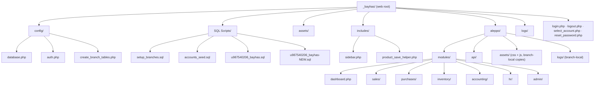
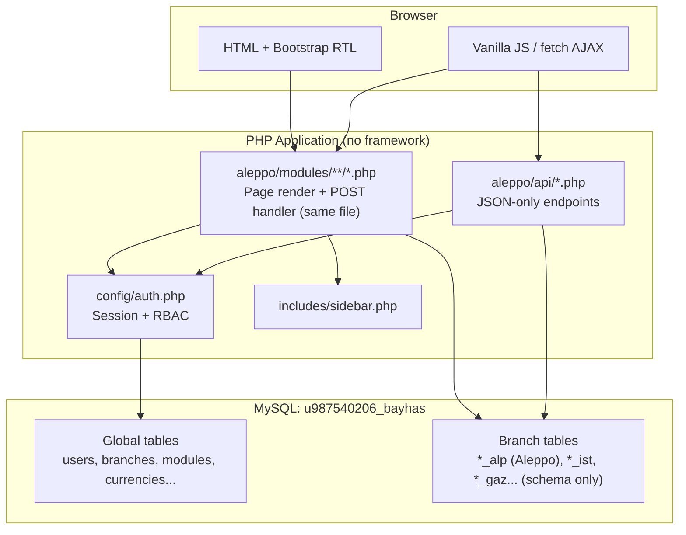
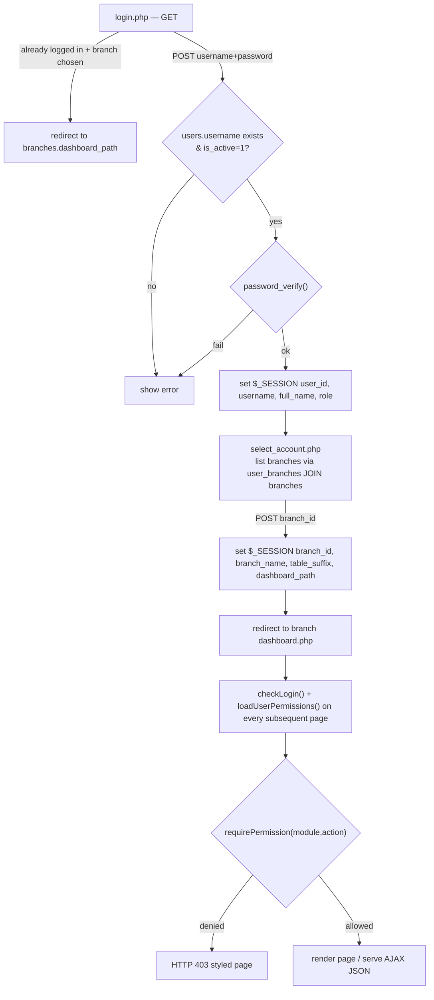
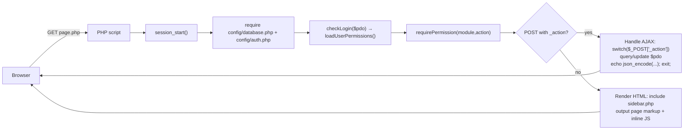
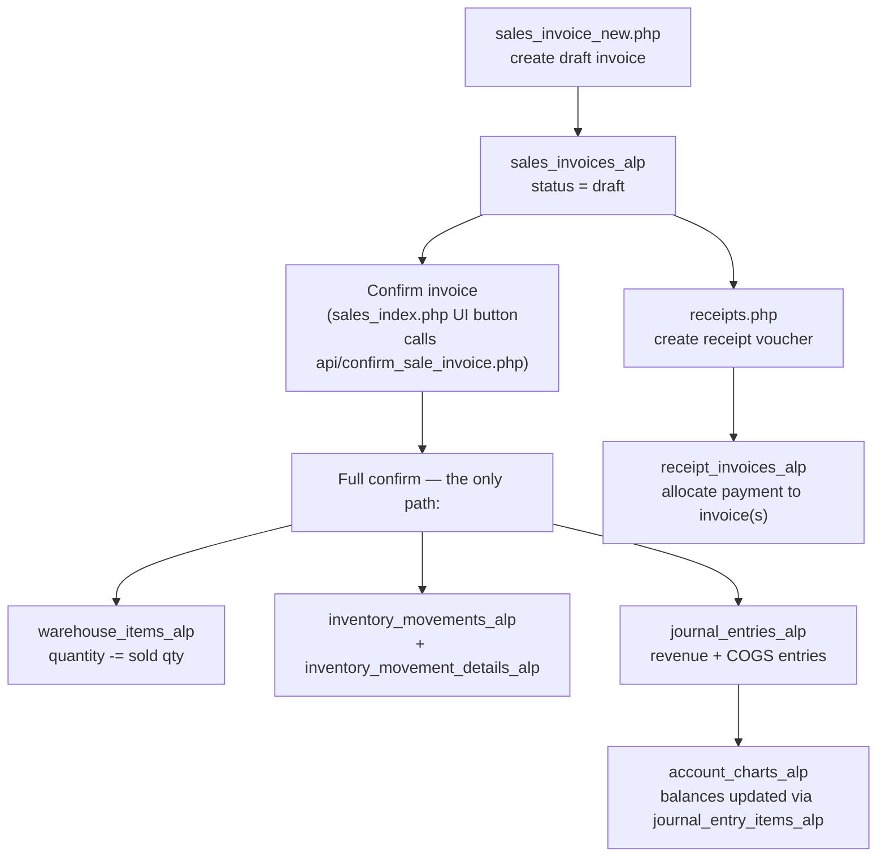

# FATORIZE (Bayhas) — Multi-Branch Financial & Inventory ERP

A native-PHP, no-framework ERP system for a multi-branch retail/manufacturing
company (clothing sector). It covers sales, purchases, inventory, accounting
(chart of accounts, journal entries, receipts), HR/payroll, consumables, and
inter-branch internal orders, all on **one shared MySQL database** with
per-branch data isolation via table-name suffixes.

> **Documentation basis:** this document was produced by directly reading the
> 40 PHP files, 1 SQL dump (`u987540206_bayhas.sql`, 64 `CREATE TABLE`
> statements / 63 distinct tables, 48 foreign-key constraints), the JS patch
> file, and the CSS file supplied in the project. Where the code snapshot
> does not include a directory (e.g. `config/`, `aleppo/modules/...`), that
> structure is reconstructed from the `require_once` paths and header
> comments embedded in every file (see "Note on file layout" below).

> **Reference-of-record policy (in effect from this point forward):** the
> project is now being worked on locally, file by file, against this
> document. Going forward, **this README is the source of truth for
> intended behavior — not whatever the current PHP file on disk happens to
> contain.** When a bug is found and fixed, or a design decision is made,
> it is written down here first (with the reasoning), and the corresponding
> file is edited to match this document — not the reverse. A section here
> marked "fixed" describes the *intended, current* correct behavior even
> if a given deployment hasn't pulled the latest file yet. If a file is
> ever found to disagree with what this document says, the document wins
> and the file is stale/needs updating, not the other way around.

---

## Table of Contents

1. [Project Description & Purpose](#project-description--purpose)
2. [Technologies Used](#technologies-used)
3. [Note on File Layout](#note-on-file-layout)
4. [Folder / File Structure](#folder--file-structure)
5. [Delivered Fix Files — Where to Place Each One](#delivered-fix-files--where-to-place-each-one)
6. [System Architecture](#system-architecture)
7. [Multi-Branch Model](#multi-branch-model)
8. [Multi-Tenant SaaS Architecture](#multi-tenant-saas-architecture)
9. [Database Overview](#database-overview)
10. [Database Relationships (ERD)](#database-relationships-erd)
11. [Authentication & Authorization](#authentication--authorization)
12. [Application Workflow](#application-workflow)
13. [Features](#features)
14. [Page-by-Page / File-by-File Reference](#page-by-page--file-by-file-reference)
15. [Barcode Module (Generation & Scanning)](#barcode-module-generation--scanning)
16. [Purchase Invoice Currency-Mismatch Bug (fixed, both files)](#purchase-invoice-currency-mismatch-bug-fixed-both-files)
17. [Consumables Module Findings (1 of 2 fixed)](#consumables-module-findings-1-of-2-fixed)
18. [Purchases Module — Findings & Fixes](#purchases-module--findings--fixes)
19. [JavaScript Structure](#javascript-structure)
20. [CSS Organization](#css-organization)
21. [Installation](#installation)
22. [Database Import](#database-import)
23. [Configuration](#configuration)
24. [Running the Project](#running-the-project)
25. [Security Notes](#security-notes)
26. [Code Quality Review](#code-quality-review)
27. [Known Limitations](#known-limitations)
28. [Future Improvements](#future-improvements)
29. [Troubleshooting](#troubleshooting)
30. [Development Guidelines](#development-guidelines)

---

## Project Description & Purpose

> **Product direction update:** FATORIZE is evolving from a single
> company's internal system into a **multi-tenant SaaS product**, sold to
> multiple independent clothing factories/shops across the Arabic-speaking
> region (competing with Oracle/SAP/Odoo, but simpler to use). Everything
> described below was originally built for one company (Bayhas) — that
> part of the codebase is being **kept as-is and reused as the per-tenant
> application**, not rewritten. The only new layer is a **tenant
> resolution system** (subdomain → which company's database to use) — see
> [Multi-Tenant SaaS Architecture](#multi-tenant-saas-architecture) for
> what's been built so far and what's still needed.

**FATORIZE** is an ERP originally built for **Bayhas**, a clothing
retail/manufacturing company operating several branches (shops, a factory,
and a lab). It digitizes:

- Sales & purchase invoicing (with items, sizes, colors, barcodes)
- Inventory across multiple warehouses per branch
- Accounting: chart of accounts, journal entries, receipts, expenses,
  multi-currency exchange rates
- HR: employees, attendance, payroll, loans, bonuses, promotions
- Consumables (packaging/raw supplies) purchasing, stock, and issuing
- Internal orders between branches (e.g., a shop ordering stock from the
  factory)
- Fine-grained, per-user, per-branch, per-module permissions (view / create
  / edit / delete / confirm / print / export)

Each **tenant** (paying customer company) gets one full copy of this
application running against its own database — all branches *within that
one company* share a **single MySQL database** (previously
`u987540206_bayhas` for the Bayhas tenant specifically). Branch data
isolation within a tenant is achieved not through separate schemas but
through a **table-name suffix** (`table_suffix`, e.g. `alp` for the
Aleppo branch), so `products_alp`, `sales_invoices_alp`, `hr_payroll_alp`,
etc. all belong to one branch, while tenant-wide tables (`users`,
`branches`, `currencies`, `modules`, `internal_orders`,
`shipping_carriers`) have no suffix and are shared across that tenant's
branches. **This entire model is unchanged by the SaaS pivot** — it now
simply describes the structure *inside* each tenant's own database, one
level below the new tenant-resolution layer.

---

## Technologies Used

| Layer | Technology |
|---|---|
| Backend language | PHP (native, no framework — procedural + a few free functions, PHP 7.4+/8.x syntax such as union return types) |
| Database | MySQL / MariaDB, accessed via **PDO** with prepared statements |
| Frontend markup | HTML5, rendered inline by PHP (no templating engine) |
| CSS | Custom `layout.css` + Bootstrap 5.3 (RTL) loaded from CDN + inline `<style>` blocks per page |
| JavaScript | Vanilla JS, inline `<script>` blocks per page + one shared file `attendance_patch.js` |
| Icons | Bootstrap Icons |
| Font | Cairo (Google Fonts) — Arabic-first UI, `dir="rtl"` |
| Password hashing | `password_hash()` / `password_verify()` (bcrypt) |
| Session | Native PHP sessions (`$_SESSION`) — the only state/authorization mechanism |
| Data exchange | Server-rendered HTML + `fetch`/`XMLHttpRequest` AJAX calls returning `application/json`, using a uniform `_action` POST parameter convention |

**Confirmed NOT used:** Laravel, Symfony, CodeIgniter, any MVC framework,
React/Vue/Angular, Node.js/Express, Composer autoloading, an ORM, or a
templating engine. Every file is a self-contained script that mixes PHP
logic and HTML output (no separation of concerns).

---

## Note on File Layout

The project files were supplied to this analysis as a **flat list** (all
`.php` files at one directory level). However, every file's own header
comment and its `require_once` calls describe a **nested directory tree**
that the flat listing does not reproduce, for example:

```php
// account_settings.php actually declares itself as:
/**
 * accounting/account_settings.php — إعدادات الربط المحاسبي
 * المسار: /bayhas/aleppo/modules/accounting/account_settings.php
 */
require_once __DIR__ . '/../../../config/database.php';
require_once __DIR__ . '/../../../config/auth.php';
```

Three `../` levels up from `aleppo/modules/accounting/` lands exactly on
the project root, which is where `config/database.php` and `config/auth.php`
must live. This pattern is consistent across **every** module file, so the
real, deployed folder structure is reconstructed below with high confidence.
Two files (`config/database.php`, `includes/product_save_helper.php`) do not
carry a path comment but their `require_once` depth (from `dashboard.php`,
three levels: `aleppo/modules/dashboard.php`) confirms the same tree.

If your actual deployment already matches the flat layout, all `require_once`
paths must be corrected before the app will run (see [Troubleshooting](#troubleshooting)).

---

## Folder / File Structure

> This tree reflects the **authoritative, confirmed** project structure
> as provided directly. Everything below is now fully accounted for —
> no more "N files, not all reviewed" placeholders remain for `inventory/`,
> `api/`, or `SQL Scripts/`.

```
_bayhas/                              (web root, aliased as /bayhas/)
├── login.php                         Login form + credential check
├── logout.php                        Session termination + activity log
├── select_account.php                Branch picker after login
├── reset_password.php                ⚠ Unauthenticated password-reset tool (must be removed)
├── u987540206_bayhas.sql             Full DB dump (schema + seed/prod data) — also duplicated under SQL Scripts/
├── README.md                         Project's own pre-existing README (separate from this document)
├── README-claude scanning.md         Likely an earlier AI-generated doc/scan artifact — not part of the app
│
├── config/
│   ├── database.php                  PDO singleton connection (getConnection())
│   ├── auth.php                      Session guard + RBAC (checkLogin, can, requirePermission)
│   └── create_branch_tables.php      Programmatic DDL for provisioning a new branch's tables
│
├── includes/
│   ├── sidebar.php                   Dynamic, permission-filtered navigation menu
│   └── product_save_helper.php       Shared UPSERT helpers for product sizes/variants/barcodes
│
├── assets/                           (top-level, shared)
│   ├── css/layout.css                Sidebar/topbar/content styling, responsive rules
│   ├── images/                       bayhas_logo.png, bayhas_logotype.svg, fatorize.png, logo.png
│   └── js/                           (present, empty — no shared JS files here; see aleppo/assets/js/)
│
├── SQL Scripts/
│   ├── accounts_seed.sql             Chart-of-accounts seed data
│   ├── setup_branches.sql            Initial branch setup/seeding script
│   ├── u987540206_bayhas-NEW.sql     A newer/alternate full DB dump
│   └── u987540206_bayhas.sql         Duplicate of the root-level dump
│
├── logs/                             (top-level)
│   └── php-error.log                 PHP error log (referenced by config/database.php)
│
└── aleppo/                           Aleppo branch (table_suffix = "alp") — the ONLY branch with code
    ├── logs/                         Branch-local log folder (separate from top-level logs/)
    ├── assets/
    │   ├── css/layout.css            Duplicate of the root assets/css/layout.css
    │   ├── images/                   (present, empty in the confirmed tree)
    │   └── js/attendance_patch.js    Attendance-page JS patch/extension (loaded from aleppo/modules/hr/attendance.php)
    ├── api/                          5 files — all confirmed
    │   ├── confirm_sale_invoice.php     Full sale confirmation: stock + GL entries
    │   ├── confirm_purchase_invoice.php Full purchase confirmation: stock + GL entries
    │   ├── payroll_api.php              Payroll calculation/save endpoints (creates HR tables on demand)
    │   ├── get_currencies.php           Simple JSON list of active currencies
    │   └── test_api.php                 Health check — confirmed location (earlier guess was correct)
    └── modules/
        ├── dashboard.php             Branch KPI dashboard (hard-coded to "alp")
        ├── sales/                    3 files
        │   ├── sales_index.php       Sales invoice list + confirm (now routed through api/confirm_sale_invoice.php only)
        │   ├── sales_invoice_new.php New sale invoice (draft creation)
        │   └── customers.php         Customer CRUD + statement of account
        ├── purchases/                4 files
        │   ├── index.php             Purchase invoice list ("purchases/index.php")
        │   ├── invoice_new.php       New purchase invoice
        │   ├── invoice_edit.php      Edit an existing (unconfirmed) purchase invoice
        │   └── suppliers.php         Supplier CRUD
        ├── inventory/                8 files confirmed + barcode.php (delivered, not yet placed — see deployment map below)
        │   ├── products.php          Product list (toggle active, quick view/edit)
        │   ├── product_add.php       Add product (model, categories, sizes, colors, variants, suppliers)
        │   ├── product_edit.php      Edit product — same form/logic as product_add.php
        │   ├── movements.php         Read-only stock-movement report (no CRUD actions)
        │   ├── internal_orders.php   Inter-branch order workflow (create → send → respond → convert to purchase)
        │   ├── consumables.php       Consumable item catalog — ✅ `_alp` hard-coding fixed
        │   ├── consumable_purchases.php Consumable purchase invoices — ✅ `_alp` hard-coding fixed; ⚠ GL-posting gap still open
        │   └── consumable_issues.php Consumable issuing/consumption — was never affected by the `_alp` bug
        ├── accounting/               7 files
        │   ├── accounts.php          Chart of accounts (tree)
        │   ├── account_settings.php  Mapping of operations → GL accounts
        │   ├── journal.php           Manual journal entries
        │   ├── receipts.php          Receipt vouchers + invoice allocation
        │   ├── expenses.php          Operating expenses + auto journal entry
        │   ├── currencies.php        Currency CRUD + exchange rates
        │   └── shipping_carriers.php Shipping-carrier CRUD + GL mapping
        ├── hr/                       3 files + test_db.php
        │   ├── employees.php         Employee CRUD + weekly work-day config
        │   ├── attendance.php        Attendance tracking + public holidays
        │   ├── payroll.php           Payroll periods (creates hr_payroll/hr_loans/hr_bonuses on the fly)
        │   └── test_db.php           ⚠ Debug page: dumps DB test + full $_SESSION
        └── admin/                    3 files
            ├── users.php             User CRUD + branch assignment
            ├── permissions.php       Per-user, per-branch, per-module permission matrix
            └── branches.php          Branch CRUD (create/edit branch settings)
```

**File inventory: 48 PHP files across the app + 4 SQL scripts + 1 JS file +
2 CSS files + 4 images.** Every folder in the tree above is now fully
enumerated and confirmed — no remaining "N files, not all reviewed" gaps.

> **Corrections from earlier versions of this document:** `setup_branches.sql`
> lives under `SQL Scripts/`, **not** `config/` as an earlier version
> claimed; there is a branch-local `aleppo/logs/` in addition to the
> top-level `logs/`; a top-level `assets/js/` folder does exist (empty);
> and `aleppo/assets/images/` exists but is empty (the real logo files are
> only under the top-level `assets/images/`).



---

## Delivered Fix Files — Where to Place Each One

Every file delivered in this conversation, and its exact destination path
in the tree above. Update this table mentally as more files are delivered
— going forward, every file I give you will state its full destination
path directly when delivered, not just here.

| Delivered file | Destination path | Status |
|---|---|---|
| `sales_index.php` | `aleppo/modules/sales/sales_index.php` | Replaces existing file |
| `barcode.php` | `aleppo/modules/inventory/barcode.php` | **New file** — not yet in your tree above, needs to be added |
| `product_save_helper.php` | `includes/product_save_helper.php` | Replaces existing file |
| `barcode_module_setup.sql` | Run once against the database (not a deployed app file); can be filed under `SQL Scripts/` for record-keeping if you want a paper trail | One-time SQL script, not PHP |
| `consumables.php` | `aleppo/modules/inventory/consumables.php` | Replaces existing file |
| `consumable_purchases.php` | `aleppo/modules/inventory/consumable_purchases.php` | Replaces existing file |
| `fatorize_master_schema.sql` | Run once against a **new, separate** database dedicated to the platform (e.g. `u987540206_master`) | One-time SQL script — creates the `tenants` registry table |
| `master_database.php` | `config/master_database.php` | **New file** — fill in real `MASTER_DB_*` constants and generate a real `MASTER_ENCRYPTION_KEY` before use |
| `tenant_resolver.php` | `config/tenant_resolver.php` | **New file** — set `PLATFORM_BASE_DOMAIN` to your real domain |
| `database.php` (multi-tenant version) | `config/database.php` | **Replaces existing file** — this is the one that makes the whole app tenant-aware; see [Multi-Tenant SaaS Architecture](#multi-tenant-saas-architecture) before deploying it |
| `add_tenant.php` (updated) | `super_admin/add_tenant.php` | **Replaces** the earlier version — two real bugs fixed: (1) `db_pass` had `required`, blocking a legitimately blank database password (common in local dev); (2) the file required `config/master_database.php` directly instead of `config/tenant_resolver.php`, so `PLATFORM_BASE_DOMAIN` (used in the success message) was undefined, causing a fatal error on successful tenant creation — the exact same class of bug already fixed in `find-my-company.php`, missed here initially. Also restyled to match the brand design system (`marketing.css`). |
| `fatorize_tenant_template.sql` | Import into a fresh, empty database when onboarding a **new** tenant (not `u987540206_bayhas.sql`, which is Bayhas's real production data) | **New file** — same 64-table structure, indexes, and foreign keys as the full dump (verified identical: 127 primary-key/auto-increment statements, 48 foreign keys), but with all Bayhas business data stripped. Only `modules` (menu definitions — not business data) and one bootstrap `users`/`branches`/`user_branches` row survive, so a fresh tenant can actually log in. **Not currently in active use** — onboarding new tenants is paused until the core system itself is more complete (see [Known Limitations](#known-limitations)). |
| `find-my-company.php` (restyled) | `find-my-company.php` (project root) | **Replaces** the earlier version — same logic, restyled with the `tag-card` motif from `marketing.css` for visual continuity with the page it's reached from (`index.php`'s "تسجيل الدخول" button). |
| `purchases_index.php` | `aleppo/modules/purchases/index.php` | Replaces existing file — removed 78 lines of unreachable dead code (`confirm_purchase`/`cancel_purchase` local actions) that carried the same bug pattern already fixed in sales; verified they were never called from the UI before removing. No behavior change for actual users — the buttons already called the API. |
| `purchases_index.php` (GROUP BY fix) | `aleppo/modules/purchases/index.php` | **Replaces** the version above — fixes a real `ONLY_FULL_GROUP_BY` SQL error that broke the "view details" (👁) icon on every purchase invoice. See [Purchases Module — Findings & Fixes](#purchases-module--findings--fixes). One line changed (`MIN(warehouse_id)` in the `get_purchase` subquery), nothing else touched. |
| `purchases_schema_migration.sql` (v4) | ✅ **Already run** against the live local database (both parts, together) — this is now the actual live schema, not just a plan | **Replaces** v3 — written against the real, confirmed `CREATE TABLE` for `purchase_items_alp`/`product_variants_alp`/`products_alp`. Added `created_by`/`invoice_currency_id`/`base_currency_id`/`warehouse_id` to `purchases_alp`; renamed `final_amount_usd`→`final_amount_base_currency`. On `purchase_items_alp`: dropped `tax_percentage`/`tax_amount`/`product_name`/`model_number`/`size`/`color`/`barcode`/`warehouse_id`/`description` (kept `product_id`+`variant_id`), renamed `unit_price_usd`→`unit_price_base_currency`, added `discount_percentage`/`created_by`/`updated_by`/`updated_at`. |
| `purchases_index.php` (schema update v4) | `aleppo/modules/purchases/index.php` | **Replaces** the version above — `get_purchase`'s item query now properly joins `products_alp`(via `product_id`)/`product_variants_alp`(via `variant_id`)/`product_sizes_alp`/`product_colors_alp` to resolve product/model/size/color/barcode live, aliased to the same keys the existing JS already expected (no JS rewrite needed). Header query joins `warehouses_alp` via the header's own `warehouse_id`. `unit_price_base_currency` corrected (no `_id`). |
| `invoice_new.php` (schema update) | `aleppo/modules/purchases/invoice_new.php` | **Replaces** existing file — `purchases_alp` INSERT now writes `created_by`/`invoice_currency_id`/`base_currency_id`/`warehouse_id`/`final_amount_base_currency`; `purchase_items_alp` INSERT drops the columns removed by the migration, writes `unit_price_base_currency` + new `discount_percentage`/`created_by`, and now also actually populates `discount_amount` per line (pre-existing column, was never written before). See [§2](#purchases-module--findings--fixes). |
| `invoice_edit.php` (schema update) | `aleppo/modules/purchases/invoice_edit.php` | **Replaces** existing file — same shape of changes as `invoice_new.php` above, adapted to this file's own separate `exRate` convention (kept, not unified). Also fixes the edit-form item table's pre-fill query, which relied on now-dropped `purchase_items_alp` columns. Surfaced two new, **not-yet-fixed** findings — see [§2](#purchases-module--findings--fixes). |
| `invoice_new.php` / `invoice_edit.php` (product-selection modal cleanup) | same paths | **Replaces** the versions above — removed the "السعر المسجّل"/"سعر الصرف" columns from `invoice_new.php`'s product-selection modal (per request; `invoice_edit.php`'s modal never had them) along with the now-orphaned `onRateInput()` function. Fixed the exchange-rate field's hardcoded `$` symbol on both files to show the real currency dynamically — `invoice_new.php` shows the branch's actual base-currency symbol (correct, since this file's rate is versus branch currency); `invoice_edit.php` shows the **anchor** currency's symbol instead (`$anchorCur`, `is_base=1`), since that file's rate is versus the global anchor, not the branch — using the branch symbol there would have been actively misleading given finding #8 below. |
| `purchases_invoice_new.php` | `aleppo/modules/purchases/invoice_new.php` | Replaces existing file — fixes a real currency-mismatch bug: products priced in a currency different from the invoice's currency were used unconverted. See [Purchase Invoice Currency-Mismatch Bug](#purchase-invoice-currency-mismatch-bug-fixed-both-files). |
| `purchases_invoice_edit.php` | `aleppo/modules/purchases/invoice_edit.php` | Replaces existing file — same currency-mismatch bug, fixed using this file's own (different) exchange-rate convention. See the same section above for why the two fixes differ. |
| `product_add.php` | `aleppo/modules/inventory/product_add.php` | Replaces existing file — removed the per-product currency-selection UI (currency dropdown, exchange-rate field, "fetch rate online" button/external API call). Every price is now entered directly in the branch's base currency. See [Future Improvements](#future-improvements) for why, and for what to rebuild if this is reintroduced later. |
| `product_edit.php` | `aleppo/modules/inventory/product_edit.php` | Replaces existing file — same simplification as `product_add.php`, plus fixed the existing-pricing-reconstruction logic (was incorrectly trying to "reverse" a stored base-currency price back into a foreign currency for display — the same wrong assumption already corrected in the purchase invoice fix). |
| `index.php` | `index.php` (project root) | **New file** — public landing page. Deliberately does **not** require `config/database.php` or `config/tenant_resolver.php` — it's tenant-agnostic, so it must not trigger tenant resolution (visiting the bare domain used to show a "company not found" error before this file existed, since there's no `index.php` in the current tree to serve at the root). |
| `marketing.css` | `assets/css/marketing.css` | **New file** — shared design system for the public marketing pages (landing + about). Deliberately separate from the internal app's Bootstrap-based `layout.css`: a marketing site benefits from a distinctive custom look, the internal tool benefits from Bootstrap's utility speed. Signature element: a stitched-border "tag card" motif (dashed border, punched hole, small barcode) tied directly to the product's actual barcode/garment-tag domain, reused consistently across both pages. |
| `index.php` (redesigned) | `index.php` (project root) | **Replaces** the earlier simple version delivered previously — full visual redesign using `marketing.css`. Still deliberately does not touch any database. |
| `about.php` | `about.php` (project root) | **New file** — company story (Kaylink), mission/principles, target audience (`#audience`), and an honest pilot-customer story featuring Bayhas as the real first partner (`#pilot`) — deliberately not fabricated client logos/testimonials, since Bayhas is the actual company this whole system was built and tested against throughout this conversation. |
| `README.md` (this document) | Not part of the app tree — keep wherever you keep project documentation. Note your project already has both `README.md` and `README-claude scanning.md` at the root; you may want to decide which of the three this becomes/replaces. | Documentation only |

---

## System Architecture

There is no MVC separation: each PHP file is simultaneously a **controller**
(handles `$_POST['_action']` AJAX requests, returning JSON) and a **view**
(renders the full HTML page on a plain GET request). A typical module file
follows this shape:

```php
session_start();
require_once __DIR__ . '/../../../config/database.php';
require_once __DIR__ . '/../../../config/auth.php';
$pdo = getConnection();
checkLogin($pdo);                      // redirect to login/select_account if needed
requirePermission('module.key', 'view');
$TS = $_SESSION['table_suffix'];       // e.g. "alp"
$table = "products_{$TS}";             // branch-scoped table name

if ($_SERVER['REQUEST_METHOD'] === 'POST' && isset($_POST['_action'])) {
    header('Content-Type: application/json; charset=utf-8');
    // ... switch on $_POST['_action'], talk to $pdo, echo json_encode([...]); exit;
}
// ... otherwise, fall through and render the HTML page (with <?php require sidebar.php ?>)
```



---

## Multi-Branch Model

| Concept | Detail |
|---|---|
| Single database | `u987540206_bayhas` |
| Data isolation | Table-name suffix `table_suffix` (e.g. `products_alp`, `sales_invoices_ist`) |
| Code isolation | Each branch is meant to have its own `modules/` folder under a branch directory (e.g. `aleppo/`) |
| Session keys driving scope | `$_SESSION['table_suffix']`, `branch_id`, `branch_name`, `dashboard_path` |
| Provisioning a new branch | `config/create_branch_tables.php::createBranchTables($pdo, $suffix, $type)` generates the full branch-scoped `CREATE TABLE` set programmatically |

| Branch | `table_suffix` | Code folder | Status |
|---|---|---|---|
| Aleppo shop | `alp` | `aleppo/` | **Implemented** (only branch with a working UI) |
| Istanbul shop | `ist` | `istanbul/` | Schema-only / not supplied |
| Gaziantep shop | `gaz` | `gaziantep/` | Schema-only / not supplied |
| Gaziantep lab/factory | `lab` | `lab/` | Schema-only / not supplied |
| Aleppo lab/factory | *(varies)* | `alep_lab/` | Schema-only / not supplied |

`dashboard.php` explicitly hard-codes a check for `table_suffix === 'alp'`
and redirects everyone else back to `select_account.php` — confirming only
the Aleppo branch has a working dashboard in this codebase.

---

## Multi-Tenant SaaS Architecture

**Status: foundational layer built, not yet wired into the login flow or
deployed.** This section documents the SaaS pivot decisions and the code
delivered so far.

### Decisions made

| Decision | Choice | Why |
|---|---|---|
| Data isolation model | **One separate MySQL database per tenant** (company) | Matches what's already being done manually on Hostinger (one DB per client); strongest data isolation for sensitive financial/accounting data; requires no change to the existing per-branch schema design |
| Tenant identification | **Subdomain per tenant** (`client1.fatorize.com`) | Chosen over a single-login + company-code field, despite needing wildcard DNS/SSL setup on Hostinger — more professional UX, no risk of a user mistyping a company code |
| Existing branch/table-suffix design | **Unchanged** | Each tenant simply gets one full copy of the existing 63-table schema in their own database; the `table_suffix`-per-branch logic already correctly handles "multiple branches under one company," which is exactly what's needed one level below the tenant layer |

### What's been built

| File | Destination path | Purpose |
|---|---|---|
| `fatorize_master_schema.sql` | Run once against a **new, separate** database dedicated to the platform (e.g. `u987540206_master` on Hostinger) | Creates the `tenants` table — the central registry mapping subdomain → which tenant, their database credentials, and account status |
| `master_database.php` | `config/master_database.php` (new file) | Connects to the master database; `encryptSecret()`/`decryptSecret()` (AES-256-CBC) so tenant DB passwords are never stored in plaintext in the registry |
| `tenant_resolver.php` | `config/tenant_resolver.php` (new file) | `resolveCurrentTenant()` — reads the subdomain from the current request, looks it up in the master DB, decrypts its credentials, and rejects the request with a friendly Arabic error page if the tenant doesn't exist or is suspended/cancelled |
| `database.php` | `config/database.php` (**replaces** the existing file) | `getConnection()` now resolves the current tenant first, then connects to *that tenant's* database — everything else in the app calls `getConnection()` exactly as before with **zero other files needing changes** |

### Required manual setup (not something I can do — Hostinger control panel work)

1. Create a wildcard DNS record: `*.fatorize.com` → your hosting IP (via Hostinger hPanel or your domain's DNS settings).
2. Ensure SSL covers subdomains (Hostinger's free SSL via Let's Encrypt typically needs the wildcard/subdomains added explicitly — check hPanel's SSL section).
3. Create the master database (e.g. `u987540206_master`) and run `fatorize_master_schema.sql` against it.
4. Fill in real values in `config/master_database.php`: `MASTER_DB_NAME`, `MASTER_DB_USER`, `MASTER_DB_PASS`, and — **critically** — replace `MASTER_ENCRYPTION_KEY` with a real, unique secret (`php -r "echo bin2hex(random_bytes(32));"` generates one).
5. Set `PLATFORM_BASE_DOMAIN` in `config/tenant_resolver.php` to your real domain if it's not `fatorize.com`.
6. Migrate the existing Bayhas data in as the **first tenant**: insert one row into `tenants` (subdomain `bayhas` or similar), pointing at the existing `u987540206_bayhas` database and its real credentials (encrypted via `encryptSecret()`).

### What's still open (not built yet)

- ~~No admin tool to add new tenants yet~~ **Done** — `super_admin/add_tenant.php` (see table above). It does not auto-create the tenant's database (Hostinger shared-hosting DB users typically can't `CREATE DATABASE` for a new tenant programmatically) — you still create the database and import the schema manually via hPanel/phpMyAdmin first. The tool then: validates the subdomain is unique, **actually test-connects to the tenant's database** before saving (catches typos/wrong credentials immediately instead of failing silently later), encrypts the password, and inserts the `tenants` row. It also lists all existing tenants. ⚠ Protected only by a single shared password for now — replace the placeholder hash before use, and strongly consider also restricting the `super_admin/` folder by IP via `.htaccess`.
- ~~`login.php` and the rest of the auth flow haven't been reviewed against this change yet.~~ **Verified, line-by-line, both files.** `login.php` and `select_account.php` both call `getMainConnection()` (an alias of `getConnection()`) with no hardcoded database name, and every asset path (`assets/images/...`) and redirect (`header('Location: ' . $branch['dashboard_path'])`) is relative — **zero code changes needed** in either file for multi-tenancy to work.
- **No billing/subscription enforcement** beyond the `status` field existing — no automated trial expiry, payment integration, or plan-based feature limits yet.
- **No super-admin panel** for you (the platform owner) to see all tenants, their status, usage, etc.
- **Security note:** never set `session.cookie_domain` to `.fatorize.com` (a leading dot) anywhere in this app — that would make session cookies readable across *all* tenant subdomains, which would be a serious cross-tenant data leak. Leave it unset (PHP's default already scopes cookies to the exact subdomain).

---

## Database Overview

The SQL dump defines **63 distinct tables** (64 `CREATE TABLE` statements —
one duplicate name appears, see Code Quality Review) and **48 foreign-key
constraints**. They fall into two groups:

### 1. Global tables (no branch suffix)

| Table | Purpose | Primary Key | Key Columns |
|---|---|---|---|
| `users` | User accounts | `id` | `username`, `password` (bcrypt), `role` (enum: admin/accountant/sales/purchases/warehouse/user), `is_active` |
| `user_branches` | Which branches a user may access | (`user_id`,`branch_id`) | link table |
| `user_permissions` | Per-user, per-branch, per-module CRUD permission flags | `id` | `module_key`, `can_view/create/edit/delete/confirm/print/export` |
| `user_activities` | Login/logout audit trail | `id` | `activity_type`, `type`, `description`, `created_at` |
| `branches` | Branch master data & settings | `id` | `table_suffix`, `dashboard_path`, `invoice_prefix`, `base_currency`, `local_currency`, `pricing_method`, `default_margin_pct`, `allow_negative_stock`, `factory_branch_id` (self-ref FK for internal-order sourcing) |
| `modules` | Menu/permission tree definition | `id` | `key` (e.g. `sales.invoices`), `parent_key`, `label`, `icon`, `sort_order` |
| `currencies` | Supported currencies & exchange rates | `id` | `code`, `symbol`, `exchange_rate` (to USD), `is_base` |
| `shipping_carriers` | Shipping companies (global) | `id` | `account_id`, `payable_account_id` (GL mapping) |
| `internal_orders` | Inter-branch stock requests | `id` | `from_branch_id`, `to_branch_id`, `status` (draft→sent→reviewing→approved/rejected→converted), `purchase_id` (link once converted) |
| `internal_order_items` | Line items of internal orders | `id` | `variant_id`, `quantity_requested`, `quantity_approved`, `status` |

### 2. Branch-scoped tables (`_alp` suffix shown — pattern repeats per branch)

**Products & Inventory**

| Table | Purpose |
|---|---|
| `products_alp` | Product catalog (models) |
| `product_categories_alp` | Product categories |
| `product_sizes_alp` | Sizes per product + pricing (age type/range columns confirmed: `age_type`, `age_from`, `age_to`) |
| `product_colors_alp` | Product colors |
| `product_variants_alp` | Size × color combinations + barcode |
| `product_suppliers_alp` | Suppliers linked to products |
| `warehouses_alp` | Warehouses |
| `warehouse_items_alp` | Stock balances per variant per warehouse |
| `inventory_movements_alp` | Header of stock movement transactions |
| `inventory_movement_details_alp` | Line items of stock movements |

**Sales & Purchases**

| Table | Purpose |
|---|---|
| `customers_alp` | Customers |
| `sales_invoices_alp` | Sales invoices (status: draft/pending/confirmed/cancelled) |
| `sales_invoice_items_alp` | Sales invoice line items |
| `sales_returns_alp` / `sales_return_items_alp` | Sales returns (schema exists; no UI page found) |
| `purchases_alp` | Purchase invoices |
| `purchase_items_alp` | Purchase invoice line items |
| `purchase_returns_alp` / `purchase_return_items_alp` | Purchase returns (schema exists; no UI page found) |

**Accounting**

| Table | Purpose |
|---|---|
| `account_charts_alp` | Chart of accounts (tree) |
| `invoice_account_settings_alp` | Maps operations (sale/purchase/expense/shipping) to GL accounts |
| `journal_entries_alp` / `journal_entry_items_alp` | Journal entries and their debit/credit lines |
| `receipts_alp` / `receipt_invoices_alp` | Receipt vouchers and their allocation to invoices |
| `expenses_alp` | Operating expenses (auto-generates a journal entry `JE-YYYY-####`) |
| `exchange_rates_alp` | Historical branch-level exchange rates |
| `shipping_carriers_alp` | Branch-local override/extension of the global carriers table |

**Consumables** (packaging/operational supplies, separate from sellable products)

| Table | Purpose |
|---|---|
| `consumable_items_alp` | Consumable item master |
| `consumable_stock_alp` | Stock balances |
| `consumable_movements_alp` | Stock movement header |
| `consumable_purchases_alp` / `consumable_purchase_items_alp` | Purchase invoices for consumables |
| `consumable_issues_alp` / `consumable_issue_items_alp` | Issuing/consumption orders |
| `consumable_sales_alp` / `consumable_sale_items_alp` | Sales of consumables |
| `consumables_alp`, `consumable_entries_alp` | Legacy/simplified consumable tracking (superseded by the tables above; still present in the dump) |

**HR & Payroll**

| Table | Purpose |
|---|---|
| `hr_employees_alp` (also legacy `employees_alp`) | Employee master |
| `hr_attendance_alp` (also legacy `attendance_alp`) | Attendance records |
| `hr_payroll_alp` (also legacy `payroll_alp`) | Payroll runs (created on-demand by `payroll.php`/`payroll_api.php` if missing) |
| `hr_loans_alp` | Employee loans/advances |
| `hr_bonuses_alp` | Bonuses |
| `hr_promotions_alp` | Salary/position promotions |
| `public_holidays_alp` | Public holiday calendar (created on-demand by `attendance.php`) |

**Manufacturing (schema present, no UI code supplied)**

| Table | Purpose |
|---|---|
| `raw_materials_alp` / `raw_material_stock_alp` | Raw material catalog & stock |
| `production_operations_alp` / `production_entries_alp` | Production process tracking |

**Other**

| Table | Purpose |
|---|---|
| `notifications_alp` | In-app notifications (schema present, no dedicated UI page supplied) |

> **Naming duplication found in the dump:** both a legacy table
> (`employees_alp`, `attendance_alp`, `payroll_alp`) and a "hr_"-prefixed
> replacement (`hr_employees_alp`, `hr_attendance_alp`, `hr_payroll_alp`)
> exist simultaneously. The current PHP code (`employees.php`,
> `attendance.php`, `payroll.php`, `payroll_api.php`) reads/writes the
> `hr_*` versions — the legacy tables appear to be dead data.

---

## Database Relationships (ERD)

Based on the 48 `FOREIGN KEY` constraints found in the dump, the core
relationships are:

```mermaid
erDiagram
    BRANCHES ||--o{ USER_BRANCHES : "accessible by"
    USERS ||--o{ USER_BRANCHES : "has access to"
    USERS ||--o{ USER_PERMISSIONS : "granted"
    BRANCHES ||--o{ USER_PERMISSIONS : "scoped to"
    MODULES ||--o{ USER_PERMISSIONS : "module_key"
    BRANCHES ||--o{ INTERNAL_ORDERS : "from_branch / to_branch"
    INTERNAL_ORDERS ||--o{ INTERNAL_ORDER_ITEMS : "contains"

    PRODUCTS_ALP ||--o{ PRODUCT_VARIANTS_ALP : "has variants"
    PRODUCT_SIZES_ALP ||--o{ PRODUCT_VARIANTS_ALP : "size"
    PRODUCT_COLORS_ALP ||--o{ PRODUCT_VARIANTS_ALP : "color"
    PRODUCT_CATEGORIES_ALP ||--o{ PRODUCTS_ALP : "categorizes"
    PRODUCT_SUPPLIERS_ALP ||--o{ PRODUCTS_ALP : "supplies"
    WAREHOUSES_ALP ||--o{ WAREHOUSE_ITEMS_ALP : "stocks"
    PRODUCT_VARIANTS_ALP ||--o{ WAREHOUSE_ITEMS_ALP : "balance of"

    CUSTOMERS_ALP ||--o{ SALES_INVOICES_ALP : "buys"
    SALES_INVOICES_ALP ||--o{ SALES_INVOICE_ITEMS_ALP : "contains"
    PRODUCT_VARIANTS_ALP ||--o{ SALES_INVOICE_ITEMS_ALP : "sold"
    SALES_INVOICES_ALP ||--o{ RECEIPT_INVOICES_ALP : "allocated by"
    RECEIPTS_ALP ||--o{ RECEIPT_INVOICES_ALP : "allocates"

    PRODUCT_SUPPLIERS_ALP ||--o{ PURCHASES_ALP : "sold by"
    PURCHASES_ALP ||--o{ PURCHASE_ITEMS_ALP : "contains"
    PRODUCT_VARIANTS_ALP ||--o{ PURCHASE_ITEMS_ALP : "purchased"

    ACCOUNT_CHARTS_ALP ||--o{ JOURNAL_ENTRY_ITEMS_ALP : "debited/credited"
    JOURNAL_ENTRIES_ALP ||--o{ JOURNAL_ENTRY_ITEMS_ALP : "contains"
    ACCOUNT_CHARTS_ALP ||--o{ INVOICE_ACCOUNT_SETTINGS_ALP : "mapped to"

    HR_EMPLOYEES_ALP ||--o{ HR_ATTENDANCE_ALP : "clocks"
    HR_EMPLOYEES_ALP ||--o{ HR_PAYROLL_ALP : "paid"
    HR_EMPLOYEES_ALP ||--o{ HR_LOANS_ALP : "borrows"
    HR_EMPLOYEES_ALP ||--o{ HR_BONUSES_ALP : "receives"

    CONSUMABLE_ITEMS_ALP ||--o{ CONSUMABLE_STOCK_ALP : "stocked"
    CONSUMABLE_ITEMS_ALP ||--o{ CONSUMABLE_MOVEMENTS_ALP : "moved"
    CONSUMABLE_PURCHASES_ALP ||--o{ CONSUMABLE_PURCHASE_ITEMS_ALP : "contains"
    CONSUMABLE_ISSUES_ALP ||--o{ CONSUMABLE_ISSUE_ITEMS_ALP : "contains"
```



> Note: every `_ALP` entity above represents the Aleppo-branch table; the
> identical relationship set is expected to repeat for each other branch's
> suffixed tables once those branches are provisioned via
> `create_branch_tables.php`. Global tables (`USERS`, `BRANCHES`, `MODULES`,
> `CURRENCIES`, `INTERNAL_ORDERS`) are the only ones NOT duplicated per
> branch.

---

## Authentication & Authorization

**File: `config/auth.php`**

| Function | Purpose |
|---|---|
| `isLoggedIn()` | `!empty($_SESSION['user_id'])` |
| `hasBranch()` | `!empty($_SESSION['branch_id'])` |
| `getCurrentUser()` | Returns an array of session-derived user fields |
| `isAdmin()` | `$_SESSION['role'] === 'admin'` |
| `hasRole(...$roles)` | Checks session role against an allow-list |
| `checkLogin($pdo=null)` | Redirects to `login.php` if not logged in, to `select_account.php` if no branch chosen; auto-loads permissions if a `$pdo` is passed |
| `loadUserPermissions($pdo)` | Loads `user_permissions` rows for the current user+branch into `$_SESSION['permissions']` (cached for the session); admins get a `['*']` wildcard |
| `can($moduleKey, $action='view')` | Checks the cached permission array for `can_{action}` |
| `requirePermission($moduleKey, $action='view')` | Calls `checkLogin()`, then dies with a styled 403 page if `can()` is false |
| `hasAnyPermission($moduleKey)` | True if the user has view/create/edit on that module |
| `buildSidebarMenu($pdo)` | Builds the parent→children menu tree from `modules`, filtered to modules the user can view |

### Authentication Flow



### Authorization model

- **Role** (`users.role`): coarse role label (admin/accountant/sales/purchases/warehouse/user). Only `admin` is special-cased (bypasses all permission checks).
- **Permissions** (`user_permissions`): fine-grained, per (`user_id`,`branch_id`,`module_key`) row with seven boolean flags (`can_view`, `can_create`, `can_edit`, `can_delete`, `can_confirm`, `can_print`, `can_export`).
- **Session caching:** permissions are loaded once per session (`isset($_SESSION['permissions'])` short-circuits reload) — changing a user's permissions mid-session requires them to log out/in or have the session's `permissions` key manually cleared.
- **Menu visibility** is a byproduct of permissions: `buildSidebarMenu()` hides any module (and any parent group with no visible children) the user can't `view`.

---

## Application Workflow

### General request flow



### Sales invoice lifecycle (most complete example in the codebase)



> **Fixed:** `sales_index.php` previously contained its own partial
> `confirm_invoice` AJAX action that only decremented stock and never
> posted journal entries, alongside the full transactional
> `api/confirm_sale_invoice.php` endpoint. That local action has been
> **removed**; the "Confirm" button now calls `api/confirm_sale_invoice.php`
> (`_action=confirm`) exclusively, so stock and GL postings always happen
> together, in one transaction.
>
> **Correction to an earlier version of this document:** it previously
> assumed, by analogy, that `purchases/index.php` had the same *live*
> bug — this was never actually verified against the file and turned out
> to be **wrong**. Direct code review (checking every JS call site) showed
> the purchases "Confirm" and "Cancel" buttons already called
> `api/confirm_purchase_invoice.php` exclusively; `purchases/index.php`
> did contain local `confirm_purchase`/`cancel_purchase` PHP actions with
> the same stock-only, no-GL logic, but **neither was ever invoked from
> the UI** — dead code, not a live path. Both have since been removed
> anyway, since leaving unreachable code with that exact bug pattern
> sitting in the file was a latent risk (a future UI tweak could easily
> wire a button to it by accident and silently reintroduce the bug).
>
> The **cancel** action in `sales_index.php` still has a local
> `cancel_invoice` path that restores stock but does not reverse journal
> entries the way `api/confirm_sale_invoice.php`'s `cancel` action does —
> this one **is** still live and worth fixing next (unlike the purchases
> case above, this hasn't been re-verified as dead code yet).

### Purchase invoice lifecycle

Mirrors the sales flow: `purchases/invoice_new.php` (draft) →
`purchases/index.php` (list, opens a confirm modal) → the modal's
"Confirm"/"Cancel" actions call `api/confirm_purchase_invoice.php`
exclusively (full confirm: stock increment + GL entries debiting
inventory/crediting payables or cash; full cancel: reverses both). No
separate/partial confirmation path exists in the live UI — see the
correction note above.


### Payroll lifecycle

`hr/payroll.php` renders the payroll UI, and lazily `CREATE TABLE IF NOT
EXISTS` for `hr_payroll_alp`, `hr_loans_alp`, `hr_bonuses_alp` if they are
missing. `api/payroll_api.php` performs the actual period/employee
calculations (via `_action=get_emp_periods` and similar) and reads active
currencies from the `currencies` table (not hard-coded) to convert amounts.

---

## Features

Only features with actual corresponding code are listed.

| Feature | Status | Evidence |
|---|---|---|
| Login / Logout | ✅ Implemented | `login.php`, `logout.php` (logs to `user_activities`) |
| Branch selection | ✅ Implemented | `select_account.php` |
| Emergency password reset | ⚠ Implemented but insecure | `reset_password.php` |
| Dashboard / KPIs | ✅ Implemented (Aleppo only) | `dashboard.php` — today's invoice count, today's sales total, pending invoices, active products |
| User management | ✅ Implemented | `users.php` (create/edit, assign branches, role) |
| Role-based + granular permissions | ✅ Implemented | `permissions.php`, `config/auth.php` |
| Branch management (CRUD) | ✅ Implemented | `branches.php` |
| Dynamic sidebar / menu | ✅ Implemented | `includes/sidebar.php`, driven by `modules` table + permissions |
| Products / catalog | ✅ Implemented | `inventory/products.php` (list/toggle), `inventory/product_add.php`, `inventory/product_edit.php` — full CRUD for products, categories, sizes, colors, variants, suppliers; correctly wired to `includes/product_save_helper.php` so barcode auto-generation (see [Barcode Module](#barcode-module-generation--scanning)) works on save |
| Warehouses / stock balances | ⚠ Partially confirmed | `inventory/movements.php` is a **read-only stock-movement report** (no CRUD actions of its own); stock balance changes happen inside `product_add.php`/`product_edit.php` and via invoice confirmation. A dedicated warehouse-CRUD page (add/edit warehouse records themselves) was not among the files reviewed here. |
| Sales invoicing | ✅ Implemented | `sales_index.php`, `sales_invoice_new.php` |
| Purchase invoicing | ✅ Implemented | `index.php` (purchases), `invoice_new.php`, `invoice_edit.php` |
| Full invoice confirmation (stock + GL) | ✅ Implemented via API | `confirm_sale_invoice.php`, `confirm_purchase_invoice.php` |
| Customers | ✅ Implemented | `customers.php` |
| Suppliers | ✅ Implemented | `suppliers.php` |
| Shipping carriers | ✅ Implemented | `shipping_carriers.php` |
| Chart of accounts | ✅ Implemented | `accounts.php` |
| GL account mapping | ✅ Implemented | `account_settings.php` |
| Journal entries | ✅ Implemented | `journal.php` |
| Receipt vouchers | ✅ Implemented | `receipts.php` |
| Expenses | ✅ Implemented | `expenses.php` (auto journal entry) |
| Multi-currency | ✅ Implemented | `currencies.php`, `get_currencies.php`, used across sales/purchase/HR modules |
| Sales/purchase returns | ❌ Schema only, no page supplied | `sales_returns_alp`, `purchase_returns_alp` tables exist |
| Internal orders (inter-branch) | ✅ Implemented | `inventory/internal_orders.php` — full workflow: `create_order` → `send_order` → `respond_order` (receiving branch approves/rejects line items) → `convert_to_purchase` (approved order becomes a real purchase invoice at the requesting branch). Reads the requesting branch's linked factory via `branches.factory_branch_id`. **Not yet verified: whether `convert_to_purchase` correctly triggers the same stock+GL posting as `api/confirm_purchase_invoice.php`, or only creates a draft** — flagged for follow-up review. |
| Employees | ✅ Implemented | `employees.php` |
| Attendance | ✅ Implemented | `attendance.php` (+ auto-creates `public_holidays_alp`) |
| Payroll | ✅ Implemented | `payroll.php`, `payroll_api.php` (loans, bonuses, periods) |
| Consumables (purchasing/stock/issuing) | ⚠ Implemented; 1 of 2 confirmed bugs fixed | `inventory/consumables.php` (catalog), `inventory/consumable_purchases.php` (purchase invoices), `inventory/consumable_issues.php` (issuing/consumption). See [Consumables Module Findings](#consumables-module-findings-1-of-2-fixed) — the multi-branch data-isolation bug (hard-coded `_alp`) is **fixed**; the accounting-integrity gap (purchases don't post to the GL) is **still open**. |
| Manufacturing / raw materials | ❌ Schema only | `raw_materials_alp`, `production_entries_alp` |
| Notifications | ❌ Schema only | `notifications_alp`, plus `branches.notify_*` columns |
| Reports | ❌ Not found | referenced in the old README's sidebar map but no reports page supplied |
| Barcode (linear/Code128) | ✅ Implemented | `inventory/barcode.php` — generation for missing barcodes, Code128 label printing, and keyboard-wedge scan-to-lookup. See [Barcode Module](#barcode-module-generation--scanning). QR codes are still not implemented (only linear/1D barcodes). |
| Multi-language | ❌ Not implemented | UI is Arabic-only, `dir="rtl"` hard-coded |
| File uploads | ❌ Not found in supplied files | no `move_uploaded_file`/`$_FILES` usage observed |

---

## Page-by-Page / File-by-File Reference

### Root / auth

| File | Role | Notes |
|---|---|---|
| `login.php` | Login page + POST handler | Redirects logged-in users with a chosen branch straight to their `dashboard_path`; verifies bcrypt hash with `password_verify()` |
| `logout.php` | Destroys session | Logs a `logout` row to `user_activities` first, sends no-cache headers, then redirects to `login.php` |
| `select_account.php` | Branch chooser | Lists branches the user has access to via `user_branches`; on POST, validates the branch is `active` and sets branch session keys |
| `reset_password.php` | Emergency password reset | **No authentication check** — protected only by a hard-coded shared secret (`fatorize2024reset`) in the source code. Must be deleted after use. |
| `test_api.php` (`aleppo/api/`) | Health check | Returns `{"ok":true,"php":PHP_VERSION,"dir":...}` as JSON — no auth. Location corrected: believed to be the 5th, previously-unconfirmed file in `aleppo/api/` per the authoritative file tree (not the web root as earlier assumed). |
| `test_db.php` (`aleppo/modules/hr/`) | Debug tool | Tests DB connectivity and **dumps the entire `$_SESSION` array to the page** — serious information disclosure risk. Correction: there is only **one** copy of this file (under `hr/`), not a duplicate at the branch root as an earlier version of this document stated. |

### Config / includes

| File | Role |
|---|---|
| `database.php` | Defines DB constants, configures error logging/timezone, exposes `getConnection()` (PDO singleton) plus back-compat aliases `getMainConnection()`, `getAleppoConnection()`, `getPdoByAccount()` |
| `auth.php` | All session/RBAC functions (see [Authentication & Authorization](#authentication--authorization)) |
| `create_branch_tables.php` | `getSharedTablesSql($suffix)` returns an array of `CREATE TABLE` DDL strings for provisioning a brand-new branch's full table set (products, warehouses, sales, purchases, accounting, etc.) |
| `sidebar.php` | Renders the `<aside>` nav from `buildSidebarMenu($pdo)`; calls `injectInternalOrdersToMenu($menu)` (function referenced but not present in the supplied files) |
| `product_save_helper.php` | `productSizeKey()`, `ensureProductSizesAuditColumns()` (adds an `updated_by` column defensively via `ALTER TABLE` if missing), `resolveGroupPricing()` for computing sell price per pricing group |

### Sales

| File | Role |
|---|---|
| `sales_index.php` (`sales/sales_index.php`) | List/search sales invoices; AJAX actions for detail fetch and a **direct confirm that only decrements stock** |
| `sales_invoice_new.php` | Draft creation form; `genInvoiceNo()` generates a sequential number per year |
| `customers.php` | Customer CRUD + fetch single customer + (implied) statement of invoices via `sales_invoices_alp` |

### Purchases

| File | Role |
|---|---|
| `index.php` (`purchases/index.php`) | Purchase invoice list; fetches branch info for print headers |
| `invoice_new.php` (`purchases/invoice_new.php`) | New purchase draft; `genPurchaseNo()` |
| `invoice_edit.php` (`purchases/invoice_edit.php`) | Edit an unconfirmed purchase invoice by `?id=` |
| `suppliers.php` | Supplier CRUD, linked to `account_charts_alp`/`invoice_account_settings_alp` for payables mapping |

### Accounting

| File | Role |
|---|---|
| `accounts.php` | Tree CRUD for `account_charts_alp` (code, name, parent, account_type) |
| `account_settings.php` | Saves a `settings` JSON map (operation key → account id) into `invoice_account_settings_alp` |
| `journal.php` | Manual journal entry creation; `genEntryNo()` (`JE-YYYY-####`) |
| `receipts.php` | Receipt voucher creation + allocation to invoices (`receipt_invoices_alp`); `genReceiptNo()` (`RCP-YYYY-####`) |
| `expenses.php` | Expense entry creation, auto-posts a journal entry |
| `currencies.php` | Currency CRUD, exchange rate maintenance |
| `shipping_carriers.php` | Shipping carrier CRUD + GL account linkage |

### HR

| File | Role |
|---|---|
| `employees.php` | Employee CRUD; defines weekly day constants (`DAYS`, `DAY_LABELS`, `DAY_SHORT`) for work-schedule configuration |
| `attendance.php` | Attendance CRUD; ensures `public_holidays_{TS}` table exists on load |
| `payroll.php` | Payroll UI; ensures `hr_payroll_{TS}`, `hr_loans_{TS}`, `hr_bonuses_{TS}` exist on load |

### Admin

| File | Role |
|---|---|
| `users.php` | User CRUD (`_action=create` etc.), branch assignment via multi-select |
| `permissions.php` | Loads a target user (`?user_id=`), renders a matrix of modules × 7 permission flags, saves via POST |
| `branches.php` | Branch CRUD: name, type, currencies, pricing method, margin, tax, thresholds, invoice prefix, etc. |

### APIs (JSON-only, no HTML output)

| File | Role |
|---|---|
| `confirm_sale_invoice.php` | `_action`-driven; requires `sales.invoices:confirm`; performs stock decrement + inventory movement logging + journal entry posting in one transaction-like sequence |
| `confirm_purchase_invoice.php` | Same pattern for purchases (stock increment + GL posting); requires `purchases.invoices:confirm` |
| `payroll_api.php` | `_action=get_emp_periods` etc.; reads active currencies dynamically; creates HR tables on demand if missing |
| `get_currencies.php` | Returns active currencies as JSON; **no session/permission check at all** |

### Dashboard

| File | Role |
|---|---|
| `dashboard.php` | Redirects any non-`alp` branch back to `select_account.php`; computes 4+ KPI cards with small inline `q()` helper (`try/catch` around `fetchColumn()`, defaulting to 0 on error) |

---

## Barcode Module (Generation & Scanning)

**Added** to close the gap flagged earlier in this document (`product_variants_{TS}.barcode` had a data column but no generation, printing, or scanning UI). New file: `aleppo/modules/inventory/barcode.php`, plus a small shared helper in `includes/product_save_helper.php`.

### What it does

| Capability | How |
|---|---|
| **Generate missing barcodes** | `_action=generate_missing` scans `product_variants_{TS}` for rows with a `NULL`/empty `barcode`, and assigns one via the new `generateFallbackBarcode($model, $variantId)` helper — format `{MODEL}-V{000000}`, guaranteed unique because it's keyed off the variant's own primary key. A "توليد الكل" (Generate All) button runs this in bulk; a per-row "↻" button (`_action=regenerate`) does one at a time. |
| **Print labels** | The "طباعة ملصقات" tab lets you search products/variants, select any number via checkboxes, then renders each selected barcode client-side with **JsBarcode** (`format: CODE128` — chosen because the stored codes are alphanumeric text, not purely numeric like EAN-13) into a print-only grid, and calls `window.print()`. Each label shows the product name, size/color, the barcode itself, and the selling price. |
| **Scan-to-lookup** | The "مسح باركود" tab is an autofocus text input. Any USB or Bluetooth **linear/1D barcode scanner** works out of the box because these devices emulate a keyboard (they "type" the decoded digits/letters followed by Enter) — no camera, driver, or extra JS library is needed. On `Enter`, `_action=lookup` looks the code up in `product_variants_{TS}` (joined to product/size/color) and returns the item's name, price, and **stock balance per warehouse** (`warehouse_items_{TS}` joined to `warehouses_{TS}`). |

### Why Code128 instead of EAN-13

The existing `syncProductVariants()` helper (already present before this fix, in `includes/product_save_helper.php`) assigns barcodes like `MODEL-G01-C02-S15` — a readable text code, not a numeric EAN-13. Rather than replace that established convention (which would orphan barcodes already printed on physical stock), the new module treats the `barcode` column as **Code128** data, which can encode any alphanumeric string. If pure numeric EAN-13/UPC-A compliance is required for external retail scanners at checkout counters, that would be a follow-up change to the barcode *format* itself (happy to build that instead/as well — just say so).

### Setup required after deployment

1. Copy `inventory/barcode.php` into `aleppo/modules/inventory/`.
2. Copy the updated `includes/product_save_helper.php` over the existing one. It adds `generateFallbackBarcode()`, **and** fixes a real bug it uncovered in `syncProductVariants()`: the old code re-wrote every existing variant's `barcode` on *every* product save via `ON DUPLICATE KEY UPDATE barcode = VALUES(barcode)` — so re-saving a product could silently change/invalidate a barcode already printed on a physical shelf label. `syncProductVariants()` now leaves `barcode` untouched on update, only assigns one (via `generateFallbackBarcode()`) to brand-new variants that don't have one yet. Everything else in the file (`saveProductSizes()`, pricing helpers) is unchanged.
3. Run `barcode_module_setup.sql` — it inserts the `inventory.barcode` row into the `modules` table (parent: `inventory`) so the page appears in the sidebar and can be permission-controlled the normal way.
4. Grant `view`/`edit`/`print` on `inventory.barcode` to the relevant users via `admin/permissions.php` (the SQL file also has a commented-out direct-grant statement if you'd rather skip the UI step).

### Known follow-ups (not built, flagging for visibility)

- **No camera-based scanning fallback** for branches without a dedicated hardware scanner — deliberately left out to keep the module dependency-light and because hardware scanners are the standard, more reliable choice for 1D barcodes in a retail/warehouse setting. Can be added (e.g. via QuaggaJS) if needed. (Note: `sales_invoice_new.php` and the purchase invoice pages already have their own, separate camera-scan feature via the browser's native `BarcodeDetector` API — unrelated to this module.)
- **No EAN-13/UPC-A support** — see the Code128-vs-EAN13 note above.
- `product_add`/`product_edit` pages that call `syncProductVariants()` were not in the supplied file set, so they weren't modified beyond the shared helper fix above — new variants created there will now get a barcode automatically if they don't already have one, and existing barcodes are no longer at risk of being silently overwritten on save.

---

## Purchase Invoice Currency-Mismatch Bug (fixed, both files)

**Real accounting bug, confirmed and fixed** — found while reviewing how
purchase invoice line items get their unit price when a product is
searched/added.

### The problem

Each product's reference price (`product_sizes.cost_price`/`selling_price`)
is stored in **its own currency** (`product_sizes.currency_id`) — this is
correct and by design (see [Multi-Tenant SaaS Architecture](#multi-tenant-saas-architecture)
era discussions on schema intent). A purchase invoice, however, has **one
currency for the whole document** (a hard accounting requirement — see
below). The bug: when adding a product to a purchase invoice, both
`purchases/invoice_new.php` and `purchases/invoice_edit.php` took the
product's raw stored price and used it **as if it were already in the
invoice's currency**, with no conversion. If a product's reference price
happened to be in a different currency than the currently selected invoice
currency, the number shown/used was simply wrong — silently mixing
currencies within a single document.

### The accounting principle behind the fix (IAS 21)

A financial document has exactly one transaction currency; every line
item on it must be expressed in that currency — there's no valid concept
of "this line is in EUR and that line is in USD" on the same invoice. A
product's own reference price is just a **convertible default/suggestion**
for data-entry speed, never a value to use un-converted. The fix does not
remove the ability to store a per-product reference price (that's normal
and necessary — every ERP does this, for quotes, budgeting, and sales
pricing) — it makes sure that price is always converted into the
invoice's currency before it's shown or stored on a line item.

### The fix — two files, two different (correct) implementations

The two files turned out to use **different, incompatible currency-rate
conventions** for their `exRate` variable — an architectural inconsistency
discovered while diagnosing this (see "New finding" below), so the fix
had to be tailored per file rather than copy-pasted:

| File | Convention used | What was fixed |
|---|---|---|
| `purchases/invoice_new.php` | `exRate` = selected currency's rate **relative to the branch's base currency** (`rate_vs_branch`) | Moved currency-rate loading earlier so the search endpoint can use it; attached each search result's own `price_rate_vs_branch`; fixed the modal's suggested price, `confirmSelection()` (converts the user-reviewed price back to the stable branch-currency anchor before storage — preserves the existing "prices auto-recalculate if you change the invoice currency after adding items" mechanic), and `addLine()` (now correctly derives its stable anchor from either a pre-converted modal price or a raw product price + its own rate, instead of assuming the raw price was already in branch currency) |
| `purchases/invoice_edit.php` | `exRate` = selected currency's **raw exchange rate vs the global anchor** (not vs branch — a different convention) | Attached each search result's own `price_exchange_rate`; fixed the modal's suggested price and the direct barcode-match path (`doSearch()`) to convert using this file's own convention. `addLine()` and `confirmSelection()` needed **no changes** here — this file's `addLine()` was already using its input price as-is with no re-conversion, so once the suggested price is correctly converted upstream, it flows through correctly. The existing-line-reconstruction code (for lines already saved on the invoice being edited) was **already correct** and untouched — those values are already in the invoice's own currency. |

### New finding along the way: the two files don't agree on what `exRate` means

`invoice_new.php` computes currency rates **relative to the branch's base
currency**; `invoice_edit.php` uses the **raw rate relative to the global
anchor currency** directly. Both are internally self-consistent and now
correctly fixed for the bug described above, but this cross-file
inconsistency is itself worth resolving at some point — right now, the
same invoice could behave subtly differently depending on whether you're
creating it or editing it, if the branch's base currency isn't the anchor
currency. **Not fixed as part of this change** (would require picking one
convention and migrating the other file to it, a separate, larger task) —
flagged here for visibility.

---

## Consumables Module Findings (1 of 2 fixed)


**Originally documentation-only; finding #1 has since been fixed.** Found
while reviewing 8 previously-unsupplied `inventory/` files (`products.php`,
`product_add.php`, `product_edit.php`, `movements.php`,
`internal_orders.php`, `consumables.php`, `consumable_purchases.php`,
`consumable_issues.php`). Finding #2 (missing GL posting) is still open —
fixing it requires an accounting decision (which chart-of-accounts keys to
post consumable purchases against) before writing the code.

### 1. Hard-coded `_alp` branch suffix — ✅ FIXED

An earlier version of this document flagged, without being able to verify
it directly, that "some consumable-related pages hard-code the `_alp`
suffix instead of using `$_SESSION['table_suffix']`." That was
**confirmed by direct code review**, and has now been **fixed**:

| File | Occurrences of hard-coded `_alp` (before fix) | Status |
|---|---|---|
| `consumables.php` | 3 — `$TI`, `$TST` declarations + one inline table name in the `delete_item` SQL query (`consumable_movements_alp`) | ✅ Fixed — all three now use `{$TS}`; a new `$TM = "consumable_movements_{$TS}";` variable was added so the inline query no longer hard-codes the table name either |
| `consumable_purchases.php` | 5 — `$TI`, `$TST`, `$TM`, `$TP`, `$TPI` declarations | ✅ Fixed — all five now use `{$TS}` |
| `consumable_issues.php` | 0 — was never affected | Unchanged — already correct |

**Impact (now resolved):** these two files used to always read/write
Aleppo's (`_alp`) consumable data regardless of which branch the logged-in
user had selected. If/when a second branch (e.g. Istanbul, `_ist`) goes
live, its consumable catalog and purchase invoices will now correctly
operate against its own tables (`consumable_items_ist`, etc.) instead of
silently writing into Aleppo's. Only the table-name variables were
touched; no query logic, permission checks, or business rules were
changed — diffs are minimal and mechanical (verified line-by-line before
deployment).

**Deployment:** copy the fixed `inventory/consumables.php` and
`inventory/consumable_purchases.php` over the existing files at
`aleppo/modules/inventory/`. No database migration needed — only PHP
table-name variables changed, not the schema.

### 2. Consumable purchases never post to the General Ledger

`consumable_purchases.php`'s `confirm_purchase` action (the **only**
confirmation path — there is no separate transactional API file the way
sales/purchases invoices have) does the following on confirm:

- Updates `consumable_stock_{TS}` (quantity + weighted-average cost)
- Updates the movement row (`qty_before`/`qty_after`, `is_posted=1`)
- Updates the consumable item's `last_purchase_price_usd`/`last_purchase_date`
- Sets the purchase invoice's status to `confirmed`/`partial`/`paid`

At no point does it touch `journal_entries_{TS}`, `journal_entry_items_{TS}`,
or `account_charts_{TS}` — confirmed by grepping the file for any GL-related
table names (zero matches). **This means money spent on consumables
(packaging/operational supplies) never appears in the chart of accounts,
payables, or cash accounts.** For a system meant to be accounting-law
compliant, this is a more serious gap than the `_alp` bug above: it's not
a display/isolation issue, it's a missing accounting event. Contrast with
`api/confirm_sale_invoice.php` / `api/confirm_purchase_invoice.php`, which
correctly post GL entries alongside stock movements for regular product
invoices — consumables never got the equivalent treatment.

**Also not GL-integrated (same root cause, not yet deep-reviewed):**
`consumable_issues.php`'s `confirm_issue` action likely has the same gap
(issuing consumables for internal use is itself a cost that should
typically hit an expense account) — flagged for follow-up, not confirmed
in as much detail as the purchases file above.

### 3. Other findings from this pass

- **`internal_orders.php`** — the inter-branch order workflow
  (`create_order` → `send_order` → `respond_order` → `convert_to_purchase`)
  is real and reads the requesting branch's linked factory via
  `branches.factory_branch_id`. **Not yet verified:** whether
  `convert_to_purchase` produces a purchase invoice that then goes through
  the same full GL-posting confirmation as `api/confirm_purchase_invoice.php`,
  or only creates a draft/partial record. Needs a follow-up read of that
  action specifically.
- **`movements.php`** is a read-only report (no `_action` handlers at
  all) — stock changes happen elsewhere (`product_add.php`/`product_edit.php`,
  invoice confirmation, consumable purchase/issue confirmation).
- **`display_errors` enabled** in `products.php` and `internal_orders.php`
  (`ini_set('display_errors', 1); error_reporting(E_ALL);` at the top of
  each file) — same pattern already flagged elsewhere in
  [Security Notes](#security-notes) for `purchases/index.php` and
  `payroll_api.php`.
- **Products/variants module confirmed solid:** `product_add.php` and
  `product_edit.php` both correctly `require_once` the shared
  `includes/product_save_helper.php`, so the barcode auto-generation and
  the anti-overwrite fix described in [Barcode Module](#barcode-module-generation--scanning)
  apply to real product creation/editing, not just theoretically.

---

## Purchases Module — Findings & Fixes

> Running log, updated one fix at a time, for `aleppo/modules/purchases/*`.
> Per the reference-of-record policy above: an entry marked **✅ FIXED**
> here is the current intended behavior, even before the corresponding
> file has necessarily been redeployed everywhere.

### 1. `purchases/index.php` — "View details" (👁) icon fails: `ONLY_FULL_GROUP_BY` SQL error — ✅ FIXED

**Symptom:** clicking the eye icon on any row in the purchase invoice list
threw:
```
SQLSTATE[42000]: Syntax error or access violation: 1055 Expression #2 of
SELECT list is not in GROUP BY clause and contains nonaggregated column
'bayhas_local.purchase_items_alp.warehouse_id' which is not functionally
dependent on columns in GROUP BY clause; this is incompatible with
sql_mode=only_full_group_by
```

**Root cause:** the `get_purchase` AJAX action joins a derived table meant
to attach one representative warehouse to each purchase invoice:
```sql
LEFT JOIN (SELECT purchase_id, warehouse_id FROM purchase_items_{TS}
           GROUP BY purchase_id) pi_w ON pi_w.purchase_id = p.id
```
`warehouse_id` is selected with no aggregate function while grouping only
by `purchase_id` — MySQL can't guarantee which row's `warehouse_id` "wins"
per group, so under `ONLY_FULL_GROUP_BY` (the server default since MySQL
5.7.5) it's rejected outright instead of silently picking an arbitrary row.

**Fix:** wrapped the column in `MIN()`:
```sql
LEFT JOIN (SELECT purchase_id, MIN(warehouse_id) AS warehouse_id
           FROM purchase_items_{TS} GROUP BY purchase_id) pi_w
       ON pi_w.purchase_id = p.id
```
Deterministic, satisfies `ONLY_FULL_GROUP_BY`, and preserves the existing
assumption already baked into the confirm-modal UI (that a purchase
invoice's line items all belong to one warehouse) — real-world behavior is
unchanged, only the crash is removed.

**Scope check:** the file has exactly one other `GROUP BY` (the main
invoice-list query, `GROUP BY p.id`). Verified separately: every
non-aggregated column selected there (`s.name`, `c.symbol`, etc.) is
functionally dependent on `p.id` through a unique-key join, which
`ONLY_FULL_GROUP_BY` explicitly permits — that query is not affected.

**⚠ Possible pattern elsewhere (not yet checked):** this is the first
confirmed `ONLY_FULL_GROUP_BY` failure found in this codebase. Since this
error only fires depending on the MySQL server's `sql_mode` (which can
differ between where the app was originally built and the current local
test environment), other files with the same "derived-table `GROUP BY`
without aggregating every other selected column" pattern may exist but
just haven't been exercised yet against a strict server. Worth a targeted
`GROUP BY` sweep across the remaining un-reviewed files if similar SQL
errors keep surfacing.

**Deployment:** replace `aleppo/modules/purchases/index.php` with the
delivered version — one line changed, no schema change, nothing else
touched.

### 2. `purchases_{TS}` / `purchase_items_{TS}` schema change (v4) — ✅ MIGRATION RUN ON THE LIVE DATABASE, `purchases/index.php` CONFIRMED WORKING, `invoice_new.php`/`invoice_edit.php` NOW ACTIVELY BROKEN

**Decision (this is now the reference-of-record schema for both tables —
see the policy note at the top of this document). Supersedes v3 — nothing
from v1/v2/v3 was ever run against a live database, so this replaces them
outright. This version is written against the real, confirmed
`CREATE TABLE` for `purchase_items_alp`, `product_variants_alp`, and
`products_alp` (supplied directly), not guesses.**

**`purchases_{TS}` (invoice header):**

| Change | Before | After | Why |
|---|---|---|---|
| Audit trail | *(no column)* | `created_by INT NULL`, FK → `users.id` | Same pattern as `product_suppliers_{TS}.created_by`/`updated_by`. |
| Total-in-branch-currency naming | `final_amount_usd` | `final_amount_base_currency` | Represents the invoice total converted into the branch's own base currency — not necessarily USD. Numbers stored don't change, only the name. |
| Recorded/entered currency | `currency` (free text, e.g. `'USD'`) | `invoice_currency_id INT`, FK → `currencies.id` | The currency the invoice was actually entered/recorded in. |
| Base-currency snapshot | *(no column)* | `base_currency_id INT`, FK → `currencies.id` | Which currency `final_amount_base_currency` is actually denominated in, snapshotted at invoice time. |
| Receiving warehouse | *(lived on `purchase_items_{TS}.warehouse_id`)* | `warehouse_id INT NULL`, FK → `warehouses_{TS}.id` | Moved up to the invoice header — one warehouse per whole invoice, matching the existing confirm-modal UI. Now the *only* source feeding the confirm-invoice stock-receiving flow. |

**`purchase_items_{TS}` (invoice line items) — confirmed against the real
table (`id, purchase_id, product_id, variant_id, product_name,
model_number, size, color, barcode, quantity, unit_price, unit_price_usd,
total_price, tax_percentage, tax_amount, discount_amount, warehouse_id,
description, created_at`):**

| Change | Before | After | Why |
|---|---|---|---|
| Removed | `tax_percentage`, `tax_amount` | *(dropped)* | Tax is invoice-level only. |
| Removed | `product_name`, `model_number`, `size`, `color`, `barcode` | *(dropped)* | Resolved live via a join instead — see below. |
| Removed | `warehouse_id` | *(dropped)* | Moved to `purchases_{TS}.warehouse_id` (see above). |
| Removed | `description` | *(dropped)* | Unused free-text field. |
| **Kept, both** | `product_id`, `variant_id` | *(unchanged)* | Confirmed intent: **`product_id`** for product-level reporting regardless of size/color (e.g. "total purchased of model X"); **`variant_id`** for size/color-specific reporting (e.g. "total purchased of model X, size M, red"). Both stay, each for a distinct query purpose. |
| Renamed | `unit_price_usd` | `unit_price_base_currency` | No `_id` suffix — holds a decimal price, not a foreign key, consistent with `final_amount_base_currency`. |
| Added | — | `discount_percentage DECIMAL(5,2)` | Line-level discount (previously only invoice-level `discount_amount` existed). |
| Added | — | `created_by`, `updated_by` (FK → `users.id`), `updated_at` | Same audit pattern as the header table. |

**The join, now confirmed:**
```
purchase_items_{TS}.product_id  → products_{TS}.name / model_number
purchase_items_{TS}.variant_id  → product_variants_{TS}.barcode
product_variants_{TS}.size_id   → product_sizes_{TS}.size
product_variants_{TS}.color_id  → product_colors_{TS}.name
```
**✅ Confirmed against the real DDL** (supplied directly): `product_sizes_{TS}`
uses a column literally called `size` (not `name`) for the label
(`'6,8,10,S,M,XL...'`), while `product_colors_{TS}` does use `name` — two
different conventions between the two tables. `purchases/index.php`'s
queries have been corrected accordingly (`psz.size AS size`, unchanged
`pcl.name AS color`). Also confirmed: `product_sizes_{TS}` already has its
own `base_currency_id`/`currency_id`/`exchange_rate` columns (for its
`selling_price`/`cost_price`) — independent validation that the
`base_currency_id` naming convention adopted for `purchases_{TS}` matches
existing precedent elsewhere in the schema.

**Migration:** `purchases_schema_migration.sql` (v4, delivered alongside
this update, replaces v3). Still does **not** drop the old `currency` text
column on `purchases_{TS}` (kept as a safety net). Also notes, as an
**optional, not-requested** suggestion: `purchase_items_{TS}.product_id`/
`variant_id` have indexes but no FK constraints toward
`products_{TS}`/`product_variants_{TS}` — unlike every other relationship
touched in this migration; commented-out `ADD CONSTRAINT` statements are
included in the file in case that's wanted later.

**`purchases/index.php` (list page) — fully updated to match:**
- `get_purchase`'s item sub-select now joins `products_{TS}` (via
  `product_id`), `product_variants_{TS}` (via `variant_id`),
  `product_sizes_{TS}`, and `product_colors_{TS}` to resolve
  `product_name`/`model_number`/`size`/`color`/`barcode` live — aliased to
  the exact same key names the JS already expected, so **no JS changes
  were needed** for the view/confirm/print modals beyond the earlier
  defensive `—` fallbacks (kept as a safety net for unlinked items).
- Header query joins `warehouses_{TS}` via the header's own
  `warehouse_id`, restoring the confirm modal's receiving-warehouse
  display.
- `unit_price_base_currency` reference corrected (no `_id`).

**✅ `purchases_schema_migration.sql` (v4) has been run — both Part 1 and
Part 2, together — against the live local database.**
`purchases/index.php` was deployed and **confirmed working** afterward
(this resolved a real incident — see the note right below).

**⚠ Live status of the write-path files, now that the schema has actually
changed under them:**
`invoice_new.php`, `invoice_edit.php`, `api/confirm_purchase_invoice.php`
are the files that actually `INSERT`/`UPDATE` these two tables.
- `purchases/index.php` — ✅ done, deployed, confirmed working against the
  migrated database.
- `invoice_new.php` — ✅ done (this update). See details below.
- `invoice_edit.php` — ✅ done (this update). See details below — surfaced
  two new findings, not yet fixed, awaiting a decision.
- `api/confirm_purchase_invoice.php` — 📥 received, **now the only
  remaining piece** of the write-path chain. Still actively broken
  (almost certainly writes `final_amount_usd`/`currency` by name). Next
  step.

**`invoice_new.php` — what changed:**
- `save_invoice`: `purchases_{TS}` INSERT now writes `created_by`,
  `invoice_currency_id` (resolved server-side from the currency-code
  string the form already sends — no frontend change needed, via a new
  `$currencyIdByCode` map), `base_currency_id` (from the branch's own
  base-currency row, already loaded at the top of this file for
  `search_product`), and `warehouse_id` (moved up from the old per-item
  field — this file already collected one warehouse for the whole
  invoice, so this was a natural fit), and `final_amount_base_currency`
  (renamed from `final_amount_usd`, same formula, unchanged).
- `purchase_items_{TS}` INSERT: no longer writes `product_name`,
  `model_number`, `size`, `color`, `barcode`, `tax_percentage`,
  `tax_amount`, `warehouse_id` (all dropped) — the query that used to
  fetch this per-variant lookup data just to duplicate it onto the row is
  gone too (replaced with a lean existence check). Writes
  `unit_price_base_currency` (renamed). Writes the new `discount_percentage`
  column. **Bonus fix, found along the way:** `discount_amount` on
  `purchase_items_{TS}` already existed before this migration but was
  never actually being populated (a pre-existing gap, not something we
  introduced) — now computed and stored per line.

**`invoice_edit.php` — what changed:** same shape of changes as
`invoice_new.php` (header `UPDATE` + item `DELETE`+`INSERT` cycle),
adapted to this file's own already-documented separate `exRate`
convention (rate vs. the global anchor currency, not vs. branch — see the
[Purchase Invoice Currency-Mismatch Bug](#purchase-invoice-currency-mismatch-bug-fixed-both-files)
section; deliberately not unified here, same reasoning as before). Also:
the query that pre-fills the edit form's item table (`$editItems`) used to
rely on `pi.*` for `product_name`/`model_number`/`size`/`barcode` — now
that those columns are gone, it was rewired to join `products_{TS}` and
pull `size`/`barcode` from `product_sizes_{TS}`/`product_variants_{TS}`
instead, matching the same live-join pattern used everywhere else in this
schema change. The currency `<select>`'s pre-selected option now reads
from `invoice_currency_id` instead of the retiring `currency` text column
(falls back to the old column for any row that somehow lacks it).

**⚠ Two new findings from this pass, not fixed — need a decision:**
1. **`invoice_edit.php`'s `search_product` reads the wrong currency
   reference for price conversion.** It resolves a product's
   `selling_price`/`cost_price` exchange rate via
   `s.currency_id AS price_currency_id` — but `invoice_new.php`'s own
   code comment (written during an earlier fix on that file) explicitly
   documents that these prices are actually stored in the currency named
   by **`base_currency_id`**, not `currency_id` (`currency_id`/
   `exchange_rate` on `product_sizes_{TS}` are only a historical record of
   how the price was first entered, not the currency of the number
   actually stored). `invoice_new.php` already reads `base_currency_id`
   correctly; `invoice_edit.php` still reads the wrong one — the same bug
   class, just not yet caught here. **Not fixed in this pass** since it
   changes computed pricing behavior, not just column names — flagging
   for an explicit go-ahead before touching it.
2. **`final_amount_base_currency` on `invoice_edit.php`'s `UPDATE` may not
   actually be in the branch's base currency**, for the same
   already-documented reason this file uses a different `exRate`
   convention than `invoice_new.php`: `$finalAmt / $exRate` here divides
   by a rate versus the *global anchor* currency, not versus the branch's
   base currency, so the result is only correct if the branch's base
   currency happens to equal the anchor. This was already known and
   deliberately deferred before this session (see the cross-file `exRate`
   inconsistency note in the currency-mismatch-bug section) — flagging
   again here because the new column name now makes an explicit promise
   ("this is the base-currency amount") that this file's current formula
   doesn't strictly keep.

**📝 Incident note (kept for the record):** between this schema being
designed and the migration being run, `purchases/index.php` was deployed
*before* the migration, causing a full page outage (blank white page —
the un-guarded main list query referenced `invoice_currency_id`, which
didn't exist yet). Root cause and fix are documented in the chat history
for this session. **Lesson applied going forward:** when a delivered file
depends on a schema change, say so explicitly and confirm which side
(file or migration) should land first, rather than assuming the person
will infer the ordering.

**Also not done:** `config/create_branch_tables.php` needs the same
changes so future branches are provisioned with the corrected schema.

### 3. Open findings — queued, not yet fixed

Found during the initial pass over `purchases/index.php` and
`purchases/suppliers.php`; being worked through one at a time per the
person's request. Listed here so nothing gets lost between sessions.

| # | File | Finding | Status |
|---|---|---|---|
| 1 | `purchases/index.php` | The "المرتجعات" tab links to `returns.php`, and each invoice number links to `invoice_view.php` — neither file has been supplied/confirmed yet, and [Features](#features) still lists purchase returns as schema-only with no page. Either these pages genuinely exist and need adding to the file tree, or these are currently dead links that should be disabled until built. | ❓ Awaiting confirmation |
| 2 | `purchases/suppliers.php` | The `delete` action only checks `purchases_{TS}` (product-purchase invoices) for references before deleting a supplier. A supplier with `supplier_type` = `consumable` or `both` can have real invoices in `consumable_purchases_{TS}` that this check never looks at — such a supplier could currently be deleted while still referenced there. | ⏳ Open |
| 3 | `purchases/suppliers.php` | The `toggle_status` action (activate/deactivate a supplier) has no dedicated `requirePermission(..., 'edit')` call — it only inherits the page-level `view` check, so a view-only user can currently flip a supplier's active status. | ⏳ Open |
| 4 | `purchases/index.php` | `fetchPaidRate()` fetches a live exchange rate client-side from `api.exchangerate-api.com` for the partial-payment-on-confirm amount, then sends that rate to the server as-is (`paid_rate`). Whether the server re-validates it is unconfirmed — `api/confirm_purchase_invoice.php` hasn't been reviewed yet. | ❓ Needs `confirm_purchase_invoice.php` review |
| 5 | `purchases/invoice_new.php`, `purchases/invoice_edit.php`, `api/confirm_purchase_invoice.php` | Need to be updated to write `invoice_currency_id`/`base_currency_id`/`created_by`/`warehouse_id` (not `currency` text) and `final_amount_base_currency` (not `final_amount_usd`) on `purchases_{TS}`, and the equivalent new columns on `purchase_items_{TS}` (`unit_price_base_currency`, `discount_percentage`, `created_by`/`updated_by`/`updated_at`), to match the v4 schema change in [§2 above](#purchases-module--findings--fixes). `purchases_schema_migration.sql` must **not** be run against a live database until this is done. | ⏳ Blocking the migration |
| 6 | `purchases/index.php` | ~~The `size`/`color` display in the item-detail join assumed `product_sizes_{TS}.name`/`product_colors_{TS}.name` were the label columns.~~ **Resolved** — confirmed against the real DDL: `product_sizes_{TS}` uses `size`, `product_colors_{TS}` uses `name`. Fixed. | ✅ Resolved |
| 7 | `purchases/invoice_edit.php` | `search_product` resolves a product's price exchange rate via `product_sizes_{TS}.currency_id`, but `invoice_new.php`'s own comments (from an earlier fix) establish that stored prices are actually in the currency named by `base_currency_id`, not `currency_id`. Same bug class already fixed in `invoice_new.php`, not yet fixed here. | ⏳ Open, needs go-ahead |
| 8 | `purchases/invoice_edit.php` | `final_amount_base_currency` is computed as `$finalAmt / $exRate`, where this file's `$exRate` is versus the *global anchor* currency, not versus the branch's base currency (a pre-existing, already-documented cross-file inconsistency — see [Purchase Invoice Currency-Mismatch Bug](#purchase-invoice-currency-mismatch-bug-fixed-both-files)). Only correct if the branch's base currency happens to equal the anchor. Not fixed — same deferred decision as before, now just more visible because of the column's new, more specific name. | ⏳ Open, deferred (pre-existing) |

---

## JavaScript Structure

There is no JS framework or bundler. JavaScript is delivered two ways:

1. **Inline `<script>` blocks** embedded directly in each PHP page
   (e.g. `sales_invoice_new.php`, `payroll.php`) — handles form
   interactivity, dynamic invoice-line rows, and `fetch`/`XMLHttpRequest`
   calls to the same PHP file's `_action` AJAX handlers or to the
   `aleppo/api/*.php` endpoints.
2. **`attendance_patch.js`** (`aleppo/assets/js/attendance_patch.js`) — a
   standalone shared script (8 KB) that patches/extends attendance-page
   behavior (loaded separately from `aleppo/modules/hr/attendance.php`,
   likely via a `<script src>` tag). It supplements client-side logic
   without modifying the main page inline script.

**Sidebar interactivity** (collapsing groups, mobile overlay toggle) is
implemented inline within `includes/sidebar.php`'s emitted HTML/JS, keyed
off CSS classes like `sb-group`/`open` seen in the sidebar markup.

No separate top-level `assets/js/` directory of shared utility modules was
found; `attendance_patch.js` lives under the branch-local
`aleppo/assets/js/` instead (see [Folder / File Structure](#folder--file-structure)).

---

## CSS Organization

| File | Scope |
|---|---|
| `layout.css` (8 KB) | Global layout: fixed sidebar, topbar, main content area, responsive breakpoints (sidebar slides off-canvas with an overlay under ~992px), stat-cards, table-cards. Exists in **two copies**: `assets/css/layout.css` (top-level) and `aleppo/assets/css/layout.css` (branch-local duplicate) — see the note on file duplication in [Code Quality Review](#code-quality-review). |
| Bootstrap 5.3 RTL (CDN) | Base component styling, grid, forms, buttons — loaded per-page via `<link>` to `cdn.jsdelivr.net` |
| Bootstrap Icons (CDN) | Iconography |
| Inline `<style>` blocks | Present in `login.php`, `select_account.php`, and several module pages for page-specific tweaks |

No CSS preprocessor (Sass/Less), no CSS-in-JS, no build step — plain CSS
files served as static assets.

---

## Installation

### Requirements

- PHP 7.4+ (8.x recommended) with extensions: `pdo_mysql`, `mbstring`,
  `json`, `session`
- MySQL 5.7+ or MariaDB 10.x+
- Apache or Nginx (with `mod_rewrite` optional — the app does not rely on
  pretty URLs)
- No Composer / no `vendor/` — nothing to install via package manager

### Steps

```bash
# 1. Copy the project into your web root, e.g.:
#    /var/www/html/bayhas/   (Apache)  — must be reachable at /bayhas/
#    because several files hard-code absolute links like
#    header('Location: /bayhas/login.php')

# 2. Create the database
mysql -u root -p -e "CREATE DATABASE u987540206_bayhas
  CHARACTER SET utf8mb4 COLLATE utf8mb4_unicode_ci;"

# 3. Import the schema + data
mysql -u root -p u987540206_bayhas < u987540206_bayhas.sql

# 4. Edit connection constants in config/database.php
#    (DB_HOST, DB_NAME, DB_USER, DB_PASS)

# 5. Ensure the web server can write to logs/
mkdir -p logs && chmod 775 logs

# 6. Remove/secure dangerous debug files before going live:
rm reset_password.php aleppo/modules/hr/test_db.php aleppo/api/test_api.php
```

---

## Database Import

| File | Description |
|---|---|
| `u987540206_bayhas.sql` | Full dump: 63 tables (schema + data), 48 foreign keys |

```bash
mysql -u DB_USER -p u987540206_bayhas < u987540206_bayhas.sql
```

If you need to provision an additional branch's tables without a fresh
dump, call `createBranchTables($pdo, $tableSuffix, $branchType)` from
`config/create_branch_tables.php` after inserting the branch's row into
`branches`.

---

## Configuration

### `config/database.php`

```php
define('DB_HOST', 'localhost');
define('DB_NAME', 'u987540206_bayhas');
define('DB_USER', 'your_user');
define('DB_PASS', 'your_password');
```

> ⚠ In the supplied source, these values are **hard-coded with a real-looking
> password** directly in the file rather than pulled from an environment
> variable — see [Security Notes](#security-notes).

### Session / timezone

- Timezone: `Asia/Damascus` (set in `config/database.php`)
- Application base path baked into absolute links: `/bayhas/` (seen in
  `auth.php` redirects and `sidebar.php` image `src` attributes)

### Branch settings (`branches` table)

Each branch row configures: `table_suffix`, `dashboard_path`,
`invoice_prefix` + `invoice_counter`, `base_currency`/`local_currency`
(+ their FK ids), `pricing_method` (fixed/cost_plus/market),
`default_margin_pct`, `tax_rate_default`, `allow_negative_stock`,
low-stock/notification thresholds, `fiscal_year_start`, `week_start_day`,
`default_payment_terms`, and `factory_branch_id` (self-referencing FK used
to route internal orders to the branch's associated factory).

---

## Running the Project

### Apache example

```apache
Alias /bayhas "/path/to/_bayhas"
<Directory "/path/to/_bayhas">
    AllowOverride All
    Require all granted
</Directory>
```

### PHP built-in server (development only)

```bash
cd _bayhas
php -S localhost:8080
```

Then open `http://localhost:8080/login.php`.

> ⚠ The hard-coded `/bayhas/...` absolute paths in redirects and asset
> `src`/`href` attributes will break unless the built-in server's document
> root is aliased/rewritten to emulate that path, or you globally
> find/replace `/bayhas/` to match your actual base path.

---

## Security Notes

| Severity | Issue | Location |
|---|---|---|
| 🔴 Critical | Database credentials (including a real-looking password) hard-coded in source | `config/database.php` |
| 🔴 Critical | Password-reset endpoint with **no authentication**, protected only by a static string compiled into the source (`fatorize2024reset`) | `reset_password.php` |
| 🔴 Critical | Full `$_SESSION` (including user id/role/branch) dumped to an unauthenticated-looking debug page | `aleppo/modules/hr/test_db.php` (single copy — corrected from an earlier version of this document which claimed a duplicate) |
| 🔴 Critical | Consumable purchase invoices are confirmed via `consumable_purchases.php`'s `confirm_purchase` action, which updates stock only and **never posts to the General Ledger** — money spent on consumables never reaches `journal_entries_{TS}`/`account_charts_{TS}`. Unlike sales/purchase invoices, there is no separate transactional API path for this at all. Confirmed by direct code review; not yet fixed. | `inventory/consumable_purchases.php` — see [Consumables Module Findings](#consumables-module-findings-1-of-2-fixed) |
| 🟠 High | Payroll API performs no `requirePermission()` check before returning financial data | `payroll_api.php` |
| 🟠 High | Currency API has no session/authentication check at all | `get_currencies.php` |
| 🟡 Medium | No CSRF tokens on any POST form/AJAX action across the whole application | all module files |
| 🟡 Medium | `select_account.php` does not appear to re-verify branch ownership beyond the initial `user_branches` join on GET; POST handling should be checked against re-validation on every request | `select_account.php` |
| 🟡 Medium | `error_reporting`/`display_errors` enabled (`1`) in some files meant for production — can leak stack traces/paths to end users | `purchases/index.php`, `payroll_api.php`, `inventory/products.php`, `inventory/internal_orders.php` |
| 🟢 Low (was a documentation error, now cleaned up) | ~~Purchases has two divergent invoice-confirmation code paths.~~ **Correction:** this was never actually true — verified by checking every JS call site in `purchases/index.php`; the UI already called `api/confirm_purchase_invoice.php` exclusively for both confirm and cancel. The file did contain unreachable dead code with the bug pattern (local `confirm_purchase`/`cancel_purchase` actions, never called from any button) — removed as a precaution against a future accidental miswiring, not because it was live. | `purchases/index.php` |
| 🟢 Low | All observed SQL uses PDO **prepared statements** with bound parameters — no direct SQL-injection evidence found in the files reviewed here, but consumables/reporting pages outside this file set were flagged in prior review as using string-concatenated queries and should be re-audited | general |
| 🟢 Low (fixed) | ~~`consumables.php` and `consumable_purchases.php` hard-coded the `_alp` branch suffix instead of using `$_SESSION['table_suffix']`, breaking multi-branch data isolation.~~ **Fixed** — both files now use `{$TS}` throughout. See [Consumables Module Findings](#consumables-module-findings-1-of-2-fixed). | `inventory/consumables.php`, `inventory/consumable_purchases.php` |

### Immediate recommendations

1. Move DB credentials to environment variables / a `.env` file outside the web root.
2. Delete `reset_password.php`, `aleppo/modules/hr/test_db.php`, and `aleppo/api/test_api.php` from any production deployment.
3. Add `requirePermission()` to `payroll_api.php` and a minimum `checkLogin()`/CSRF-style guard to `get_currencies.php`.
4. Add CSRF tokens to every state-changing form/AJAX call.
5. ~~Consolidate the sales confirmation logic so only the transactional API path (with GL posting) can confirm an invoice.~~ **Done for sales.** For purchases: **re-verified and corrected** — the assumption that this needed the same fix was wrong; the purchases UI already called the API exclusively. Removed the unreachable dead code that carried the bug pattern anyway, as a precaution.
6. Turn `display_errors` off everywhere in production; log to `logs/php-error.log` only (now also confirmed present in `inventory/products.php` and `inventory/internal_orders.php`, not just the two files previously listed).
7. ~~Replace the hard-coded `_alp` literals in `inventory/consumables.php` (3 places) and `inventory/consumable_purchases.php` (5 places) with `{$TS}`.~~ **Done.**
8. **Still open, higher priority than #7 was:** Give `consumable_purchases.php`'s `confirm_purchase` action a GL-posting step (debit consumable inventory or expense, credit payables/cash) analogous to `api/confirm_purchase_invoice.php`, so consumable spend actually reaches the books. Also audit `consumable_issues.php`'s `confirm_issue` for the same gap.

---

## Code Quality Review

- **No separation of concerns:** every file mixes SQL, business logic,
  JSON API handling, and HTML rendering in one script — this makes files
  large (several exceed 40–70 KB) and hard to unit-test.
- **Duplicated static assets:** `layout.css` exists in two copies
  (`assets/css/layout.css` and `aleppo/assets/css/layout.css`) with no
  clear single source of truth — a change to one will silently not apply
  to the other. *(Corrected from an earlier version of this document,
  which incorrectly claimed `test_db.php` was the duplicated file; there
  is only one copy of `test_db.php`, under `hr/`.)*
- **Redundant SQL backups (now with exact filenames confirmed):**
  `SQL Scripts/` holds `u987540206_bayhas.sql` (a third copy — also
  duplicated at the project root), `u987540206_bayhas-NEW.sql` (an
  **alternate/newer dump — unclear which is authoritative**, worth
  resolving before any fresh deployment), `accounts_seed.sql`, and
  `setup_branches.sql`. Having two differently-named full dumps
  (`u987540206_bayhas.sql` vs. `-NEW.sql`) with no changelog is a real
  risk of deploying the wrong schema/data by accident.
- **Duplicated/legacy tables:** `employees_alp`/`hr_employees_alp`,
  `attendance_alp`/`hr_attendance_alp`, `payroll_alp`/`hr_payroll_alp`, and
  `consumables_alp`/`consumable_entries_alp` vs. the newer consumable_*
  table set all coexist — the legacy versions appear to be dead schema.
- **Repeated boilerplate:** the `session_start(); require_once
  config/database.php; require_once config/auth.php; $pdo =
  getConnection(); checkLogin($pdo); requirePermission(...)` block, and the
  `genXxxNo()` sequential-number generator function, are copy-pasted with
  minor variation into nearly every module file rather than centralized in
  a shared include.
- **Silent failure pattern:** several `try { ... } catch (Throwable $e) {}`
  blocks (e.g. auto-`CREATE TABLE IF NOT EXISTS` in `attendance.php`,
  `payroll.php`) swallow errors without logging — a genuine schema problem
  could fail silently.
- **Inconsistent development flags:** `error_reporting`/`display_errors`
  settings vary file-to-file instead of being centralized in one bootstrap.
- **Large files that should be split:** `index.php` (72K), `invoice_edit.php`
  (72K), `invoice_new.php` (68K), `attendance.php` (72K), `payroll.php` (56K),
  `employees.php` (52K) mix multiple concerns (list view + form view + AJAX
  handlers + print templates) and are strong candidates for splitting into
  smaller included partials.
- **Naming inconsistency vs. navigation config:** file names like
  `sales_index.php`/`sales_invoice_new.php` don't match the
  `sales/invoices.php`-style paths implied by module keys in `modules`,
  which likely requires a URL-mapping function (`moduleUrl()`) in
  `sidebar.php` to reconcile — a fragile indirection that breaks easily
  when files are renamed/moved.

---

## Known Limitations

1. **Only one branch (`aleppo/`, suffix `alp`) has working application
   code** — the other four branches defined in the `branches` table have
   no corresponding module/page implementation in this file set.
2. **Schema-only features (updated):** sales/purchase returns, manufacturing/raw
   materials, and notifications still have database tables but no confirmed
   page implementation among the supplied files. **No longer schema-only:**
   internal orders (`inventory/internal_orders.php`) and consumables
   (`inventory/consumables.php` + `consumable_purchases.php` +
   `consumable_issues.php`) are real, working code — see
   [Consumables Module Findings](#consumables-module-findings-1-of-2-fixed)
   for the bugs found in the consumables implementation specifically.
3. **Dead/legacy tables** (`employees_alp`, `attendance_alp`,
   `payroll_alp`, `consumables_alp`, `consumable_entries_alp`) exist
   alongside the actively used `hr_*`/newer consumable tables.
4. ~~Dual invoice-confirmation logic for purchases~~ **Was a documentation
   error, now corrected and cleaned up.** An earlier version of this
   document assumed, without verifying, that `purchases/index.php` had
   the same live confirmation bug as `sales_index.php` once did. Direct
   verification of every JS call site showed this was never true — the
   purchases UI already called `api/confirm_purchase_invoice.php`
   exclusively. The file did contain unreachable dead code with the same
   bug pattern; it's been removed as a precaution, but it was never live.
5. **`dashboard.php` hard-codes the `alp` table suffix** in its KPI
   queries rather than using `$_SESSION['table_suffix']` dynamically,
   despite being multi-branch-aware in its access check. *(The equivalent
   bug in `inventory/consumables.php` and `inventory/consumable_purchases.php`
   has been fixed — see [Consumables Module Findings](#consumables-module-findings-1-of-2-fixed).)*
6. **Consumable purchases never post to the General Ledger** — the single
   confirmation path in `consumable_purchases.php` updates stock only.
   This is an accounting-integrity gap, not just a code-quality one: real
   money spent on consumables is currently invisible to the chart of
   accounts. See [Consumables Module Findings](#consumables-module-findings-1-of-2-fixed).
7. **No CSRF protection, no rate limiting on login.**
8. **No automated tests** were found anywhere in the supplied files.
9. **Purchases module has open findings not yet fixed** — a supplier
   deletion check that misses `consumable_purchases_{TS}` references, a
   permission gap on toggling a supplier's active status, and two links
   (`returns.php`, `invoice_view.php`) referenced from the UI but not yet
   confirmed to exist. See [Purchases Module — Findings & Fixes](#purchases-module--findings--fixes).
10. **`ONLY_FULL_GROUP_BY` risk across the codebase:** one confirmed SQL
   crash from this MySQL `sql_mode` setting has been found and fixed (see
   above) — the same "derived-table `GROUP BY` without aggregating every
   selected column" pattern may exist unnoticed in files not yet
   exercised against a server with this mode on.

---

## Future Improvements

- [ ] Build out the remaining branch folders/modules (Istanbul, Gaziantep, labs) reusing the Aleppo module pattern
- [ ] Extract shared bootstrap (`session_start` + config includes + `checkLogin`) and the invoice-number generator into single shared includes
- [ ] Build UI for sales/purchase returns, internal orders, consumables, and reporting
- [x] Unify **sales** invoice confirmation behind the transactional API-only path
- [ ] Do the same for **purchase** invoice confirmation (`purchases/index.php` still has a local direct-confirm shortcut)
- [ ] Also reconcile `sales_index.php`'s local `cancel_invoice` action, which restores stock but does not reverse journal entries the way `api/confirm_sale_invoice.php`'s `cancel` action does
- [ ] Drop legacy duplicate tables after confirming no remaining reads/writes
- [ ] Add CSRF tokens and centralize input validation
- [ ] Move secrets to environment variables outside the web root
- [ ] Make `dashboard.php` fully dynamic on `table_suffix`
- [ ] Add automated tests (at minimum for the invoice-confirmation and permission logic)

### Deferred currency features (explicit product decision — schema kept intact, UI simplified)

While testing the products section, we found and fixed a real bug: `product_add.php`/`product_edit.php` let a user register a product's price in a currency other than the branch's base currency, but the stored `cost_price`/`selling_price` values are (correctly) converted and saved in the branch's base currency at save time — `currency_id`/`exchange_rate` on `product_sizes` were only ever a historical record of the original input, not the currency of the stored number. This mismatch between what the UI implied and what was actually stored was the root cause of the purchase-invoice currency bug fixed earlier in this session.

**Decision:** rather than just fixing the display logic, the per-product currency-selection UI was **removed entirely** from `product_add.php`/`product_edit.php` — every price is now entered and stored directly in the branch's base currency, full stop. This matches how Odoo/SAP handle product reference pricing (always in the company's functional currency) and eliminates this whole bug class at the source. **The database columns (`currency_id`, `exchange_rate` on `product_sizes`) were deliberately left untouched** in case this is reintroduced as a real feature later — nothing schema-level needs to change to bring it back, only UI/logic.

If/when re-introducing currency selection at the product level, also consider building alongside it (discussed during this session, not yet built):
- [ ] Per-supplier price lists (a product can have a different real negotiated price per supplier, in that supplier's currency) — matches Odoo's Vendor Pricelist / SAP's Purchasing Info Record pattern; especially relevant for a clothing business sourcing the same product from multiple suppliers
- [ ] Auto-update a product's reference cost after each confirmed purchase (last-purchase-cost or moving-average-cost), so the suggested price stays realistic instead of frozen at first entry
- [ ] Use dated exchange rates (the `exchange_rates_alp` table already exists but isn't used for this) — pull the rate as of the invoice date, not just "today's" rate

---

## Troubleshooting

| Symptom | Likely cause / fix |
|---|---|
| Blank white page | Check `logs/php-error.log` (path is set in `config/database.php`) |
| Endless redirect to `login.php` | Session not persisting — check `session.save_path` permissions, cookie domain/path settings |
| HTTP 403 "غير مصرح" (Not authorized) | Check the user's `user_permissions` row for that `module_key`/`branch_id`; remember permissions are session-cached, so re-login after granting new ones |
| Sidebar links go to `#` | The module's `key` in the `modules` table has no corresponding mapping/file — check `includes/sidebar.php`'s URL-building logic |
| DB connection failure | Verify `config/database.php` constants and that the `pdo_mysql` PHP extension is enabled |
| "Branch not supported" / redirected from dashboard | `dashboard.php` currently only accepts `table_suffix === 'alp'` |
| Confirming an invoice doesn't post to the ledger | You used the list-page direct-confirm action instead of `api/confirm_sale_invoice.php` / `api/confirm_purchase_invoice.php` |
| Broken absolute links (images/redirects 404) | The app assumes it's served from `/bayhas/`; adjust or find/replace this base path for a different deployment root |

---

## Development Guidelines

### Adding a new page

1. Create the file under `aleppo/modules/{section}/your_page.php`.
2. Start with the standard bootstrap:
   ```php
   session_start();
   require_once __DIR__ . '/../../../config/database.php';
   require_once __DIR__ . '/../../../config/auth.php';
   $pdo = getConnection();
   checkLogin($pdo);
   requirePermission('module.key', 'view');
   $TS = $_SESSION['table_suffix'];
   $currentModule = 'module.key';
   ```
3. Add a corresponding row to the `modules` table (for menu + permission targeting).
4. Grant permissions to relevant users/roles via `admin/permissions.php`.
5. Wire the menu entry so `includes/sidebar.php` resolves to the real file path.

### Table naming convention

```php
$table = "products_{$TS}";  // ALWAYS use the session's table_suffix, never hard-code "_alp"
```

### AJAX handler convention

```php
if ($_SERVER['REQUEST_METHOD'] === 'POST' && isset($_POST['_action'])) {
    header('Content-Type: application/json; charset=utf-8');
    try {
        // switch ($_POST['_action']) { ... }
        echo json_encode(['ok' => true, 'msg' => '...']);
    } catch (Throwable $e) {
        echo json_encode(['ok' => false, 'msg' => $e->getMessage()]);
    }
    exit;
}
```

### Testing notes

- Use an `admin` account to exercise all permission-gated pages during manual testing (admins bypass `can()` entirely).
- Never leave `reset_password.php`, `aleppo/modules/hr/test_db.php`, or `aleppo/api/test_api.php` deployed.
- After changing a user's permissions, have them log out and back in (or clear `$_SESSION['permissions']` server-side) since permissions are session-cached.

---

*Document generated from a direct inspection of the 40 PHP files, the SQL
dump, the JS patch file, and the CSS file supplied in this project. Any
statement above that could not be directly verified against the supplied
source is explicitly marked "not found" / "schema only" / "not supplied"
rather than assumed.*
