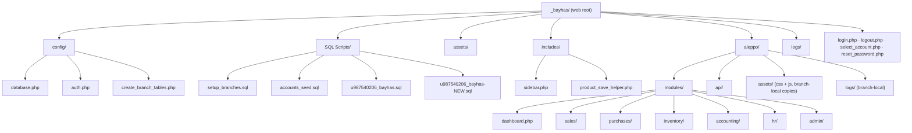
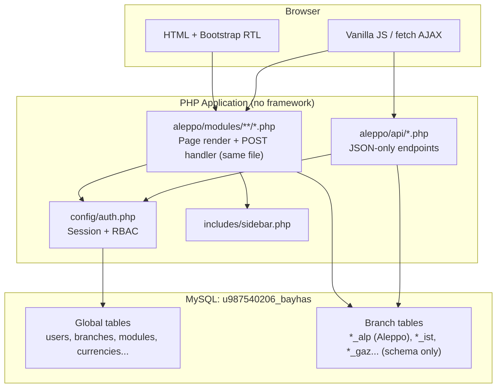
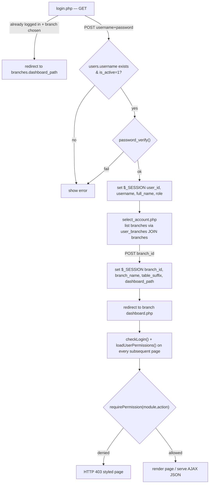
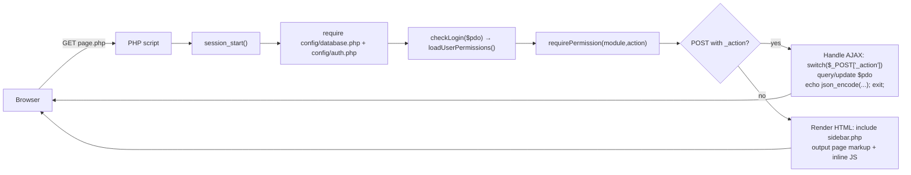
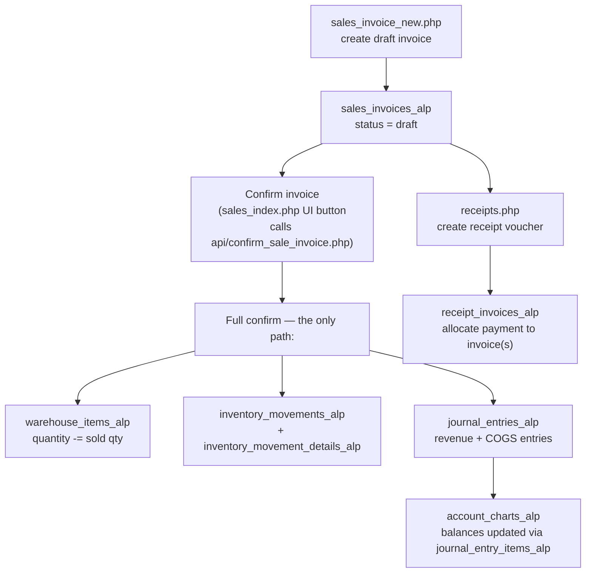

# FATORIZE (Bayhas) — Multi-Branch Financial & Inventory ERP

A native-PHP, no-framework ERP system for a multi-branch retail/manufacturing
company (clothing sector). It covers sales, purchases, inventory, accounting
(chart of accounts, journal entries, receipts), HR/payroll, consumables, and
inter-branch internal orders, all on **one shared MySQL database** with
per-branch data isolation via table-name suffixes.

> **Documentation basis:** this document was produced by directly reading the
> 40 PHP files, 1 SQL dump (`u987540206_bayhas.sql`, 64 `CREATE TABLE`
> statements / 63 distinct tables, 48 foreign-key constraints), the JS patch
> file, and the CSS file supplied in the project. Where the code snapshot
> does not include a directory (e.g. `config/`, `aleppo/modules/...`), that
> structure is reconstructed from the `require_once` paths and header
> comments embedded in every file (see "Note on file layout" below).

---

## Table of Contents

1. [Migration Log (July 2026 — generic branch/tenant naming)](#migration-log-july-2026-generic-branchtenant-naming)
2. [Currency Architecture (July 2026 — reporting currency reform)](#currency-architecture-july-2026-reporting-currency-reform)
3. [Sidebar/Menu Restructuring & Shared Components (July 2026)](#sidebarmenu-restructuring-shared-components-july-2026)
4. [Production Deployment (July 2026 — Hostinger SaaS Rollout)](#production-deployment-july-2026-hostinger-saas-rollout)
5. [Section Theming (July 2026 — per-section color system)](#section-theming-july-2026-per-section-color-system)
6. [Inventory Movements Ledger — تصحيح معماري (أغسطس ٢٠٢٦)](#inventory-movements-ledger-تصحيح-معماري-أغسطس-٢٠٢٦)
7. [Barcode Redesign, Product Reports & Inventory Costing (أغسطس ٢٠٢٦)](#barcode-redesign-product-reports-inventory-costing-أغسطس-٢٠٢٦)
8. [Project Description & Purpose](#project-description-purpose)
9. [Technologies Used](#technologies-used)
10. [Note on File Layout](#note-on-file-layout)
11. [Folder / File Structure](#folder-file-structure)
12. [Delivered Fix Files — Where to Place Each One](#delivered-fix-files-where-to-place-each-one)
13. [System Architecture](#system-architecture)
14. [Multi-Branch Model](#multi-branch-model)
15. [Multi-Tenant SaaS Architecture](#multi-tenant-saas-architecture)
16. [Database Overview — retail1 (Current, أغسطس ٢٠٢٦)](#database-overview-retail1-current-أغسطس-٢٠٢٦)
17. [Database Overview (Historical — aleppo/_alp)](#database-overview-historical-aleppo_alp)
18. [Database Relationships (ERD)](#database-relationships-erd)
19. [Authentication & Authorization](#authentication-authorization)
20. [Application Workflow](#application-workflow)
21. [Features](#features)
22. [Page-by-Page / File-by-File Reference](#page-by-page-file-by-file-reference)
23. [Barcode Module (Generation & Scanning)](#barcode-module-generation-scanning)
24. [Purchase Invoice Currency-Mismatch Bug (fixed, both files)](#purchase-invoice-currency-mismatch-bug-fixed-both-files)
25. [Consumables Module Findings (1 of 2 fixed)](#consumables-module-findings-1-of-2-fixed)
26. [JavaScript Structure](#javascript-structure)
27. [CSS Organization](#css-organization)
28. [Installation](#installation)
29. [Database Import](#database-import)
30. [Configuration](#configuration)
31. [Running the Project](#running-the-project)
32. [Security Notes](#security-notes)
33. [Code Quality Review](#code-quality-review)
34. [Known Limitations](#known-limitations)
35. [Future Improvements](#future-improvements)
36. [Troubleshooting](#troubleshooting)
37. [Development Guidelines](#development-guidelines)
38. [قسم المبيعات والعملاء — فرع retail1 (توثيق شامل، محدَّث)](#قسم-المبيعات-والعملاء-فرع-retail1-توثيق-شامل،-محدَّث)
39. [قسم المشتريات والموردين — فرع retail1 (توثيق شامل، محدَّث)](#قسم-المشتريات-والموردين-فرع-retail1-توثيق-شامل،-محدَّث)
40. [قسم المستهلكات والمصاريف — فرع retail1 (توثيق شامل، محدَّث — يستبدل النسخة القديمة بالكامل)](#قسم-المستهلكات-والمصاريف-فرع-retail1-توثيق-شامل،-محدَّث-يستبدل-النسخة-القديمة-بالكامل)
41. [قسم المالية — فرع retail1 (توثيق شامل، محدَّث)](#قسم-المالية-فرع-retail1-توثيق-شامل،-محدَّث)
42. [قسم الموارد البشرية — فرع retail1 (توثيق شامل، محدَّث)](#قسم-الموارد-البشرية-فرع-retail1-توثيق-شامل،-محدَّث)
43. [قسم إدارة المستخدمين والصلاحيات — تحقق ومقارنة (أغسطس ٢٠٢٦)](#قسم-إدارة-المستخدمين-والصلاحيات-تحقق-ومقارنة-أغسطس-٢٠٢٦)
44. [Production Module Architecture (أغسطس ٢٠٢٦ — جلسة تخطيط قسم الإنتاج)](#production-module-architecture-أغسطس-٢٠٢٦-جلسة-تخطيط-قسم-الإنتاج)

---

## Migration Log (July 2026 — generic branch/tenant naming)

بهالجلسة عملنا سلسلة تعديلات لإزالة أي تسمية مرتبطة بمكان/عميل محدد
(Aleppo, Bayhas) من بنية النظام نفسها، تحضيراً لتحويله لمنتج SaaS عام.
هاي خلاصة كل شي اتغيّر، بالترتيب:

| # | التغيير | من | إلى | الحالة |
|---|---|---|---|---|
| 1 | لاحقة جداول قاعدة البيانات لفرع البيع الأول (٥٤ جدول) | `_alp` | `_ret` | ✅ منفّذ (`01_migrate_alp_to_ret.sql`) |
| 2 | اسم/نوع الفرع الأول بجدول `branches` | "فرع حلب"، `branch_type` متنوع | "فرع البيع ١"، `branch_type='retail'` | ✅ منفّذ |
| 3 | قيم `branches.branch_type` الممكنة | `retail/factory/warehouse/lab/office` | `retail/factory` فقط (ENUM مقيّد بقاعدة البيانات) | ✅ منفّذ |
| 4 | مجلد كود الفرع الأول | `aleppo/` | `retail1/` | ✅ منفّذ (فيزيائياً + بكل مراجع الكود) |
| 5 | مجلد جذر المشروع | `bayhas/` | `fatorize_erp_system/` | ✅ منفّذ على اللوكل والإنتاج (راجع [Production Deployment](#production-deployment-july-2026--hostinger-saas-rollout)) |
| 6 | مسارات مطلقة مكتوبة حرفياً بكل الكود (`/bayhas/...`) | سترينغ ثابت متكرر بعشرات الأماكن | ثابت مركزي واحد `BASE_PATH` | ✅ منفّذ (راجع [The BASE_PATH Constant](#the-base_path-constant)) |
| 7 | `config/create_branch_tables.php` — مراجع القالب المرجعي لأي فرع جديد | `SELECT * FROM sales_invoices_alp WHERE 0` وأخواتها (١٢ جدول) | نفس الاستعلامات لكن `_ret` | ✅ منفّذ |
| 8 | اسم قاعدة البيانات الفعلية بـ MySQL | `u987540206_bayhas` | (لم يتغيّر) | 🟡 قرار واعٍ: ما في داعي وظيفي لترينيمها |
| 9 | محتوى `about.php` التسويقي (قصة بايهاس كعميل حقيقي أول) | — | (لم يتغيّر) | 🟢 مقصود |

### ملفات الترحيل المُنتجة بهالجلسة (سجل مرجعي)
- `01_migrate_alp_to_ret.sql` — رينيم الـ ٥٤ جدول + تحديث صف الفرع + تقييد enum
- `02_rollback_ret_to_alp.sql` — سكريبت عكس احتياطي (غير مُستخدم)
- `03_update_dashboard_path.sql` — تحديث `branches.dashboard_path` بعد رينيم `aleppo→retail1` ثم `bayhas→fatorize_erp_system`
- `dashboard.php`, `sidebar.php`, `branches.php`, `create_branch_tables.php`, `purchases/index.php` — محدّثين

### ✅ إغلاق: جرد `_alp` الشامل عبر كل المشروع
جرد شامل عبر VS Code ("Find in Files") عن `_alp` بكامل المشروع — **صفر
نتائج**. الوحدة الحقيقية الوحيدة (`account_charts_alp` حرفياً بـ
`receipts.php`، بقايا ترحيل قديمة جوا نص SQL) انصلحت أثناء جلسة العملات.

---

## Currency Architecture (July 2026 — reporting currency reform)

إصلاح Anti-pattern حقيقي: كل عمود مالي بقاعدة بيانات كل tenant كان
مسمّى صراحة بلاحقة `_usd` — اسم العمود نفسه كان مقفول على افتراض
"العملة المرجعية دايماً دولار".

### النموذج الصحيح المعتمد الآن (مطابق لـ IAS 21)

| المستوى | الاسم المحاسبي | وين يُختار | وين يُخزَّن | يشمل |
|---|---|---|---|---|
| **الشركة كاملة** | Reporting/Group Currency (عملة التقارير) | وقت تسجيل الشركة (tenant جديد) | `fatorize_master.tenants.reporting_currency_id` (FK) | كل فروع نفس الشركة — موحّدة إجبارياً |
| **كل فرع لحاله** | Functional Currency (العملة الوظيفية) | وقت إنشاء الفرع | `branches.base_currency` (varchar(3)، داخل قاعدة الـ tenant) | فرع واحد بس — منفصل تماماً عن عملة التقارير |

**الاثنين مجمّدان بعد أول تحديد** — تغييرهم لاحقاً كإعداد عادي غير مسموح.

### قاعدة `fatorize_master` — التنفيذ
- جدول جديد `currencies` (مصغّر، **بدون أسعار صرف** — مجرد قاموس هوية عملة)
- عمود `tenants.reporting_currency_id` — FK حقيقي، `NOT NULL`
- **Trigger فعلي بقاعدة البيانات** (`trg_tenants_freeze_reporting_currency`) يمنع أي `UPDATE` يغيّر القيمة بعد أول تحديد
- السكريبت: `09_master_reporting_currency.sql`

### قاعدة كل tenant — إعادة تسمية الأعمدة
**الصيغة المعتمدة:** `_usd` → `_base`. **٢٣ عمود بـ١٥ جدول** بقاعدة
`bayhas_local` (السكريبت: `10_rename_usd_to_base_columns.sql`، ✅ منفّذ):
`consumable_issue_items_ret`, `consumable_items_ret`,
`consumable_movements_ret`, `consumable_purchases_ret` (٦ أعمدة),
`consumable_purchase_items_ret`, `consumable_stock_ret`, `expenses_ret`,
`internal_order_items`, `inventory_movements_ret`, `payroll_ret` (الجدول
الميت القديم), `production_entries_ret`, `production_operations_ret`,
`raw_material_stock_ret`, `receipts_ret`, `sales_invoice_items_ret`.

تعليقات مضلّلة إضافية اتصلحت (بدون رينيم): `branches.base_currency`،
`currencies.exchange_rate`/`is_base`، `inventory_movement_details_ret.cost_price`،
`receipt_invoices_ret.allocated_amount`، `sales_invoices_ret.cost_total`،
`sales_invoice_items_ret.unit_price`.

### ملفات PHP — الجرد الكامل والإصلاحات (١٦ ملف، ✅ كلهم منتهين)

| الملف | شو صار |
|---|---|
| `config/create_branch_tables.php` | ✅ (جلسة الترحيل البنيوي) |
| `api/confirm_purchase_invoice.php` | ✅ رينيم + **٣ إصلاحات hardcoded `'USD'`** بقيود الدفعة المقدمة/الشحن/الدفع |
| `api/confirm_sale_invoice.php` | ✅ رينيم + hardcoded `'USD'` بقيد COGS. ⚠ تضارب منطقي بحساب `original_amount` بقيد ذمم العملاء — موثّق، لم يُصلح |
| `api/payroll_api.php` | ✅ رينيم + **🔴 بق حرج**: استعلام `base_currency_id` (عمود غير موجود بـ`branches`) — **حساب وصرف الرواتب كانا معطّلين بالكامل** |
| `accounting/receipts.php` | ✅ رينيم + **🔴 بق `_alp` منفصل**: `account_charts_alp` حرفياً بدالة `getSettingAccount()` — **كل عملية سند قبض فيها قيد محاسبي كانت تفشل** |
| `accounting/expenses.php` | ✅ رينيم بحت |
| `inventory/consumable_issues.php` | ✅ رينيم + hardcoded `'USD'` + فلترة مستودعات بالنوع + `$currentModule` مصلّحة |
| `inventory/consumable_purchases.php` | ✅ ١١ عمود + ١١ متغير PHP + `$currentModule` **غير معرّفة إطلاقاً** + hardcoded `'USD'` بـ٥ أماكن |
| `inventory/consumables.php` | ✅ رينيم بحت (`avg_cost_usd`) |
| `inventory/internal_orders.php` | ✅ رينيم + **🔴 بقّان حرجان**: `final_amount_usd`/`unit_price_usd` بجدولي `purchases_ret`/`purchase_items_ret` — أسماء غير موجودة إطلاقاً — **تحويل أي طلب داخلي لفاتورة شراء كان يفشل بالكامل** |
| `inventory/movements.php` | ✅ رينيم أعمدة حقيقية + أسماء مستعارة PHP |
| `sales/customers.php`, `sales/sales_index.php` | ✅ أسماء مستعارة PHP فقط |
| `sales/sales_invoice_new.php` | ✅ عمود حقيقي وحيد (`cost_price_usd`) |
| `purchases/invoice_new.php`, `purchases/invoice_edit.php` | ✅ لا بق — السيرفر كان أصلاً يستخدم `unit_price_base_currency` الصحيح |

### اكتشاف مهم: نمطين مختلفين من "الاسم الصحيح" بنفس المشروع
بعض الجداول (`purchases_ret.final_amount_base_currency`,
`purchase_items_ret.unit_price_base_currency`) كانت أصلاً مسمّاة صح من
البداية (`_base_currency`، مش `_usd`) — المشكلة فيها كانت كود بأماكن
تانية يستخدم اسم مختلف وغير موجود (`_usd`)، فيفشل الاستعلام. **هاي بقّات
كتابة/قراءة لعمود غلط، مش تسميات تحتاج توحيد.**

### 🟢 مؤجّل بقرار واعٍ
- **مفتاح `'cash_usd'`** بجدول `invoice_account_settings_{TS}` — تأكّد من المستخدم إنه مقصود فعلاً (حساب صندوق نقدي مخصص للدولار) — **لن يُغيَّر**
- **توحيد رمز العملة بالواجهة** — `$` مكتوبة حرفياً بعشرات الأماكن، وفحوصات JS من نوع `=== 'USD'`
- **فجوة سعر صرف الشحن** بـ`confirm_purchase_invoice.php`
- **تضارب اتجاه سعر الصرف** بقيد ذمم العملاء

---

## Sidebar/Menu Restructuring & Shared Components (July 2026)

جلسة ثالثة ركّزت على إعادة تنظيم الشريط الجانبي فعلياً — منطقياً (أي
قسم بيحوي شو) وفيزيائياً (مجلدات الملفات الحقيقية).

### إعادة الهيكلة المنطقية لجدول `modules`

| التغيير | الحالة |
|---|---|
| نقل "إدارة المستهلكات" ومشتقاتها من "المخزون" لمجموعة جديدة "المصاريف والمستهلكات" | ✅ (`07_restructure_modules_menu.sql`) |
| نقل "مشتريات المستهلكات" لمجموعة "المشتريات" (معيار Odoo/SAP) | ✅ بعد تصحيح (`12_fix_consumable_purchases_parent.sql`) |
| حذف مجموعة "العملاء والموردون" (CRM) بالكامل | ✅ (`11_dissolve_crm_group.sql`) — العملاء انضموا لـ"المبيعات"، الموردون بقوا تحت "المشتريات" |
| إضافة "فاتورة شراء جديدة" | ✅ (`13_add_purchases_invoice_new.sql`) |

### إعادة الهيكلة الفيزيائية — مجلد جديد `modules/expenses_and_consumables/`

الملفات الأربعة الحصرية لقسم المصاريف والمستهلكات انتقلت فيزيائياً:
`consumables.php`, `consumable_purchases.php`, `consumable_issues.php`
(من `inventory/`)، و`expenses.php` (من `accounting/`).
**`warehouse.php` و`movements.php` بقوا بمكانهم تحت `inventory/`** —
مشتركين بين قسمين (منتجات/مستهلكات عبر `?type=`/`?tab=`).

**قاعدة عملية اتعلمناها:** بعد أي نقل مجلد، دوّر يدوياً عن كل `href=`
داخل الملفات المنقولة وتأكد من كل مسار نسبي — صارت مشاكل فعلية أكتر
من مرة بالتنفيذ (روابط بقيت تشاور على المسار القديم).

### مكوّن `includes/breadcrumb.php`
Breadcrumb عام لأي صفحة موديول "قياسية" (قسم ثابت واحد) — بيقرأ نفس
`$menu`/`$currentModule` الجاهزين أصلاً من `sidebar.php`. الصفحات
"مزدوجة الغرض" (`warehouse.php`, `movements.php`) عندها breadcrumb
يدوي خاص (القسم بيتغيّر ديناميكياً حسب `?type=`/`?tab=`).

### 🔴 بق مكتشف: دوال JS الشريط الجانبي مفقودة من بعض الصفحات
`toggleGroup`/`sbOpen`/`sbClose` — كل صفحة فيها نسخة خاصة (نسخ-لصق،
مش ملف مشترك). `warehouse.php` كانت ناقصة منها بالكامل — الضغط على أي
عنوان قسم رئيسي ما كان يعمل شي **بهالصفحة تحديداً**. أُصلحت.

### 🔴 بق ثانٍ مكتشف من نفس السبب (تراكم الأقسام المفتوحة بالشريط الجانبي)
كل الصفحات يلي عندها نسخة مكررة من `toggleGroup()` عندها نفس البق:
لما تُغلق الأقسام التانية بصرياً (`classList.remove('open')`)، الكود ما
كان يصفّر قيمتها المحفوظة بـ`localStorage`. النتيجة: كل قسم انفتح
يوماً ما بيضل `'true'` للأبد، وبيتراكموا — فبأي صفحة جديدة، **كل قسم
سبق وانفتح مرة بيفتح مع بعض بنفس الوقت**، بدل بس القسم الحالي.

**✅ الحل النهائي:** بدل ترقيع كل صفحة لحالها، اتحسم القرار المعلّق
(استخراج الدوال لملف JS مشترك) — ملف جديد `assets/js/sidebar.js`
(نسخة واحدة مصلَّحة، فيها كمان إصلاح ذاتي لمرة وحدة للحالة المتراكمة
القديمة). **بديل الكود المكرر بكل صفحة، صفحة تحتاج بس سطر وحيد قبل
`</body>`:**
```php
<script src="<?= BASE_PATH ?>/assets/js/sidebar.js"></script>
```
**⚠️ لسا مفتوح:** تطبيق هالاستبدال (حذف الكود المكرر القديم + إضافة
السطر الجديد) على كل صفحات المشروع — بيصير تدريجياً بكل محادثة قسم
لحالها، نفس أسلوب تطبيق الـ Breadcrumb والألوان.

### إصلاح `admin/branches.php` — تجميد العملة الوظيفية للفرع
٤ إصلاحات: (١) حذف `base_currency_id`/`local_currency_id` (أعمدة غير
موجودة، كانت تُسقط حفظ أي فرع بالكامل)، (٢) تصحيح قيمة `<select>` من ID
لكود نصي، (٣) تصحيح تسمية "العملة الأساسية (التقارير)" لـ"العملة
الوظيفية"، (٤) تجميد الحقل (`disabled` + رفض صريح بالسيرفر). **لا يوجد
صفحة "إضافة فرع جديد" بالمشروع** — الفروع تُنشأ يدوياً عبر SQL مباشر.

---

## Production Deployment (July 2026 — Hostinger SaaS Rollout)

أول نشر إنتاج ناجح وكامل لبنية الـSaaS متعددة المستأجرين — تسجيل دخول
→ اختيار فرع → داشبورد → إضافة منتج → فاتورة شراء، كلها اختُبرت وعملت
صح على السيرفر الحقيقي، على `bayhas.musabbinomran.online` (دومين
اختباري؛ `fatorize.com` مُشترى، نشره لسا مهمة منفصلة).

### 🔴 الدرس الأهم: Wildcard SSL على Hostinger يحتاج VPS
سجل DNS wildcard (`A | * | IP`) اشتغل صح (DNS + وصول HTTP)، **بس HTTPS
فشل لأي ساب-دومين غير مُعرَّف صراحة** (خطأ SSL، وبعدين 403 Forbidden).
**تأكيد رسمي من دعم Hostinger:** شهادة SSL wildcard حقيقية غير مدعومة
على خطط Cloud/الاستضافة المشتركة — متاحة فقط على VPS.

### ✅ الحل البديل المؤكَّد (يعمل على أي خطة)
كل تينانت جديد بياخد ساب-دومين مُعرَّف صراحة بـ hPanel:
`Subdomains → أنشئ الساب-دومين → فعّل "Use public_html directory"`
(بدل "Custom folder"). Hostinger بتضيف تلقائياً سجل `ALIAS` وتصدر SSL
تلقائياً خلال دقائق لساعة. التكلفة: ٢-٣ دقايق يدوية لكل عميل جديد.

### ⚠️ قيد إضافي: حدود الخطة
خطة **"Single Web Hosting"** — حد أقصى **٢ ساب-دومين فقط** (قيد إداري،
مو تقني). لازم ترقية الخطة قبل أي تينانت ثالث.

### الإعدادات الثلاثة الحرجة (مختلفة عن اللوكل)
```php
// config/database.php
define('BASE_PATH', '');
// config/tenant_resolver.php
define('PLATFORM_BASE_DOMAIN', 'musabbinomran.online'); // fatorize.com لاحقاً
// config/master_database.php — نفس مفتاح اللوكل (قاعدة منسوخة مباشرة)
```

### ⚠️ لسا مفتوح
- **نشر `fatorize.com`** — لسا لم يُنفَّذ (خارطة طريق جاهزة: `hostinger_deployment_roadmap_v2_fatorize_com.md`)
- **حذف الملفات الأمنية** (`reset_password.php`, `hr/test_db.php`, `api/test_api.php`) من الإنتاج — **لم يُؤكَّد بعد**
- **ترقية الخطة** قبل تينانت ثالث

---

## Section Theming (July 2026 — per-section color system)

بنية تحتية جديدة (غير مُطبَّقة على صفحات فعلية بعد — بانتظار كل محادثة
قسم تطبّقها على صفحاتها لحالها) لحل تضارب الألوان الحالي (كل صفحة
بتستخدم ألوان حرفية مختلفة/متضاربة عن باقي صفحات نفس القسم).

### الآلية (٣ طبقات)
1. **التخزين:** عمود جديد `modules.theme_color` (hex) — بس على الصفوف
   الأب (`parent_key IS NULL`). السكريبت: `15_add_section_theme_colors.sql`
   (بيضيف العمود + ألوان افتراضية مبدئية + صف صفحة الإعدادات الجديدة)
2. **الحقن:** `includes/sidebar.php` (دالة جديدة `getCurrentSectionColor()`)
   بتحدد لون القسم الحالي وتطبعه كمتغيّر CSS وحيد بأول كل صفحة:
   ```php
   :root { --section-color: <?= $sectionColor ?>; }
   ```
3. **الاستخدام:** أي صفحة داخل القسم بتستبدل أي لون حرفي (`background:#10b981`)
   بـ `background:var(--section-color)` — أزرار، تبويبات، حدود، أي عنصر.
   التغيير من صفحة الإعدادات بينعكس فوراً على كل صفحات القسم بدون
   إعادة نشر أي ملف.

### صفحة الإعدادات الجديدة
`admin/section_colors.php` (مفتاح `admin.section_colors`) — قائمة
الأقسام الرئيسية + Color Picker لكل وحدة، حفظ فوري عبر AJAX.

### 📋 دليل التطبيق العملي — خطوة بخطوة (لأي محادثة قسم)

هاي الخطوات المضبوطة لتطبيق اللون على صفحة موجودة، بدون حاجة لأي سياق
إضافي غير هالتوثيق:

**١. تأكد الصفحة أصلاً تستدعي `sidebar.php`**
لازم يكون فيها:
```php
require_once __DIR__ . '/../../../includes/sidebar.php';
```
(هاد هو مصدر تعريف `--section-color` — بدونه المتغيّر مش موجود إطلاقاً).

**٢. دوّر عن كل لون حرفي (hex) داخل الصفحة**
`Ctrl+Shift+F` جوا الملف عن نمط `#` متبوع بـ٣ أو ٦ خانات (`#10b981`،
`#3b82f6`... إلخ) بمناطق الـ`<style>` أو الـ`style="..."` inline.

**٣. صنّف كل لون قبل ما تبدّله — مو كل لون بدّله**

| النوع | مثال | القرار |
|---|---|---|
| لون العلامة التجارية للقسم (أزرار أساسية، تبويب نشط، حدود بطاقات مميزة، أيقونات رئيسية) | `background:#10b981` على زر "فاتورة جديدة" | ✅ بدّله بـ `var(--section-color)` |
| ألوان دلالية (Status/Semantic) — نجاح/خطر/تحذير/معلومة | `.badge-success{background:#16a34a}` (حالة "مؤكدة") | ❌ **لا تبدّله** — لازم يضل أخضر/أحمر بغض النظر عن لون القسم |
| ألوان نص/خلفية محايدة | `color:#64748b` (نص ثانوي رمادي) | ❌ لا تبدّله |

**٤. طبّق الاستبدال**
```css
/* قبل */
.btn-primary-action { background: #10b981; border-color: #10b981; }
.nav-link.active { border-bottom: 2px solid #10b981; color: #10b981; }

/* بعد */
.btn-primary-action { background: var(--section-color); border-color: var(--section-color); }
.nav-link.active { border-bottom: 2px solid var(--section-color); color: var(--section-color); }
```
لو اللون مكتوب inline (`style="background:#10b981"` بالـHTML مباشرة مو
بملف CSS)، نفس المبدأ:
```php
style="background:var(--section-color)"
```

**٥. اختبر بصفحة الإعدادات نفسها**
افتح `admin/section_colors.php`، غيّر لون القسم يلي شغّلت عليه، ورجع
افتح الصفحة يلي عدّلتها — اللون لازم يتغيّر فوراً بدون رفع أي ملف جديد.

### ⚠️ استثناء: الصفحات مزدوجة الغرض
`warehouse.php` و`movements.php` بيخدموا قسمين مختلفين بنفس الملف —
`--section-color` المحقون من `sidebar.php` بيعكس **قسم الصفحة الحالي
حسب `$currentModule`**، مش حسب `?type=`/`?tab=` النشط. يعني لو هالملفين
احتاجوا تلوين، لازم منطق إضافي يدوي (تحديد اللون حسب `$type`/`$tab`
مباشرة داخل الملف نفسه، مش الاعتماد على `--section-color` وحده) — نفس
أسلوب الـbreadcrumb اليدوي المبني فيهم أصلاً.

### ⚠️ لسا مفتوح
- **التطبيق الفعلي** على CSS كل صفحة — **لم يبدأ بعد**، بيصير تدريجياً بكل محادثة قسم لحالها

---

## Inventory Movements Ledger — تصحيح معماري (أغسطس ٢٠٢٦)

### الاكتشاف

`inventory/movements.php` كانت "تستنتج" حركات المخزون بإعادة قراءة
`purchase_items_ret`/`sales_invoice_items_ret` مباشرة — منطق مكرَّر
وناقص (بيتجاهل المرتجعات تماماً). فحص الأربع APIs الفعلية
(`confirm_purchase_invoice.php`, `confirm_sale_invoice.php`,
`confirm_purchase_return.php`, `confirm_sale_return.php`) أكّد إنهم
**كلهم فعلياً بيكتبوا مباشرة** بجدولي `inventory_movements_{TS}` +
`inventory_movement_details_{TS}` عند كل تأكيد — وهاد المصدر الحقيقي
والوحيد الموثوق لسجل حركات المخزون (فيه `balance_before`/`balance_after`
جاهزة، ويغطي `purchase`/`sale`/`purchase_return`/`sale_return` بشكل
موحّد عبر عمودي `movement_type` (`in`/`out`) و`reference_type`).

### الإصلاح

`movements.php` أُعيدت بناؤها بالكامل — استعلام واحد موحّد من
`inventory_movements`+`inventory_movement_details` (بدل استعلامين
منفصلين مبنيين على استنتاج من الفواتير). نفس أسماء حقول الإخراج
اتحفظت (`movement_type`, `direction`, `product_name`...) فكود العرض
بالواجهة ما احتاج تعديل، غير مصدر البيانات نفسه.

### التمييز الجوهري: `warehouse_items` مقابل `inventory_movements`

نفس نمط `account_charts.balance` (رصيد جاهز/Cached) مقابل
`journal_entries`/`journal_entry_items` (سجل تاريخي/Ledger) الموجود
أصلاً بالجانب المحاسبي — بس للمخزون:

| | `warehouse_items_{TS}` | `inventory_movements`+`_details` |
|---|---|---|
| الطبيعة | رصيد جاهز، بيتحدّث بـ`UPDATE quantity=?` بكل عملية | سجل تاريخي كامل، append-only |
| الاستخدام الصحيح | "شو مخزوني هلق؟" — عرض سريع (`products.php`, `warehouse.php`) | "شو صار، وامتى؟" — تدقيق وتقارير (`movements.php`) |

### 🆕 فكرة مؤجّلة: تقرير مطابقة (Reconciliation)

بما إنه `warehouse_items.quantity` رقم "مخزَّن" بيتحدّث تدريجياً (مو
محسوب لحظياً من السجل)، فيه احتمال نظري ينحرف عن الحقيقة لو صار خطأ
بمكان واحد بعملية تأكيد. الأنظمة الجدية بتعمل تقرير دوري يقارن
`SUM(الحركات)` لكل `variant_id`+`warehouse_id` مقابل
`warehouse_items.quantity` الفعلي، وينبّه لو في فرق. **غير مبنية بعد —
مؤجّلة بقرار صريح** (أولوية الأساسيات أولاً)، مرشّحة لتُبنى بنفس مرحلة
باقي أدوات التدقيق المحاسبي لاحقاً.

---

## Barcode Redesign, Product Reports & Inventory Costing (أغسطس ٢٠٢٦)

### ١. إعادة تصميم نظام الباركود بالكامل

**القرار المعماري:** الباركود صار **مشترك لكل (كروب سعري × لون)**، مو
لكل متغيّر (مقاس مفرد) لحاله — بقرار صريح: الشغل بالنظام كله قائم على
إدخال/تخريج بالكروب (باكيت)، مو بالقطعة المفردة. يعني كروب "٢-٥ سنة"
أحمر = باركود واحد يغطي كل مقاساته، مختلف عن نفس الكروب أخضر، ومختلف
عن كروب "٦-٩ سنة" أحمر. (تمييز القطعة المفردة — مؤجّل لحد ما تُبنى
نقطة بيع مفرّق مستقبلاً.)

**الصيغة:** من Code128 نصي (`{MODEL}-V{000000}`) إلى **رقم عشوائي من ٩
خانات**، بتحقّق فعلي من التفرّد بقاعدة البيانات قبل الاعتماد عليه (مش
بس احتمال رياضي — فراغ ٩ خانات أصغر بكتير من الصيغة الأقدم المقترحة
بـ١٥ خانة).

**⚠ بق حقيقي اكتُشف أثناء التطبيق:** عمود `product_variants.barcode`
كان عليه **قيد تفرّد (UNIQUE constraint)** بقاعدة البيانات — بيتعارض
مباشرة مع القرار الجديد (نفس الباركود لازم يتكرر على أكتر من صف
بالتصميم). الحل: `ALTER TABLE product_variants_ret DROP INDEX \`barcode\`;`
(حُذف قيد التفرّد بس، وضلّ الفهرس العادي `idx_barcode` لسرعة البحث).

**واجهة طباعة جديدة:** زر "طباعة الباركود" بكل صف منتج بـ`products.php`،
بيفتح مودال اختيار **مجمَّع بالكروب** (بطاقة وحدة لكل باركود فعلي — مو
صف لكل مقاس، لأن الباركود أصلاً مشترك للكروب كامل)، وبعده مودال ثاني
لاختيار **مقاس الملصق**.

**⚠ كل منطق الطباعة انتقل لملف مستقل: `inventory/barcode_print_helper.php`**
— قرار مقصود لتخفيف `products.php` (يلي صار ضخم). `products.php` بيستدعيه
بسطر واحد (`require_once`) وبينادي دالتين منه بس: `bcOpenPrintWindow()`
و`bcGetSelectedSize()`.

**مقاسات الملصق (قابلة للاختيار من مودال قبل الطباعة):**

| المقاس | الأبعاد | ملاحظة |
|---|---|---|
| صغير | ٤٠×٢٠ مم | المستخدم فعلياً بـBayhas |
| متوسط | ٥٠×٢٥ مم | |
| كبير | ٨٠×٤٠ مم | |
| مخصّص | يُدخله المستخدم بالمليمتر | الخطوط تُحسب نسبياً تلقائياً |

كل الأحجام (الخطوط، اللوغو، ارتفاع الباركود وعرض خطوطه، الهوامش،
المسافة بين عناصر السطر) **بتتكيّف تلقائياً** مع المقاس المختار. المقاس
بينحفظ بـ`localStorage` فما يحتاج المستخدم يعيد اختياره كل مرة.

**تخطيط الملصق النهائي (٦ عناصر):** لوغو العميل → اسم المنتج → رقم
الموديل → (عدد القطع + اللون) → (القياس + سعر البيع بدون رمز عملة) →
باركود Code128 → رقمه كنص.

**⚠ درس تقني مهم (تكرّر ٣ مرات بالجلسة):** الطباعة **بنافذة منفصلة**
(`window.open`) مع `@page { size: XXmm YYmm; margin: 0 }` — مش بنفس
الصفحة مع إخفاء بـCSS. السبب: الطريقة الثانية بتطبع على مقاس A4 وتحاول
حشر الملصقات فيه، فيتصرّف المتصفح بالهوامش والتحجيم على كيفه (النتيجة
كانت ملصقات متداخلة وباركود مقصوص). كمان: **كروم ما بيطبّق `@page size`
بشكل موثوق على مقاس الورق الفعلي** — فالمستخدم لازم يختار **نفس المقاس
يدوياً** من إعدادات الطابعة كمان (فيه تنبيه صريح بالمودال بيذكّره).

**⚠ درس CSS تكرّر كمان:** بحاوية `display:flex` عمودية، عنصر `<svg>`
**ما عنده ارتفاع أدنى طبيعي** (بعكس النصوص) — فلما المحتوى يفيض، الباركود
بينضغط لارتفاع **صفر** ويختفي كلياً بينما باقي العناصر تضل ظاهرة. الحل
الإلزامي: `flex-shrink: 0` + `min-height` على الـSVG. كمان `width: 100%`
على الـSVG ضروري، وإلا بيضل بعرض ما ولّده JsBarcode بس وتضل فراغات
جانبية بالملصق المطبوع.

**أداة "إعادة توليد الباركودات" للمنتجات القديمة:** بُنيت ثم **أُلغيت
بقرار صريح** من المستخدم (فضّل حذف البيانات القديمة والبدء نظيف عبر
`product_add.php` مباشرة بدل أداة تصحيح رجعي). القرار الوحيد الباقي:
منتجات جديدة/متغيرات جديدة تاخد النمط الجديد تلقائياً؛ باركودات قديمة
(مسجَّلة قبل التحديث) تضلّ زي ما هي (نفس مبدأ حماية الملصق المطبوع فعلياً).

### ٢. صفحة تقارير المنتجات — `inventory/reports.php` (جديدة بالكامل)

بحث عن منتج (بالاسم أو رقم الموديل) → ٣ تقارير فرعية لنفس المنتج:
- **حركة المنتج** — من دفتر `inventory_movements`/`_details` مباشرة (كل
  شراء/بيع/مرتجع، بالرصيد بعد كل عملية)
- **تاريخ أسعار الشراء** — تاريخ أسعار الشراء الفعلية (**مو** سجل
  "تغيير سعر" مستقل — لا يوجد جدول لهذا، موضَّح بملاحظة بالواجهة نفسها)
- **الربح** — بطاقات ملخّص (مبيعات/تكلفة/ربح صافي/هامش٪) + جدول كل
  عملية بيع بربحها الفعلي وقتها

أُضيف تبويب "التقارير" لشريط القسم الموحّد بكل الصفحات الخمس
(`products.php`, `warehouse.php`, `movements.php`,
`internal_orders.php` وضع الصيانة). يحتاج تسجيل مفتاح صلاحية جديد
(`inventory.reports`) — راجع `inventory_reports_module_setup.sql`.

**⚠ بق منفصل اكتُشف ويتّصل بنفس الصفحة:** `includes/sidebar.php` عندها
خريطة صريحة (`moduleUrl()`) تربط كل مفتاح صلاحية بمساره الفعلي — أي
مفتاح غير مسجَّل فيها بيرجع رابط فاضي (`.../modules/#`، بالضبط نمط
"Index of" يلي ظهر). **كل مفتاح صلاحية جديد بالمستقبل لازم يُضاف هون
كمان**، مو بس بجدول `modules` — درس عام يستاهل التوثيق.

### ٣. اكتشاف جوهري: تكلفة البيع كانت "مجمَّدة"، مش حيّة

**المشكلة الأصلية (بلّشت كشكوى عن تقرير الربح):** `cost_price` وقت
تأكيد فاتورة البيع كان بيجي من `product_sizes.cost_price` — **رقم ثابت
مُدخَل يدوياً وقت إضافة المنتج أول مرة**، غير محدَّث مع عمليات الشراء
اللاحقة. يعني لو نفس المنتج انشرى مرتين بسعرين مختلفين، الربح المحسوب
دايماً بياخد نفس الرقم الأولي — بق محاسبي حقيقي، مش تفصيل عرض.

**⚠ بق أعمق اكتُشف أثناء التتبّع (منفصل عن الأول):** جدولي الفواتير
(`sales_invoice_items`/`purchase_items`) **كانا سليمين ١٠٠٪** من
الأساس (بيانات حقيقية تحقّقناها: `unit_price ÷ سعر الصرف = unit_price_base_currency`
مطابقة رياضياً بالضبط). المشكلة كانت بخطوة **النسخ** —
`confirm_sale_invoice.php`/`confirm_purchase_invoice.php` كانا يكتبوا
`unit_price` **الخام بعملة الفاتورة** لجدول `inventory_movement_details`
(دفتر الحركات)، بدل استخدام `unit_price_base_currency` الجاهزة
والصحيحة الموجودة أصلاً بجدول الفاتورة. أُصلح بالملفين (مسار التأكيد
**و**مسار الإلغاء بالاثنين — الإلغاء احتاج إضافة `$rate` لم تكن معرَّفة
بذاك النطاق إطلاقاً).

**الحل الشامل — طريقة حساب تكلفة قابلة للاختيار لكل فرع:**

| | آخر سعر شراء (`last_cost`) | المتوسط المرجّح (`weighted_average`) |
|---|---|---|
| الافتراضي | ✅ (أبسط) | اختياري |
| الدقة | متوسطة (تتجاهل كميات الدفعات الأقدم) | أعلى (معيار محاسبي شائع) |

- عمود جديد `branches.costing_method` (ENUM)
- عمود جديد `warehouse_items.current_cost` — **"الرصيد الحي" للتكلفة**،
  نفس مبدأ `account_charts.balance` بالضبط، بيتحدّث تلقائياً بكل
  تأكيد شراء حسب الطريقة المختارة
- `confirm_purchase_invoice.php`: يحسب `current_cost` الجديدة (آخر
  سعر أو متوسط مرجّح بالكمية) ويحدّثها بكل عملية شراء
- `confirm_sale_invoice.php`: يقرا التكلفة الفعلية من `current_cost`
  الحيّة وقت البيع (بدل `product_sizes.cost_price` الثابت) — **مع
  fallback** للقيمة الثابتة لو `current_cost` لسا صفر (منتج قديم لم
  يُشترى عبر النظام الجديد بعد)
- **مسار الإلغاء (cancel) بمنطق مختلف عمداً:** بيعكس **بالضبط نفس
  القيمة الأصلية** المسجَّلة وقت البيع (مقروءة من سجل الحركة الأصلي
  نفسه، `reference_type='sale' AND reference_id=؟`) — **مو** قيمة
  `current_cost` الحالية (قد تكون تغيّرت من وقتها بسبب مشتريات لاحقة).
  هذا مبدأ محاسبي أساسي: عكس القيد يعكس المُسجَّل فعلياً، مش يُعاد حسابه.

**تأكيد مهم (سؤال المستخدم المباشر):** تبديل `costing_method` بمنتصف
عمليات فرع معيّن **آمن تماماً، بدون أي تصفير مطلوب** — بعكس قصة "تجميد
عملة المنتج" (يلي كانت عن غموض هوية الرقم نفسه). هون الرقم دايماً
بعملة الفرع دايماً، بغض النظر شو الطريقة يلي أنتجته؛ التبديل بس بيغيّر
المعادلة المطبَّقة على العمليات **الجايّة**، والبداية بتاخد آخر
`current_cost` موجود فعلياً كنقطة انطلاق (نفس سلوك أي ERP كبير عند
تبديل طريقة التكلفة). العمليات القديمة المرحّلة محاسبياً **لا تتأثر
إطلاقاً**.

**الإعداد نفسه بيانات لا كود:** فرعين مختلفين بنفس الكود البرمجي
بالضبط، بس كل واحد بقيمة `costing_method` مختلفة بصفه بجدول `branches`
— نفس فلسفة عملة الفرع الأساسية والمستودع الافتراضي، إعداد بالبيانات
مش تفريع بالكود.

### ٤. ربط إضافي بسيط: هامش الربح الافتراضي

`branches.default_margin_pct` (موجود أصلاً بالجدول، كان غير مستخدم)
صار **القيمة الافتراضية** لحقل "نسبة المحل %" بجدول تسعير المنتج
(`product_add.php`/`product_edit.php`) — بدل رقم ٣٠٪ ثابت بالكود. يضل
الحقل قابل للتعديل الكامل لكل منتج/كروب لحاله؛ هذا بس نقطة بداية أذكى.

### ٥. إصلاحات إضافية بقسم المخزون (نفس الجلسة)

**⚠ بق حقيقي: عمود "المخزون" بقائمة المنتجات كان يعرض أرقاماً مضخَّمة.**
الاستعلام الرئيسي بـ`products.php` كان يربط `warehouse_items` بالمنتج
مباشرة (`wi.product_id = p.id`) بينما `product_variants` مربوطة بنفس
المنتج بشكل منفصل — يعني **ضرب ديكارتي (fan-out)**: منتج بـ٤ متغيرات
و٤ صفوف مخزون ينتج ١٦ صف، و`SUM(wi.quantity)` يعدّ كل رصيد ٤ مرات.
كل ما زاد عدد المتغيرات زاد التضخيم. **الإصلاح:** ربط المخزون
بالمتغيّر لا بالمنتج (`wi.variant_id = v.id`) — سطر واحد، بس أثره
جوهري على دقة كل الأرقام المعروضة.

**⚠ `reports.php` ما كانت تعرّف `$currentModule`** — فعنصر "التقارير"
بالشريط الجانبي ما كان يتفعّل إطلاقاً عند فتح الصفحة (الشريط بيقارن
`$currentModule === $child['key']`، والمقارنة دايماً `false` بدونها).
نفس النقص بالضبط كان بـ`internal_orders.php` وانصلح سابقاً.

**تأكيد سلامة `packet_qty` (بعد شكوى):** الحفظ بـ`product_save_helper.php`
سليم ومؤكَّد ببيانات حقيقية — `packet_qty = count(مقاسات الكروب)`،
مكرَّر عمداً على كل صفوف مقاسات الكروب الواحد (كروب ٢-٥ = ٤ على أربع
صفوف، كروب ٦-١٠ = ٣ على ثلاث صفوف). **`packet_qty` قيمة على مستوى
الكروب، مش خاصة بمقاس مفرد** — أي كود يقراها من صف مقاس ويربطها
بـ"هذا المقاس بس" غلط بالمفهوم. صفحات المخزون كلها فُحصت وسليمة؛ لو
ظهر خلل فهو بصفحات المشتريات/المبيعات (خارج نطاق هذه المحادثة).

### قرارات تبدّلت أثناء الجلسة (توثيق تاريخي)

- **صيغة الباركود:** ١٥ خانة → ٩ خانات (بطلب صريح)
- **عرض القياس بالملصق:** كان "مدى مختصر" (`2-5 سنة`) → رجع "سرد كامل"
  (`2-3-4-5 سنة`) بطلب صريح لاحق
- **أداة إعادة توليد الباركودات للمنتجات القديمة:** بُنيت كاملة →
  أُلغيت بقرار صريح (فُضّل حذف البيانات القديمة والبدء نظيف)
- **مقاس الملصق:** ٨٠×٤٠ مم (من كود سابق للمستخدم) → ٤٠×٢٠ مم (المقاس
  الورقي الفعلي)، ومنه جاءت الحاجة لمودال اختيار المقاس أصلاً

### ⚠ لسا مفتوح
- تطبيق حقل `costing_method` فعلياً بواجهة `admin/branches.php` (تعليمات
  جاهزة بـ`branches_costing_method_instructions.md`، الملف نفسه لم
  يُرفع بهالجلسة فعُدِّل بتعليمات نصية بدل تعديل مباشر)
- **`confirm_purchase_invoice.php`'s `cancel` ما بتكتب أي سجل حركة
  للإلغاء إطلاقاً** — فجوة تدقيق حقيقية: إلغاء فاتورة شراء مؤكَّدة
  بيرجّع المخزون بس بدون أثر بدفتر `inventory_movements`، فالإلغاء
  ما بيظهر بصفحة حركة المخزون ولا بتقارير المنتج. (بالمقابل،
  `confirm_sale_invoice.php`'s cancel **بتكتب** سجل حركة صح.)
  اكتُشفت أثناء تتبّع مشاكل العملة، غير مرتبطة فيها، **لم تُصلح بعد**
  — و**خارج نطاق محادثة المخزون** (ملف تابع لقسم المشتريات).
- تعميم فحص "قراءة `unit_price` الخام بدل `unit_price_base_currency`"
  على أي API تأكيد إضافي يُبنى مستقبلاً (نفس نمط البق بالضبط قابل
  للتكرار بأي مكان مشابه)

---

## Project Description & Purpose

> **Product direction update:** FATORIZE is evolving from a single
> company's internal system into a **multi-tenant SaaS product**, sold to
> multiple independent clothing factories/shops across the Arabic-speaking
> region (competing with Oracle/SAP/Odoo, but simpler to use). Everything
> described below was originally built for one company (Bayhas) — that
> part of the codebase is being **kept as-is and reused as the per-tenant
> application**, not rewritten. The only new layer is a **tenant
> resolution system** (subdomain → which company's database to use) — see
> [Multi-Tenant SaaS Architecture](#multi-tenant-saas-architecture) for
> what's been built so far and what's still needed.

**FATORIZE** is an ERP originally built for **Bayhas**, a clothing
retail/manufacturing company operating several branches (shops, a factory,
and a lab). It digitizes:

- Sales & purchase invoicing (with items, sizes, colors, barcodes)
- Inventory across multiple warehouses per branch
- Accounting: chart of accounts, journal entries, receipts, expenses,
  multi-currency exchange rates
- HR: employees, attendance, payroll, loans, bonuses, promotions
- Consumables (packaging/raw supplies) purchasing, stock, and issuing
- Internal orders between branches (e.g., a shop ordering stock from the
  factory)
- Fine-grained, per-user, per-branch, per-module permissions (view / create
  / edit / delete / confirm / print / export)

Each **tenant** (paying customer company) gets one full copy of this
application running against its own database — all branches *within that
one company* share a **single MySQL database** (previously
`u987540206_bayhas` for the Bayhas tenant specifically). Branch data
isolation within a tenant is achieved not through separate schemas but
through a **table-name suffix** (`table_suffix`, e.g. `alp` for the
Aleppo branch), so `products_alp`, `sales_invoices_alp`, `hr_payroll_alp`,
etc. all belong to one branch, while tenant-wide tables (`users`,
`branches`, `currencies`, `modules`, `internal_orders`,
`shipping_carriers`) have no suffix and are shared across that tenant's
branches. **This entire model is unchanged by the SaaS pivot** — it now
simply describes the structure *inside* each tenant's own database, one
level below the new tenant-resolution layer.

---

## Technologies Used

| Layer | Technology |
|---|---|
| Backend language | PHP (native, no framework — procedural + a few free functions, PHP 7.4+/8.x syntax such as union return types) |
| Database | MySQL / MariaDB, accessed via **PDO** with prepared statements |
| Frontend markup | HTML5, rendered inline by PHP (no templating engine) |
| CSS | Custom `layout.css` + Bootstrap 5.3 (RTL) loaded from CDN + inline `<style>` blocks per page |
| JavaScript | Vanilla JS, inline `<script>` blocks per page + one shared file `attendance_patch.js` |
| Icons | Bootstrap Icons |
| Font | Cairo (Google Fonts) — Arabic-first UI, `dir="rtl"` |
| Password hashing | `password_hash()` / `password_verify()` (bcrypt) |
| Session | Native PHP sessions (`$_SESSION`) — the only state/authorization mechanism |
| Data exchange | Server-rendered HTML + `fetch`/`XMLHttpRequest` AJAX calls returning `application/json`, using a uniform `_action` POST parameter convention |

**Confirmed NOT used:** Laravel, Symfony, CodeIgniter, any MVC framework,
React/Vue/Angular, Node.js/Express, Composer autoloading, an ORM, or a
templating engine. Every file is a self-contained script that mixes PHP
logic and HTML output (no separation of concerns).

---

## Note on File Layout

The project files were supplied to this analysis as a **flat list** (all
`.php` files at one directory level). However, every file's own header
comment and its `require_once` calls describe a **nested directory tree**
that the flat listing does not reproduce, for example:

```php
// account_settings.php actually declares itself as:
/**
 * accounting/account_settings.php — إعدادات الربط المحاسبي
 * المسار: /bayhas/aleppo/modules/accounting/account_settings.php
 */
require_once __DIR__ . '/../../../config/database.php';
require_once __DIR__ . '/../../../config/auth.php';
```

Three `../` levels up from `aleppo/modules/accounting/` lands exactly on
the project root, which is where `config/database.php` and `config/auth.php`
must live. This pattern is consistent across **every** module file, so the
real, deployed folder structure is reconstructed below with high confidence.
Two files (`config/database.php`, `includes/product_save_helper.php`) do not
carry a path comment but their `require_once` depth (from `dashboard.php`,
three levels: `aleppo/modules/dashboard.php`) confirms the same tree.

If your actual deployment already matches the flat layout, all `require_once`
paths must be corrected before the app will run (see [Troubleshooting](#troubleshooting)).

---

## Folder / File Structure

> This tree reflects the **authoritative, confirmed** project structure
> as provided directly. Everything below is now fully accounted for —
> no more "N files, not all reviewed" placeholders remain for `inventory/`,
> `api/`, or `SQL Scripts/`.

```
_bayhas/                              (web root, aliased as /bayhas/)
├── login.php                         Login form + credential check
├── logout.php                        Session termination + activity log
├── select_account.php                Branch picker after login
├── reset_password.php                ⚠ Unauthenticated password-reset tool (must be removed)
├── u987540206_bayhas.sql             Full DB dump (schema + seed/prod data) — also duplicated under SQL Scripts/
├── README.md                         Project's own pre-existing README (separate from this document)
├── README-claude scanning.md         Likely an earlier AI-generated doc/scan artifact — not part of the app
│
├── config/
│   ├── database.php                  PDO singleton connection (getConnection())
│   ├── auth.php                      Session guard + RBAC (checkLogin, can, requirePermission)
│   └── create_branch_tables.php      Programmatic DDL for provisioning a new branch's tables
│
├── includes/
│   ├── sidebar.php                   Dynamic, permission-filtered navigation menu
│   └── product_save_helper.php       Shared UPSERT helpers for product sizes/variants/barcodes
│
├── assets/                           (top-level, shared)
│   ├── css/layout.css                Sidebar/topbar/content styling, responsive rules
│   ├── images/                       bayhas_logo.png, bayhas_logotype.svg, fatorize.png, logo.png
│   └── js/                           (present, empty — no shared JS files here; see aleppo/assets/js/)
│
├── SQL Scripts/
│   ├── accounts_seed.sql             Chart-of-accounts seed data
│   ├── setup_branches.sql            Initial branch setup/seeding script
│   ├── u987540206_bayhas-NEW.sql     A newer/alternate full DB dump
│   └── u987540206_bayhas.sql         Duplicate of the root-level dump
│
├── logs/                             (top-level)
│   └── php-error.log                 PHP error log (referenced by config/database.php)
│
└── aleppo/                           Aleppo branch (table_suffix = "alp") — the ONLY branch with code
    ├── logs/                         Branch-local log folder (separate from top-level logs/)
    ├── assets/
    │   ├── css/layout.css            Duplicate of the root assets/css/layout.css
    │   ├── images/                   (present, empty in the confirmed tree)
    │   └── js/attendance_patch.js    Attendance-page JS patch/extension (loaded from aleppo/modules/hr/attendance.php)
    ├── api/                          5 files — all confirmed
    │   ├── confirm_sale_invoice.php     Full sale confirmation: stock + GL entries
    │   ├── confirm_purchase_invoice.php Full purchase confirmation: stock + GL entries
    │   ├── payroll_api.php              Payroll calculation/save endpoints (creates HR tables on demand)
    │   ├── get_currencies.php           Simple JSON list of active currencies
    │   └── test_api.php                 Health check — confirmed location (earlier guess was correct)
    └── modules/
        ├── dashboard.php             Branch KPI dashboard (hard-coded to "alp")
        ├── sales/                    3 files
        │   ├── sales_index.php       Sales invoice list + confirm (now routed through api/confirm_sale_invoice.php only)
        │   ├── sales_invoice_new.php New sale invoice (draft creation)
        │   └── customers.php         Customer CRUD + statement of account
        ├── purchases/                4 files
        │   ├── index.php             Purchase invoice list ("purchases/index.php")
        │   ├── invoice_new.php       New purchase invoice
        │   ├── invoice_edit.php      Edit an existing (unconfirmed) purchase invoice
        │   └── suppliers.php         Supplier CRUD
        ├── inventory/                8 files confirmed + barcode.php (delivered, not yet placed — see deployment map below)
        │   ├── products.php          Product list (toggle active, quick view/edit)
        │   ├── product_add.php       Add product (model, categories, sizes, colors, variants, suppliers)
        │   ├── product_edit.php      Edit product — same form/logic as product_add.php
        │   ├── movements.php         Read-only stock-movement report (no CRUD actions)
        │   ├── internal_orders.php   Inter-branch order workflow (create → send → respond → convert to purchase)
        │   ├── consumables.php       Consumable item catalog — ✅ `_alp` hard-coding fixed
        │   ├── consumable_purchases.php Consumable purchase invoices — ✅ `_alp` hard-coding fixed; ⚠ GL-posting gap still open
        │   └── consumable_issues.php Consumable issuing/consumption — was never affected by the `_alp` bug
        │   ├── reports.php                  تقارير المنتجات (حركة/أسعار/ربح)
        │   └── barcode_print_helper.php     مساعد طباعة الباركود (مقاسات + بناء نافذة الطباعة)
        ├── accounting/               7 files
        │   ├── accounts.php          Chart of accounts (tree)
        │   ├── account_settings.php  Mapping of operations → GL accounts
        │   ├── journal.php           Manual journal entries
        │   ├── receipts.php          Receipt vouchers + invoice allocation
        │   ├── expenses.php          Operating expenses + auto journal entry
        │   ├── currencies.php        Currency CRUD + exchange rates
        │   └── shipping_carriers.php Shipping-carrier CRUD + GL mapping
        ├── hr/                       3 files + test_db.php
        │   ├── employees.php         Employee CRUD + weekly work-day config
        │   ├── attendance.php        Attendance tracking + public holidays
        │   ├── payroll.php           Payroll periods (creates hr_payroll/hr_loans/hr_bonuses on the fly)
        │   └── test_db.php           ⚠ Debug page: dumps DB test + full $_SESSION
        └── admin/                    3 files
            ├── users.php             User CRUD + branch assignment
            ├── permissions.php       Per-user, per-branch, per-module permission matrix
            └── branches.php          Branch CRUD (create/edit branch settings)
```

**File inventory: 48 PHP files across the app + 4 SQL scripts + 1 JS file +
2 CSS files + 4 images.** Every folder in the tree above is now fully
enumerated and confirmed — no remaining "N files, not all reviewed" gaps.

> **Corrections from earlier versions of this document:** `setup_branches.sql`
> lives under `SQL Scripts/`, **not** `config/` as an earlier version
> claimed; there is a branch-local `aleppo/logs/` in addition to the
> top-level `logs/`; a top-level `assets/js/` folder does exist (empty);
> and `aleppo/assets/images/` exists but is empty (the real logo files are
> only under the top-level `assets/images/`).



---

## Delivered Fix Files — Where to Place Each One

Every file delivered in this conversation, and its exact destination path
in the tree above. Update this table mentally as more files are delivered
— going forward, every file I give you will state its full destination
path directly when delivered, not just here.

| Delivered file | Destination path | Status |
|---|---|---|
| `sales_index.php` | `aleppo/modules/sales/sales_index.php` | Replaces existing file |
| `barcode.php` | `aleppo/modules/inventory/barcode.php` | **New file** — not yet in your tree above, needs to be added |
| `product_save_helper.php` | `includes/product_save_helper.php` | Replaces existing file |
| `barcode_module_setup.sql` | Run once against the database (not a deployed app file); can be filed under `SQL Scripts/` for record-keeping if you want a paper trail | One-time SQL script, not PHP |
| `consumables.php` | `aleppo/modules/inventory/consumables.php` | Replaces existing file |
| `consumable_purchases.php` | `aleppo/modules/inventory/consumable_purchases.php` | Replaces existing file |
| `fatorize_master_schema.sql` | Run once against a **new, separate** database dedicated to the platform (e.g. `u987540206_master`) | One-time SQL script — creates the `tenants` registry table |
| `master_database.php` | `config/master_database.php` | **New file** — fill in real `MASTER_DB_*` constants and generate a real `MASTER_ENCRYPTION_KEY` before use |
| `tenant_resolver.php` | `config/tenant_resolver.php` | **New file** — set `PLATFORM_BASE_DOMAIN` to your real domain |
| `database.php` (multi-tenant version) | `config/database.php` | **Replaces existing file** — this is the one that makes the whole app tenant-aware; see [Multi-Tenant SaaS Architecture](#multi-tenant-saas-architecture) before deploying it |
| `add_tenant.php` (updated) | `super_admin/add_tenant.php` | **Replaces** the earlier version — two real bugs fixed: (1) `db_pass` had `required`, blocking a legitimately blank database password (common in local dev); (2) the file required `config/master_database.php` directly instead of `config/tenant_resolver.php`, so `PLATFORM_BASE_DOMAIN` (used in the success message) was undefined, causing a fatal error on successful tenant creation — the exact same class of bug already fixed in `find-my-company.php`, missed here initially. Also restyled to match the brand design system (`marketing.css`). |
| `fatorize_tenant_template.sql` | Import into a fresh, empty database when onboarding a **new** tenant (not `u987540206_bayhas.sql`, which is Bayhas's real production data) | **New file** — same 64-table structure, indexes, and foreign keys as the full dump (verified identical: 127 primary-key/auto-increment statements, 48 foreign keys), but with all Bayhas business data stripped. Only `modules` (menu definitions — not business data) and one bootstrap `users`/`branches`/`user_branches` row survive, so a fresh tenant can actually log in. **Not currently in active use** — onboarding new tenants is paused until the core system itself is more complete (see [Known Limitations](#known-limitations)). |
| `find-my-company.php` (restyled) | `find-my-company.php` (project root) | **Replaces** the earlier version — same logic, restyled with the `tag-card` motif from `marketing.css` for visual continuity with the page it's reached from (`index.php`'s "تسجيل الدخول" button). |
| `purchases_index.php` | `aleppo/modules/purchases/index.php` | Replaces existing file — removed 78 lines of unreachable dead code (`confirm_purchase`/`cancel_purchase` local actions) that carried the same bug pattern already fixed in sales; verified they were never called from the UI before removing. No behavior change for actual users — the buttons already called the API. |
| `purchases_invoice_new.php` | `aleppo/modules/purchases/invoice_new.php` | Replaces existing file — fixes a real currency-mismatch bug: products priced in a currency different from the invoice's currency were used unconverted. See [Purchase Invoice Currency-Mismatch Bug](#purchase-invoice-currency-mismatch-bug-fixed-both-files). |
| `purchases_invoice_edit.php` | `aleppo/modules/purchases/invoice_edit.php` | Replaces existing file — same currency-mismatch bug, fixed using this file's own (different) exchange-rate convention. See the same section above for why the two fixes differ. |
| `product_add.php` | `aleppo/modules/inventory/product_add.php` | Replaces existing file — removed the per-product currency-selection UI (currency dropdown, exchange-rate field, "fetch rate online" button/external API call). Every price is now entered directly in the branch's base currency. See [Future Improvements](#future-improvements) for why, and for what to rebuild if this is reintroduced later. |
| `product_edit.php` | `aleppo/modules/inventory/product_edit.php` | Replaces existing file — same simplification as `product_add.php`, plus fixed the existing-pricing-reconstruction logic (was incorrectly trying to "reverse" a stored base-currency price back into a foreign currency for display — the same wrong assumption already corrected in the purchase invoice fix). |
| `index.php` | `index.php` (project root) | **New file** — public landing page. Deliberately does **not** require `config/database.php` or `config/tenant_resolver.php` — it's tenant-agnostic, so it must not trigger tenant resolution (visiting the bare domain used to show a "company not found" error before this file existed, since there's no `index.php` in the current tree to serve at the root). |
| `marketing.css` | `assets/css/marketing.css` | **New file** — shared design system for the public marketing pages (landing + about). Deliberately separate from the internal app's Bootstrap-based `layout.css`: a marketing site benefits from a distinctive custom look, the internal tool benefits from Bootstrap's utility speed. Signature element: a stitched-border "tag card" motif (dashed border, punched hole, small barcode) tied directly to the product's actual barcode/garment-tag domain, reused consistently across both pages. |
| `index.php` (redesigned) | `index.php` (project root) | **Replaces** the earlier simple version delivered previously — full visual redesign using `marketing.css`. Still deliberately does not touch any database. |
| `about.php` | `about.php` (project root) | **New file** — company story (Kaylink), mission/principles, target audience (`#audience`), and an honest pilot-customer story featuring Bayhas as the real first partner (`#pilot`) — deliberately not fabricated client logos/testimonials, since Bayhas is the actual company this whole system was built and tested against throughout this conversation. |
| `README.md` (this document) | Not part of the app tree — keep wherever you keep project documentation. Note your project already has both `README.md` and `README-claude scanning.md` at the root; you may want to decide which of the three this becomes/replaces. | Documentation only |
| `reports.php` | `retail1/modules/inventory/reports.php` | **ملف جديد** — تقارير المنتجات (حركة/تاريخ أسعار شراء/ربح) |
| `barcode_print_helper.php` | `retail1/modules/inventory/barcode_print_helper.php` | **ملف جديد** — كل منطق طباعة الباركود (مودال المقاسات + بناء نافذة الطباعة)، مفصول عمداً عن `products.php` |
| `inventory_reports_module_setup.sql` | تنفيذ مرة وحدة على قاعدة البيانات | تسجيل `inventory.reports` بجدول `modules` + منح صلاحية العرض |
| `costing_method_setup.sql` | تنفيذ مرة وحدة على قاعدة البيانات | `branches.costing_method` + `warehouse_items.current_cost` |
| `branches_costing_method_instructions.md` | تعليمات يدوية (مش ملف تطبيق) | خطوات إضافة حقل طريقة حساب التكلفة لـ`admin/branches.php` — الملف نفسه ما انرفع بالجلسة |

---

## System Architecture

There is no MVC separation: each PHP file is simultaneously a **controller**
(handles `$_POST['_action']` AJAX requests, returning JSON) and a **view**
(renders the full HTML page on a plain GET request). A typical module file
follows this shape:

```php
session_start();
require_once __DIR__ . '/../../../config/database.php';
require_once __DIR__ . '/../../../config/auth.php';
$pdo = getConnection();
checkLogin($pdo);                      // redirect to login/select_account if needed
requirePermission('module.key', 'view');
$TS = $_SESSION['table_suffix'];       // e.g. "alp"
$table = "products_{$TS}";             // branch-scoped table name

if ($_SERVER['REQUEST_METHOD'] === 'POST' && isset($_POST['_action'])) {
    header('Content-Type: application/json; charset=utf-8');
    // ... switch on $_POST['_action'], talk to $pdo, echo json_encode([...]); exit;
}
// ... otherwise, fall through and render the HTML page (with <?php require sidebar.php ?>)
```



---

## Multi-Branch Model

| Concept | Detail |
|---|---|
| Single database | `u987540206_bayhas` |
| Data isolation | Table-name suffix `table_suffix` (e.g. `products_alp`, `sales_invoices_ist`) |
| Code isolation | Each branch is meant to have its own `modules/` folder under a branch directory (e.g. `aleppo/`) |
| Session keys driving scope | `$_SESSION['table_suffix']`, `branch_id`, `branch_name`, `dashboard_path` |
| Provisioning a new branch | `config/create_branch_tables.php::createBranchTables($pdo, $suffix, $type)` generates the full branch-scoped `CREATE TABLE` set programmatically |

| Branch | `table_suffix` | Code folder | Status |
|---|---|---|---|
| Aleppo shop | `alp` | `aleppo/` | **Implemented** (only branch with a working UI) |
| Istanbul shop | `ist` | `istanbul/` | Schema-only / not supplied |
| Gaziantep shop | `gaz` | `gaziantep/` | Schema-only / not supplied |
| Gaziantep lab/factory | `lab` | `lab/` | Schema-only / not supplied |
| Aleppo lab/factory | *(varies)* | `alep_lab/` | Schema-only / not supplied |

`dashboard.php` explicitly hard-codes a check for `table_suffix === 'alp'`
and redirects everyone else back to `select_account.php` — confirming only
the Aleppo branch has a working dashboard in this codebase.

---

## Multi-Tenant SaaS Architecture

**Status: foundational layer built, not yet wired into the login flow or
deployed.** This section documents the SaaS pivot decisions and the code
delivered so far.

### Decisions made

| Decision | Choice | Why |
|---|---|---|
| Data isolation model | **One separate MySQL database per tenant** (company) | Matches what's already being done manually on Hostinger (one DB per client); strongest data isolation for sensitive financial/accounting data; requires no change to the existing per-branch schema design |
| Tenant identification | **Subdomain per tenant** (`client1.fatorize.com`) | Chosen over a single-login + company-code field, despite needing wildcard DNS/SSL setup on Hostinger — more professional UX, no risk of a user mistyping a company code |
| Existing branch/table-suffix design | **Unchanged** | Each tenant simply gets one full copy of the existing 63-table schema in their own database; the `table_suffix`-per-branch logic already correctly handles "multiple branches under one company," which is exactly what's needed one level below the tenant layer |

### What's been built

| File | Destination path | Purpose |
|---|---|---|
| `fatorize_master_schema.sql` | Run once against a **new, separate** database dedicated to the platform (e.g. `u987540206_master` on Hostinger) | Creates the `tenants` table — the central registry mapping subdomain → which tenant, their database credentials, and account status |
| `master_database.php` | `config/master_database.php` (new file) | Connects to the master database; `encryptSecret()`/`decryptSecret()` (AES-256-CBC) so tenant DB passwords are never stored in plaintext in the registry |
| `tenant_resolver.php` | `config/tenant_resolver.php` (new file) | `resolveCurrentTenant()` — reads the subdomain from the current request, looks it up in the master DB, decrypts its credentials, and rejects the request with a friendly Arabic error page if the tenant doesn't exist or is suspended/cancelled |
| `database.php` | `config/database.php` (**replaces** the existing file) | `getConnection()` now resolves the current tenant first, then connects to *that tenant's* database — everything else in the app calls `getConnection()` exactly as before with **zero other files needing changes** |

### Required manual setup (not something I can do — Hostinger control panel work)

1. Create a wildcard DNS record: `*.fatorize.com` → your hosting IP (via Hostinger hPanel or your domain's DNS settings).
2. Ensure SSL covers subdomains (Hostinger's free SSL via Let's Encrypt typically needs the wildcard/subdomains added explicitly — check hPanel's SSL section).
3. Create the master database (e.g. `u987540206_master`) and run `fatorize_master_schema.sql` against it.
4. Fill in real values in `config/master_database.php`: `MASTER_DB_NAME`, `MASTER_DB_USER`, `MASTER_DB_PASS`, and — **critically** — replace `MASTER_ENCRYPTION_KEY` with a real, unique secret (`php -r "echo bin2hex(random_bytes(32));"` generates one).
5. Set `PLATFORM_BASE_DOMAIN` in `config/tenant_resolver.php` to your real domain if it's not `fatorize.com`.
6. Migrate the existing Bayhas data in as the **first tenant**: insert one row into `tenants` (subdomain `bayhas` or similar), pointing at the existing `u987540206_bayhas` database and its real credentials (encrypted via `encryptSecret()`).

### What's still open (not built yet)

- ~~No admin tool to add new tenants yet~~ **Done** — `super_admin/add_tenant.php` (see table above). It does not auto-create the tenant's database (Hostinger shared-hosting DB users typically can't `CREATE DATABASE` for a new tenant programmatically) — you still create the database and import the schema manually via hPanel/phpMyAdmin first. The tool then: validates the subdomain is unique, **actually test-connects to the tenant's database** before saving (catches typos/wrong credentials immediately instead of failing silently later), encrypts the password, and inserts the `tenants` row. It also lists all existing tenants. ⚠ Protected only by a single shared password for now — replace the placeholder hash before use, and strongly consider also restricting the `super_admin/` folder by IP via `.htaccess`.
- ~~`login.php` and the rest of the auth flow haven't been reviewed against this change yet.~~ **Verified, line-by-line, both files.** `login.php` and `select_account.php` both call `getMainConnection()` (an alias of `getConnection()`) with no hardcoded database name, and every asset path (`assets/images/...`) and redirect (`header('Location: ' . $branch['dashboard_path'])`) is relative — **zero code changes needed** in either file for multi-tenancy to work.
- **No billing/subscription enforcement** beyond the `status` field existing — no automated trial expiry, payment integration, or plan-based feature limits yet.
- **No super-admin panel** for you (the platform owner) to see all tenants, their status, usage, etc.
- **Security note:** never set `session.cookie_domain` to `.fatorize.com` (a leading dot) anywhere in this app — that would make session cookies readable across *all* tenant subdomains, which would be a serious cross-tenant data leak. Leave it unset (PHP's default already scopes cookies to the exact subdomain).

---

## Database Overview — retail1 (Current, أغسطس ٢٠٢٦)

> ⚠️ **يستبدل بالكامل** قسم "Database Overview" الأصلي بالأسفل (يلي
> بيوصف بنية `aleppo`/`_alp` القديمة تماماً — مرجع تاريخي بس، لا تعتمد
> عليه). هالقسم مبني مباشرة من دمپ بنية حقيقي كامل (`bayhas_local`،
> ٦٥ جدول، بنية بدون بيانات) بتاريخ أغسطس ٢٠٢٦ — مو من الذاكرة أو
> استنتاج. الجداول المنتهية بـ`_ret` خاصة بفرع `retail1` (كل فرع جديد
> بياخد نفس البنية بلاحقة مختلفة عبر `createBranchTables()`)؛ الجداول
> بدون لاحقة عالمية (مشتركة بين كل فروع نفس الـtenant).

### الجداول العالمية (بدون لاحقة فرع)

| الجدول | الغرض | أعمدة مهمة |
|---|---|---|
| `branches` | الفروع | `branch_type` (`retail`/`factory`)، `base_currency`/`base_currency_id` (العملة الوظيفية، تتجمّد بعد الإنشاء)، `local_currency`/`local_currency_id`، `table_suffix`، `costing_method`، `opening_balance_locked_at`/`_by` (قفل الأرصدة الافتتاحية) |
| `currencies` | العملات المدعومة | `code`، `is_base` (هل هي عملة الفرع الأساسية)، `cash_account_id`/`bank_account_id` (رابط عرض بس، المصدر الحقيقي `invoice_account_settings`) |
| `modules` | أقسام الشريط الجانبي وتدرجها | `key`/`parent_key` (تدرّج القوائم)، `theme_color` (لون القسم، بس على الصفوف الأب) |
| `users` | المستخدمون | `role` (`admin`/`accountant`/`sales`/`purchases`/`warehouse`/`user`)، `password` (bcrypt) |
| `user_branches` | ربط مستخدم↔فرع | مفتاح مركّب (`user_id`, `branch_id`) |
| `user_permissions` | صلاحيات دقيقة لكل مستخدم/فرع/قسم | ٧ أعلام (`can_view/create/edit/delete/confirm/print/export`) |
| `user_activities` | سجل دخول/خروج | `activity_type` — **لا يسجّل CRUD إطلاقاً**، دخول/خروج بس |
| `user_tab_order` | ترتيب تبويبات مخصَّص لكل مستخدم | **معطَّل مؤقتاً** بطلب صريح (الجدول والمنطق جاهزين) |
| `shipping_carriers` | شركات الشحن | `account_id`/`payable_account_id` (حساب ذمة تلقائي لكل شركة) |
| `internal_orders` | الطلبات الداخلية بين الفروع | `from_branch_id`/`to_branch_id`، `status` (دورة حياة ٨ حالات: draft→...→converted)، `purchase_id` (الفاتورة الناتجة بعد التحويل) |
| `internal_order_items` | بنود الطلبات الداخلية | `quantity_requested`/`quantity_approved`، `unit_price_base` |
| `migration_alp_to_ret_log` | سجل تدقيق ترحيل `_alp`→`_ret` | تاريخي بس، مو مستخدم بالتشغيل العادي |

### المنتجات والمخزون (`_ret`)

| الجدول | الغرض | أعمدة مهمة |
|---|---|---|
| `products_ret` | الموديلات الأب | `model_number`، `category_id`، `supplier_id`، `fabric_type` |
| `product_categories_ret` | فئات المنتجات | تدرّج (`parent_id`) |
| `product_colors_ret` | الألوان (قاموس عام) | `hex_code` |
| `product_sizes_ret` | مقاسات كل موديل — **مصدر السعر الحقيقي** | `selling_price`، `cost_price`، `packet_qty` (جزء من معادلة الإجمالي بالمبيعات/المشتريات)، `age_type` |
| `product_variants_ret` | مقاس×لون = سطر (وحدة الباركود الفعلية) | `size_id`/`color_id` (FK، مش نص مباشر)، `barcode` (مشترك لكل كروب سعري×لون، مو فريد لكل صف — قيد `UNIQUE` محذوف عمداً) |
| `product_suppliers_ret` | الموردون | `account_id`/`prepaid_account_id` (حساب مخصص تلقائي)، `supplier_type` (`product`/`consumable`/`both`) |
| `warehouses_ret` | المستودعات | `warehouse_type` (`products`/`consumables`/`raw_materials`) |
| `warehouse_items_ret` | رصيد كل Variant بكل مستودع | `current_cost` (رصيد تكلفة حي، يُحدَّث حسب `branches.costing_method`) |
| `inventory_movements_ret` | رأس حركة مخزون | `movement_type` (`in`/`out`/`adjustment`/`transfer`/`opening`)، `total_value_base` |
| `inventory_movement_details_ret` | بنود الحركة | `cost_price` (بعملة الفرع)، `balance_before`/`balance_after` |

### المبيعات (`_ret`)

| الجدول | الغرض | أعمدة مهمة |
|---|---|---|
| `customers_ret` | العملاء | `account_id`/`prepaid_account_id` (حساب مخصص تلقائي)، `credit_limit`/`discount_percentage` (معلوماتية بس حالياً)، `branch_relation` (`internal`/`external`) |
| `sales_invoices_ret` | فواتير البيع | `final_amount`/`final_amount_base_currency` (متطابقان دايماً — عملة الفرع مصدر الحقيقة)، `status` (`draft`/`confirmed`/`received`/`cancelled`) |
| `sales_invoice_items_ret` | بنود الفاتورة | `unit_price` (بعملة الفاتورة) **مقابل** `unit_price_base_currency` (بعملة الفرع) — زوج حقيقي، الاستثناء الوحيد لقاعدة "عملة الفرع بس" |
| `sales_returns_ret` | مرتجعات المبيعات | `payment_handling` (`not_paid`/`partial`/`paid_full`)، `target_account_type` (`cash`/`receivable`/`prepaid`) |
| `sales_return_items_ret` | بنود المرتجع | — |

### المشتريات (`_ret`)

| الجدول | الغرض | أعمدة مهمة |
|---|---|---|
| `purchases_ret` | فواتير الشراء | نفس بنية `sales_invoices_ret` بالضبط (`final_amount`/`final_amount_base_currency`)، `status` (`draft`/`confirmed`/`cancelled`) |
| `purchase_items_ret` | بنود فاتورة الشراء | `unit_price` مقابل `unit_price_base_currency` (نفس نمط المبيعات) |
| `purchase_returns_ret` | مرتجعات الشراء | ⚠️ **`status` قيمته `'posted'`، مش `'confirmed'`** (تصادم تسمية مع `purchases_ret.status`) — `target_account_type` (`cash`/`supplier`/`advance`) |
| `purchase_return_items_ret` | بنود مرتجع الشراء | — |
| `purchase_payments_ret` | سندات الدفع للموردين | `debit_account_id` (دفعة عامة بدون مورد محدَّد) |
| `purchase_payment_invoices_ret` | توزيع سند الدفع على فواتير | `allocated_amount` |

### المحاسبة (`_ret`)

| الجدول | الغرض | أعمدة مهمة |
|---|---|---|
| `account_charts_ret` | شجرة الحسابات | `balance` (بعملة الحساب) **مقابل** `base_balance` (بعملة الفرع) — لازم يتحدّثوا سوا بكل ترحيل؛ `cash_flow_category` (تشغيلي/استثماري/تمويلي/مستثنى، لتقرير التدفقات)؛ `is_locked` (حساب نظامي) |
| `invoice_account_settings_ret` | إعدادات الربط المحاسبي — **المصدر الحقيقي الوحيد** | `setting_key` (فريد — `sales_revenue`, `customer_receivable`, `cash_usd`... إلخ) |
| `journal_entries_ret` | رأس القيد | `currency_id` (FK رقمي، **أبداً** نص)، `status` (`draft`/`posted`/`cancelled`) |
| `journal_entry_items_ret` | أسطر القيد | `original_amount` **منفصل عن** `base_amount` (IAS 21 — ثبات تاريخي بالعملة الأصلية) |
| `receipts_ret` | سندات القبض من العملاء | `amount`/`amount_base` (نفس نمط الفواتير) |
| `receipt_invoices_ret` | توزيع سند القبض على فواتير | `allocated_amount` بعملة الفرع |
| `exchange_rates_ret` | تاريخ أسعار الصرف اليومية | `currency_from`/`currency_to`/`rate_date` |
| `tax_types_ret` | أنواع الضرائب المعرَّفة | `tax_scope` (`sales`/`purchase`/`withholding`)، `calc_type` (`percentage`/`fixed`) |
| `expenses_ret` | المصاريف العامة | `status` (`active`/`cancelled` — "حذف" تحوّل لإلغاء بقيد عكسي، مش `DELETE`) |

### المستهلكات والمصاريف (`_ret`)

| الجدول | الغرض | أعمدة مهمة |
|---|---|---|
| `consumable_categories_ret` | فئات المستهلكات | `icon`/`color`/`bg_color` |
| `consumable_units_ret` | وحدات القياس | — |
| `consumable_departments_ret` | أقسام الجهات المستلمة (للصرف) | — |
| `consumable_items_ret` | كتالوج المستهلكات | `category_id`/`unit_id` (FK، مش enum/نص)، `last_purchase_price_base` |
| `consumable_item_packagings_ret` | عبوات كل مادة (عوامل التحويل) | `qty_per_package` |
| `consumable_stock_ret` | رصيد كل مادة بكل مستودع | `avg_cost_base` (متوسط مرجّح) |
| `consumable_movements_ret` | حركات المخزون — دفتر مستقل عن الفواتير | `movement_type` (٨ قيم بما فيها `opening`)، `reference_type` (٨ قيم بما فيها `opening_balance`) |
| `consumable_purchases_ret` | فواتير شراء المستهلكات | أزواج `_orig`/`_base` كاملة (`subtotal`, `discount`, `tax`, `total`, `paid`, `balance`) |
| `consumable_purchase_items_ret` | بنود فاتورة الشراء | `packaging_id`/`packaging_qty` (الكمية المخزَّنة دايماً بالوحدة الأساسية) |
| `consumable_issues_ret` | أوامر الصرف الداخلي | `department_id` (FK)، `status` (`draft`/`confirmed`/`cancelled`) |
| `consumable_issue_items_ret` | بنود أمر الصرف | `returned_qty` |
| `consumable_returns_ret` | إرجاع مستقل عن الإلغاء | مرتبط بـ`issue_id` |
| `consumable_return_items_ret` | بنود الإرجاع | بسعر التكلفة الأصلي |
| `consumable_transfers_ret` | مناقلة بين مستودعات | `from_warehouse_id`/`to_warehouse_id`، **بلا قيد محاسبي** (نقل داخلي بحت) |
| `consumable_transfer_items_ret` | بنود المناقلة | `movement_out_id`/`movement_in_id` |

### الموارد البشرية (`_ret`)

| الجدول | الغرض | أعمدة مهمة |
|---|---|---|
| `hr_employees_ret` | الموظفون | `payable_account_id`/`loan_account_id` (Subledger حقيقي لكل موظف)، جدول دوام أسبوعي كامل (`monday_from`...`sunday_to`) + `work_schedule` (JSON)، `salary_type` (`monthly`/`weekly`/`daily`/`hourly`) |
| `hr_attendance_ret` | الحضور والانصراف | `attendance_status` (٥ حالات) |
| `hr_payroll_ret` | فترات الرواتب | `payment_status` (بما فيها `accrued` — استحقاق منفصل عن الدفع)، `accrual_entry_id` **منفصل عن** `payment_entry_id` (قيدين، IAS 21) |
| `hr_loans_ret` | سلف الموظفين | `journal_entry_id`/`cancel_entry_id` (إلغاء = مستند عكسي منفصل، لا حذف) |
| `hr_bonuses_ret` | المكافآت | `status` (`active`/`cancelled` — لا `DELETE`) |
| `hr_promotions_ret` | الترقيات | `old_salary`/`new_salary` |
| `public_holidays_ret` | العطل الرسمية | `is_recurring` |

### ⚠️ ملاحظات معمارية عامة تنطبق عبر كل الجداول أعلاه

- **`_base`/`_base_currency` = عملة الفرع دايماً.** بعض الجداول (`purchases_ret`, `sales_invoices_ret`) تستخدم `_base_currency` (تسمية أقدم)، وبعضها التاني (`consumable_*`, `expenses_ret`, `receipts_ret`) يستخدم `_base` (بعد جلسة الرينيم `_usd`→`_base`) — **نفس المفهوم بالضبط، تسميتين تاريخيتين مختلفتين**، لا تفترض توحيد قسري.
- **`_orig` (على `consumable_purchases_ret` تحديداً) = عملة المستند نفسه**، مقابل `_base` = عملة الفرع — زوج كامل مكرَّر عبر كل الحقول المالية بهالجدول تحديداً.
- **جداول المرتجعات (`sales_returns_ret`, `purchase_returns_ret`, `consumable_returns_ret`) كلها مستقلة عن "الإلغاء"** — الإلغاء بيعكس مستند موجود بقيد عكسي، المرتجع مستند جديد قائم بذاته بسعر التكلفة الأصلي.
- **حسابات مخصصة تلقائياً**: أي كيان تجاري جديد (عميل، مورد، شركة شحن، موظف) ياخد حساب/حسابين فرعيين تلقائياً بشجرة الحسابات — لا حساب أب مشترك واحد لكل الكيانات.

---

## Database Overview (Historical — aleppo/_alp)

> ⚠️ القسم تحت تاريخي بالكامل (بنية `aleppo`/`_alp` القديمة) — راجع
> القسم فوق للبنية الحالية الفعلية.

The SQL dump defines **63 distinct tables** (64 `CREATE TABLE` statements —
one duplicate name appears, see Code Quality Review) and **48 foreign-key
constraints**. They fall into two groups:

### 1. Global tables (no branch suffix)

| Table | Purpose | Primary Key | Key Columns |
|---|---|---|---|
| `users` | User accounts | `id` | `username`, `password` (bcrypt), `role` (enum: admin/accountant/sales/purchases/warehouse/user), `is_active` |
| `user_branches` | Which branches a user may access | (`user_id`,`branch_id`) | link table |
| `user_permissions` | Per-user, per-branch, per-module CRUD permission flags | `id` | `module_key`, `can_view/create/edit/delete/confirm/print/export` |
| `user_activities` | Login/logout audit trail | `id` | `activity_type`, `type`, `description`, `created_at` |
| `branches` | Branch master data & settings | `id` | `table_suffix`, `dashboard_path`, `invoice_prefix`, `base_currency`, `local_currency`, `pricing_method`, `default_margin_pct`, `allow_negative_stock`, `factory_branch_id` (self-ref FK for internal-order sourcing) |
| `modules` | Menu/permission tree definition | `id` | `key` (e.g. `sales.invoices`), `parent_key`, `label`, `icon`, `sort_order` |
| `currencies` | Supported currencies & exchange rates | `id` | `code`, `symbol`, `exchange_rate` (to USD), `is_base` |
| `shipping_carriers` | Shipping companies (global) | `id` | `account_id`, `payable_account_id` (GL mapping) |
| `internal_orders` | Inter-branch stock requests | `id` | `from_branch_id`, `to_branch_id`, `status` (draft→sent→reviewing→approved/rejected→converted), `purchase_id` (link once converted) |
| `internal_order_items` | Line items of internal orders | `id` | `variant_id`, `quantity_requested`, `quantity_approved`, `status` |

### 2. Branch-scoped tables (`_alp` suffix shown — pattern repeats per branch)

**Products & Inventory**

| Table | Purpose |
|---|---|
| `products_alp` | Product catalog (models) |
| `product_categories_alp` | Product categories |
| `product_sizes_alp` | Sizes per product + pricing (age type/range columns confirmed: `age_type`, `age_from`, `age_to`) |
| `product_colors_alp` | Product colors |
| `product_variants_alp` | Size × color combinations + barcode |
| `product_suppliers_alp` | Suppliers linked to products |
| `warehouses_alp` | Warehouses |
| `warehouse_items_alp` | Stock balances per variant per warehouse |
| `inventory_movements_alp` | Header of stock movement transactions |
| `inventory_movement_details_alp` | Line items of stock movements |

**Sales & Purchases**

| Table | Purpose |
|---|---|
| `customers_alp` | Customers |
| `sales_invoices_alp` | Sales invoices (status: draft/pending/confirmed/cancelled) |
| `sales_invoice_items_alp` | Sales invoice line items |
| `sales_returns_alp` / `sales_return_items_alp` | Sales returns (schema exists; no UI page found) |
| `purchases_alp` | Purchase invoices |
| `purchase_items_alp` | Purchase invoice line items |
| `purchase_returns_alp` / `purchase_return_items_alp` | Purchase returns (schema exists; no UI page found) |

**Accounting**

| Table | Purpose |
|---|---|
| `account_charts_alp` | Chart of accounts (tree) |
| `invoice_account_settings_alp` | Maps operations (sale/purchase/expense/shipping) to GL accounts |
| `journal_entries_alp` / `journal_entry_items_alp` | Journal entries and their debit/credit lines |
| `receipts_alp` / `receipt_invoices_alp` | Receipt vouchers and their allocation to invoices |
| `expenses_alp` | Operating expenses (auto-generates a journal entry `JE-YYYY-####`) |
| `exchange_rates_alp` | Historical branch-level exchange rates |
| `shipping_carriers_alp` | Branch-local override/extension of the global carriers table |

**Consumables** (packaging/operational supplies, separate from sellable products)

| Table | Purpose |
|---|---|
| `consumable_items_alp` | Consumable item master |
| `consumable_stock_alp` | Stock balances |
| `consumable_movements_alp` | Stock movement header |
| `consumable_purchases_alp` / `consumable_purchase_items_alp` | Purchase invoices for consumables |
| `consumable_issues_alp` / `consumable_issue_items_alp` | Issuing/consumption orders |
| `consumable_sales_alp` / `consumable_sale_items_alp` | Sales of consumables |
| `consumables_alp`, `consumable_entries_alp` | Legacy/simplified consumable tracking (superseded by the tables above; still present in the dump) |

**HR & Payroll**

| Table | Purpose |
|---|---|
| `hr_employees_alp` (also legacy `employees_alp`) | Employee master |
| `hr_attendance_alp` (also legacy `attendance_alp`) | Attendance records |
| `hr_payroll_alp` (also legacy `payroll_alp`) | Payroll runs (created on-demand by `payroll.php`/`payroll_api.php` if missing) |
| `hr_loans_alp` | Employee loans/advances |
| `hr_bonuses_alp` | Bonuses |
| `hr_promotions_alp` | Salary/position promotions |
| `public_holidays_alp` | Public holiday calendar (created on-demand by `attendance.php`) |

**Manufacturing (schema present, no UI code supplied)**

| Table | Purpose |
|---|---|
| `raw_materials_alp` / `raw_material_stock_alp` | Raw material catalog & stock |
| `production_operations_alp` / `production_entries_alp` | Production process tracking |

**Other**

| Table | Purpose |
|---|---|
| `notifications_alp` | In-app notifications (schema present, no dedicated UI page supplied) |

> **Naming duplication found in the dump:** both a legacy table
> (`employees_alp`, `attendance_alp`, `payroll_alp`) and a "hr_"-prefixed
> replacement (`hr_employees_alp`, `hr_attendance_alp`, `hr_payroll_alp`)
> exist simultaneously. The current PHP code (`employees.php`,
> `attendance.php`, `payroll.php`, `payroll_api.php`) reads/writes the
> `hr_*` versions — the legacy tables appear to be dead data.

---

## Database Relationships (ERD)

Based on the 48 `FOREIGN KEY` constraints found in the dump, the core
relationships are:

```mermaid
erDiagram
    BRANCHES ||--o{ USER_BRANCHES : "accessible by"
    USERS ||--o{ USER_BRANCHES : "has access to"
    USERS ||--o{ USER_PERMISSIONS : "granted"
    BRANCHES ||--o{ USER_PERMISSIONS : "scoped to"
    MODULES ||--o{ USER_PERMISSIONS : "module_key"
    BRANCHES ||--o{ INTERNAL_ORDERS : "from_branch / to_branch"
    INTERNAL_ORDERS ||--o{ INTERNAL_ORDER_ITEMS : "contains"

    PRODUCTS_ALP ||--o{ PRODUCT_VARIANTS_ALP : "has variants"
    PRODUCT_SIZES_ALP ||--o{ PRODUCT_VARIANTS_ALP : "size"
    PRODUCT_COLORS_ALP ||--o{ PRODUCT_VARIANTS_ALP : "color"
    PRODUCT_CATEGORIES_ALP ||--o{ PRODUCTS_ALP : "categorizes"
    PRODUCT_SUPPLIERS_ALP ||--o{ PRODUCTS_ALP : "supplies"
    WAREHOUSES_ALP ||--o{ WAREHOUSE_ITEMS_ALP : "stocks"
    PRODUCT_VARIANTS_ALP ||--o{ WAREHOUSE_ITEMS_ALP : "balance of"

    CUSTOMERS_ALP ||--o{ SALES_INVOICES_ALP : "buys"
    SALES_INVOICES_ALP ||--o{ SALES_INVOICE_ITEMS_ALP : "contains"
    PRODUCT_VARIANTS_ALP ||--o{ SALES_INVOICE_ITEMS_ALP : "sold"
    SALES_INVOICES_ALP ||--o{ RECEIPT_INVOICES_ALP : "allocated by"
    RECEIPTS_ALP ||--o{ RECEIPT_INVOICES_ALP : "allocates"

    PRODUCT_SUPPLIERS_ALP ||--o{ PURCHASES_ALP : "sold by"
    PURCHASES_ALP ||--o{ PURCHASE_ITEMS_ALP : "contains"
    PRODUCT_VARIANTS_ALP ||--o{ PURCHASE_ITEMS_ALP : "purchased"

    ACCOUNT_CHARTS_ALP ||--o{ JOURNAL_ENTRY_ITEMS_ALP : "debited/credited"
    JOURNAL_ENTRIES_ALP ||--o{ JOURNAL_ENTRY_ITEMS_ALP : "contains"
    ACCOUNT_CHARTS_ALP ||--o{ INVOICE_ACCOUNT_SETTINGS_ALP : "mapped to"

    HR_EMPLOYEES_ALP ||--o{ HR_ATTENDANCE_ALP : "clocks"
    HR_EMPLOYEES_ALP ||--o{ HR_PAYROLL_ALP : "paid"
    HR_EMPLOYEES_ALP ||--o{ HR_LOANS_ALP : "borrows"
    HR_EMPLOYEES_ALP ||--o{ HR_BONUSES_ALP : "receives"

    CONSUMABLE_ITEMS_ALP ||--o{ CONSUMABLE_STOCK_ALP : "stocked"
    CONSUMABLE_ITEMS_ALP ||--o{ CONSUMABLE_MOVEMENTS_ALP : "moved"
    CONSUMABLE_PURCHASES_ALP ||--o{ CONSUMABLE_PURCHASE_ITEMS_ALP : "contains"
    CONSUMABLE_ISSUES_ALP ||--o{ CONSUMABLE_ISSUE_ITEMS_ALP : "contains"
```



> Note: every `_ALP` entity above represents the Aleppo-branch table; the
> identical relationship set is expected to repeat for each other branch's
> suffixed tables once those branches are provisioned via
> `create_branch_tables.php`. Global tables (`USERS`, `BRANCHES`, `MODULES`,
> `CURRENCIES`, `INTERNAL_ORDERS`) are the only ones NOT duplicated per
> branch.

---

## Authentication & Authorization

**File: `config/auth.php`**

| Function | Purpose |
|---|---|
| `isLoggedIn()` | `!empty($_SESSION['user_id'])` |
| `hasBranch()` | `!empty($_SESSION['branch_id'])` |
| `getCurrentUser()` | Returns an array of session-derived user fields |
| `isAdmin()` | `$_SESSION['role'] === 'admin'` |
| `hasRole(...$roles)` | Checks session role against an allow-list |
| `checkLogin($pdo=null)` | Redirects to `login.php` if not logged in, to `select_account.php` if no branch chosen; auto-loads permissions if a `$pdo` is passed |
| `loadUserPermissions($pdo)` | Loads `user_permissions` rows for the current user+branch into `$_SESSION['permissions']` (cached for the session); admins get a `['*']` wildcard |
| `can($moduleKey, $action='view')` | Checks the cached permission array for `can_{action}` |
| `requirePermission($moduleKey, $action='view')` | Calls `checkLogin()`, then dies with a styled 403 page if `can()` is false |
| `hasAnyPermission($moduleKey)` | True if the user has view/create/edit on that module |
| `buildSidebarMenu($pdo)` | Builds the parent→children menu tree from `modules`, filtered to modules the user can view |

### Authentication Flow



### Authorization model

- **Role** (`users.role`): coarse role label (admin/accountant/sales/purchases/warehouse/user). Only `admin` is special-cased (bypasses all permission checks).
- **Permissions** (`user_permissions`): fine-grained, per (`user_id`,`branch_id`,`module_key`) row with seven boolean flags (`can_view`, `can_create`, `can_edit`, `can_delete`, `can_confirm`, `can_print`, `can_export`).
- **Session caching:** permissions are loaded once per session (`isset($_SESSION['permissions'])` short-circuits reload) — changing a user's permissions mid-session requires them to log out/in or have the session's `permissions` key manually cleared.
- **Menu visibility** is a byproduct of permissions: `buildSidebarMenu()` hides any module (and any parent group with no visible children) the user can't `view`.

---

## Application Workflow

### General request flow



### Sales invoice lifecycle (most complete example in the codebase)



> **Fixed:** `sales_index.php` previously contained its own partial
> `confirm_invoice` AJAX action that only decremented stock and never
> posted journal entries, alongside the full transactional
> `api/confirm_sale_invoice.php` endpoint. That local action has been
> **removed**; the "Confirm" button now calls `api/confirm_sale_invoice.php`
> (`_action=confirm`) exclusively, so stock and GL postings always happen
> together, in one transaction.
>
> **Correction to an earlier version of this document:** it previously
> assumed, by analogy, that `purchases/index.php` had the same *live*
> bug — this was never actually verified against the file and turned out
> to be **wrong**. Direct code review (checking every JS call site) showed
> the purchases "Confirm" and "Cancel" buttons already called
> `api/confirm_purchase_invoice.php` exclusively; `purchases/index.php`
> did contain local `confirm_purchase`/`cancel_purchase` PHP actions with
> the same stock-only, no-GL logic, but **neither was ever invoked from
> the UI** — dead code, not a live path. Both have since been removed
> anyway, since leaving unreachable code with that exact bug pattern
> sitting in the file was a latent risk (a future UI tweak could easily
> wire a button to it by accident and silently reintroduce the bug).
>
> The **cancel** action in `sales_index.php` still has a local
> `cancel_invoice` path that restores stock but does not reverse journal
> entries the way `api/confirm_sale_invoice.php`'s `cancel` action does —
> this one **is** still live and worth fixing next (unlike the purchases
> case above, this hasn't been re-verified as dead code yet).

### Purchase invoice lifecycle

Mirrors the sales flow: `purchases/invoice_new.php` (draft) →
`purchases/index.php` (list, opens a confirm modal) → the modal's
"Confirm"/"Cancel" actions call `api/confirm_purchase_invoice.php`
exclusively (full confirm: stock increment + GL entries debiting
inventory/crediting payables or cash; full cancel: reverses both). No
separate/partial confirmation path exists in the live UI — see the
correction note above.


### Payroll lifecycle

`hr/payroll.php` renders the payroll UI, and lazily `CREATE TABLE IF NOT
EXISTS` for `hr_payroll_alp`, `hr_loans_alp`, `hr_bonuses_alp` if they are
missing. `api/payroll_api.php` performs the actual period/employee
calculations (via `_action=get_emp_periods` and similar) and reads active
currencies from the `currencies` table (not hard-coded) to convert amounts.

---

## Features

Only features with actual corresponding code are listed.

| Feature | Status | Evidence |
|---|---|---|
| Login / Logout | ✅ Implemented | `login.php`, `logout.php` (logs to `user_activities`) |
| Branch selection | ✅ Implemented | `select_account.php` |
| Emergency password reset | ⚠ Implemented but insecure | `reset_password.php` |
| Dashboard / KPIs | ✅ Implemented (Aleppo only) | `dashboard.php` — today's invoice count, today's sales total, pending invoices, active products |
| User management | ✅ Implemented | `users.php` (create/edit, assign branches, role) |
| Role-based + granular permissions | ✅ Implemented | `permissions.php`, `config/auth.php` |
| Branch management (CRUD) | ✅ Implemented | `branches.php` |
| Dynamic sidebar / menu | ✅ Implemented | `includes/sidebar.php`, driven by `modules` table + permissions |
| Products / catalog | ✅ Implemented | `inventory/products.php` (list/toggle), `inventory/product_add.php`, `inventory/product_edit.php` — full CRUD for products, categories, sizes, colors, variants, suppliers; correctly wired to `includes/product_save_helper.php` so barcode auto-generation (see [Barcode Module](#barcode-module-generation--scanning)) works on save |
| Warehouses / stock balances | ⚠ Partially confirmed | `inventory/movements.php` is a **read-only stock-movement report** (no CRUD actions of its own); stock balance changes happen inside `product_add.php`/`product_edit.php` and via invoice confirmation. A dedicated warehouse-CRUD page (add/edit warehouse records themselves) was not among the files reviewed here. |
| Sales invoicing | ✅ Implemented | `sales_index.php`, `sales_invoice_new.php` |
| Purchase invoicing | ✅ Implemented | `index.php` (purchases), `invoice_new.php`, `invoice_edit.php` |
| Full invoice confirmation (stock + GL) | ✅ Implemented via API | `confirm_sale_invoice.php`, `confirm_purchase_invoice.php` |
| Customers | ✅ Implemented | `customers.php` |
| Suppliers | ✅ Implemented | `suppliers.php` |
| Shipping carriers | ✅ Implemented | `shipping_carriers.php` |
| Chart of accounts | ✅ Implemented | `accounts.php` |
| GL account mapping | ✅ Implemented | `account_settings.php` |
| Journal entries | ✅ Implemented | `journal.php` |
| Receipt vouchers | ✅ Implemented | `receipts.php` |
| Expenses | ✅ Implemented | `expenses.php` (auto journal entry) |
| Multi-currency | ✅ Implemented | `currencies.php`, `get_currencies.php`, used across sales/purchase/HR modules |
| Sales/purchase returns | ❌ Schema only, no page supplied | `sales_returns_alp`, `purchase_returns_alp` tables exist |
| Internal orders (inter-branch) | ✅ Implemented | `inventory/internal_orders.php` — full workflow: `create_order` → `send_order` → `respond_order` (receiving branch approves/rejects line items) → `convert_to_purchase` (approved order becomes a real purchase invoice at the requesting branch). Reads the requesting branch's linked factory via `branches.factory_branch_id`. **Not yet verified: whether `convert_to_purchase` correctly triggers the same stock+GL posting as `api/confirm_purchase_invoice.php`, or only creates a draft** — flagged for follow-up review. |
| Employees | ✅ Implemented | `employees.php` |
| Attendance | ✅ Implemented | `attendance.php` (+ auto-creates `public_holidays_alp`) |
| Payroll | ✅ Implemented | `payroll.php`, `payroll_api.php` (loans, bonuses, periods) |
| Consumables (purchasing/stock/issuing) | ⚠ Implemented; 1 of 2 confirmed bugs fixed | `inventory/consumables.php` (catalog), `inventory/consumable_purchases.php` (purchase invoices), `inventory/consumable_issues.php` (issuing/consumption). See [Consumables Module Findings](#consumables-module-findings-1-of-2-fixed) — the multi-branch data-isolation bug (hard-coded `_alp`) is **fixed**; the accounting-integrity gap (purchases don't post to the GL) is **still open**. |
| Manufacturing / raw materials | ❌ Schema only | `raw_materials_alp`, `production_entries_alp` |
| Notifications | ❌ Schema only | `notifications_alp`, plus `branches.notify_*` columns |
| Reports | ❌ Not found | referenced in the old README's sidebar map but no reports page supplied |
| Barcode (linear/Code128) | ✅ Implemented | `inventory/barcode.php` — generation for missing barcodes, Code128 label printing, and keyboard-wedge scan-to-lookup. See [Barcode Module](#barcode-module-generation--scanning). QR codes are still not implemented (only linear/1D barcodes). |
| Multi-language | ❌ Not implemented | UI is Arabic-only, `dir="rtl"` hard-coded |
| File uploads | ❌ Not found in supplied files | no `move_uploaded_file`/`$_FILES` usage observed |

---

## Page-by-Page / File-by-File Reference

### Root / auth

| File | Role | Notes |
|---|---|---|
| `login.php` | Login page + POST handler | Redirects logged-in users with a chosen branch straight to their `dashboard_path`; verifies bcrypt hash with `password_verify()` |
| `logout.php` | Destroys session | Logs a `logout` row to `user_activities` first, sends no-cache headers, then redirects to `login.php` |
| `select_account.php` | Branch chooser | Lists branches the user has access to via `user_branches`; on POST, validates the branch is `active` and sets branch session keys |
| `reset_password.php` | Emergency password reset | **No authentication check** — protected only by a hard-coded shared secret (`fatorize2024reset`) in the source code. Must be deleted after use. |
| `test_api.php` (`aleppo/api/`) | Health check | Returns `{"ok":true,"php":PHP_VERSION,"dir":...}` as JSON — no auth. Location corrected: believed to be the 5th, previously-unconfirmed file in `aleppo/api/` per the authoritative file tree (not the web root as earlier assumed). |
| `test_db.php` (`aleppo/modules/hr/`) | Debug tool | Tests DB connectivity and **dumps the entire `$_SESSION` array to the page** — serious information disclosure risk. Correction: there is only **one** copy of this file (under `hr/`), not a duplicate at the branch root as an earlier version of this document stated. |

### Config / includes

| File | Role |
|---|---|
| `database.php` | Defines DB constants, configures error logging/timezone, exposes `getConnection()` (PDO singleton) plus back-compat aliases `getMainConnection()`, `getAleppoConnection()`, `getPdoByAccount()` |
| `auth.php` | All session/RBAC functions (see [Authentication & Authorization](#authentication--authorization)) |
| `create_branch_tables.php` | `getSharedTablesSql($suffix)` returns an array of `CREATE TABLE` DDL strings for provisioning a brand-new branch's full table set (products, warehouses, sales, purchases, accounting, etc.) |
| `sidebar.php` | Renders the `<aside>` nav from `buildSidebarMenu($pdo)`; calls `injectInternalOrdersToMenu($menu)` (function referenced but not present in the supplied files) |
| `product_save_helper.php` | `productSizeKey()`, `ensureProductSizesAuditColumns()` (adds an `updated_by` column defensively via `ALTER TABLE` if missing), `resolveGroupPricing()` for computing sell price per pricing group |

### Sales

| File | Role |
|---|---|
| `sales_index.php` (`sales/sales_index.php`) | List/search sales invoices; AJAX actions for detail fetch and a **direct confirm that only decrements stock** |
| `sales_invoice_new.php` | Draft creation form; `genInvoiceNo()` generates a sequential number per year |
| `customers.php` | Customer CRUD + fetch single customer + (implied) statement of invoices via `sales_invoices_alp` |

### Purchases

| File | Role |
|---|---|
| `index.php` (`purchases/index.php`) | Purchase invoice list; fetches branch info for print headers |
| `invoice_new.php` (`purchases/invoice_new.php`) | New purchase draft; `genPurchaseNo()` |
| `invoice_edit.php` (`purchases/invoice_edit.php`) | Edit an unconfirmed purchase invoice by `?id=` |
| `suppliers.php` | Supplier CRUD, linked to `account_charts_alp`/`invoice_account_settings_alp` for payables mapping |

### Accounting

| File | Role |
|---|---|
| `accounts.php` | Tree CRUD for `account_charts_alp` (code, name, parent, account_type) |
| `account_settings.php` | Saves a `settings` JSON map (operation key → account id) into `invoice_account_settings_alp` |
| `journal.php` | Manual journal entry creation; `genEntryNo()` (`JE-YYYY-####`) |
| `receipts.php` | Receipt voucher creation + allocation to invoices (`receipt_invoices_alp`); `genReceiptNo()` (`RCP-YYYY-####`) |
| `expenses.php` | Expense entry creation, auto-posts a journal entry |
| `currencies.php` | Currency CRUD, exchange rate maintenance |
| `shipping_carriers.php` | Shipping carrier CRUD + GL account linkage |

### HR

| File | Role |
|---|---|
| `employees.php` | Employee CRUD; defines weekly day constants (`DAYS`, `DAY_LABELS`, `DAY_SHORT`) for work-schedule configuration |
| `attendance.php` | Attendance CRUD; ensures `public_holidays_{TS}` table exists on load |
| `payroll.php` | Payroll UI; ensures `hr_payroll_{TS}`, `hr_loans_{TS}`, `hr_bonuses_{TS}` exist on load |

### Admin

| File | Role |
|---|---|
| `users.php` | User CRUD (`_action=create` etc.), branch assignment via multi-select |
| `permissions.php` | Loads a target user (`?user_id=`), renders a matrix of modules × 7 permission flags, saves via POST |
| `branches.php` | Branch CRUD: name, type, currencies, pricing method, margin, tax, thresholds, invoice prefix, etc. |

### APIs (JSON-only, no HTML output)

| File | Role |
|---|---|
| `confirm_sale_invoice.php` | `_action`-driven; requires `sales.invoices:confirm`; performs stock decrement + inventory movement logging + journal entry posting in one transaction-like sequence |
| `confirm_purchase_invoice.php` | Same pattern for purchases (stock increment + GL posting); requires `purchases.invoices:confirm` |
| `payroll_api.php` | `_action=get_emp_periods` etc.; reads active currencies dynamically; creates HR tables on demand if missing |
| `get_currencies.php` | Returns active currencies as JSON; **no session/permission check at all** |

### Dashboard

| File | Role |
|---|---|
| `dashboard.php` | Redirects any non-`alp` branch back to `select_account.php`; computes 4+ KPI cards with small inline `q()` helper (`try/catch` around `fetchColumn()`, defaulting to 0 on error) |

---

## Barcode Module (Generation & Scanning)

**Added** to close the gap flagged earlier in this document (`product_variants_{TS}.barcode` had a data column but no generation, printing, or scanning UI). New file: `aleppo/modules/inventory/barcode.php`, plus a small shared helper in `includes/product_save_helper.php`.

### What it does

| Capability | How |
|---|---|
| **Generate missing barcodes** | `_action=generate_missing` scans `product_variants_{TS}` for rows with a `NULL`/empty `barcode`, and assigns one via the new `generateFallbackBarcode($model, $variantId)` helper — format `{MODEL}-V{000000}`, guaranteed unique because it's keyed off the variant's own primary key. A "توليد الكل" (Generate All) button runs this in bulk; a per-row "↻" button (`_action=regenerate`) does one at a time. |
| **Print labels** | The "طباعة ملصقات" tab lets you search products/variants, select any number via checkboxes, then renders each selected barcode client-side with **JsBarcode** (`format: CODE128` — chosen because the stored codes are alphanumeric text, not purely numeric like EAN-13) into a print-only grid, and calls `window.print()`. Each label shows the product name, size/color, the barcode itself, and the selling price. |
| **Scan-to-lookup** | The "مسح باركود" tab is an autofocus text input. Any USB or Bluetooth **linear/1D barcode scanner** works out of the box because these devices emulate a keyboard (they "type" the decoded digits/letters followed by Enter) — no camera, driver, or extra JS library is needed. On `Enter`, `_action=lookup` looks the code up in `product_variants_{TS}` (joined to product/size/color) and returns the item's name, price, and **stock balance per warehouse** (`warehouse_items_{TS}` joined to `warehouses_{TS}`). |

### Why Code128 instead of EAN-13

The existing `syncProductVariants()` helper (already present before this fix, in `includes/product_save_helper.php`) assigns barcodes like `MODEL-G01-C02-S15` — a readable text code, not a numeric EAN-13. Rather than replace that established convention (which would orphan barcodes already printed on physical stock), the new module treats the `barcode` column as **Code128** data, which can encode any alphanumeric string. If pure numeric EAN-13/UPC-A compliance is required for external retail scanners at checkout counters, that would be a follow-up change to the barcode *format* itself (happy to build that instead/as well — just say so).

### Setup required after deployment

1. Copy `inventory/barcode.php` into `aleppo/modules/inventory/`.
2. Copy the updated `includes/product_save_helper.php` over the existing one. It adds `generateFallbackBarcode()`, **and** fixes a real bug it uncovered in `syncProductVariants()`: the old code re-wrote every existing variant's `barcode` on *every* product save via `ON DUPLICATE KEY UPDATE barcode = VALUES(barcode)` — so re-saving a product could silently change/invalidate a barcode already printed on a physical shelf label. `syncProductVariants()` now leaves `barcode` untouched on update, only assigns one (via `generateFallbackBarcode()`) to brand-new variants that don't have one yet. Everything else in the file (`saveProductSizes()`, pricing helpers) is unchanged.
3. Run `barcode_module_setup.sql` — it inserts the `inventory.barcode` row into the `modules` table (parent: `inventory`) so the page appears in the sidebar and can be permission-controlled the normal way.
4. Grant `view`/`edit`/`print` on `inventory.barcode` to the relevant users via `admin/permissions.php` (the SQL file also has a commented-out direct-grant statement if you'd rather skip the UI step).

### Known follow-ups (not built, flagging for visibility)

- **No camera-based scanning fallback** for branches without a dedicated hardware scanner — deliberately left out to keep the module dependency-light and because hardware scanners are the standard, more reliable choice for 1D barcodes in a retail/warehouse setting. Can be added (e.g. via QuaggaJS) if needed. (Note: `sales_invoice_new.php` and the purchase invoice pages already have their own, separate camera-scan feature via the browser's native `BarcodeDetector` API — unrelated to this module.)
- **No EAN-13/UPC-A support** — see the Code128-vs-EAN13 note above.
- `product_add`/`product_edit` pages that call `syncProductVariants()` were not in the supplied file set, so they weren't modified beyond the shared helper fix above — new variants created there will now get a barcode automatically if they don't already have one, and existing barcodes are no longer at risk of being silently overwritten on save.

---

## Purchase Invoice Currency-Mismatch Bug (fixed, both files)

> ⚠️ **ملاحظة تحديث:** نفس فئة هالبق (خلط اتجاه القسمة/الضرب بين عملة
> الفرع وعملة المستند) اكتُشفت وانصلحت كمان بقسم المبيعات (راجع
> [قسم المبيعات والعملاء](#قسم-المبيعات-والعملاء--فرع-retail1-توثيق-شامل-محدَّث)
> → بند ٤.أ) — العنوان هون تاريخي (خاص بالمشتريات وقت الاكتشاف الأول)،
> بس المبدأ العام يطبَّق على أي مستند مالي بالنظام.

**Real accounting bug, confirmed and fixed** — found while reviewing how
purchase invoice line items get their unit price when a product is
searched/added.

### The problem

Each product's reference price (`product_sizes.cost_price`/`selling_price`)
is stored in **its own currency** (`product_sizes.currency_id`) — this is
correct and by design (see [Multi-Tenant SaaS Architecture](#multi-tenant-saas-architecture)
era discussions on schema intent). A purchase invoice, however, has **one
currency for the whole document** (a hard accounting requirement — see
below). The bug: when adding a product to a purchase invoice, both
`purchases/invoice_new.php` and `purchases/invoice_edit.php` took the
product's raw stored price and used it **as if it were already in the
invoice's currency**, with no conversion. If a product's reference price
happened to be in a different currency than the currently selected invoice
currency, the number shown/used was simply wrong — silently mixing
currencies within a single document.

### The accounting principle behind the fix (IAS 21)

A financial document has exactly one transaction currency; every line
item on it must be expressed in that currency — there's no valid concept
of "this line is in EUR and that line is in USD" on the same invoice. A
product's own reference price is just a **convertible default/suggestion**
for data-entry speed, never a value to use un-converted. The fix does not
remove the ability to store a per-product reference price (that's normal
and necessary — every ERP does this, for quotes, budgeting, and sales
pricing) — it makes sure that price is always converted into the
invoice's currency before it's shown or stored on a line item.

### The fix — two files, two different (correct) implementations

The two files turned out to use **different, incompatible currency-rate
conventions** for their `exRate` variable — an architectural inconsistency
discovered while diagnosing this (see "New finding" below), so the fix
had to be tailored per file rather than copy-pasted:

| File | Convention used | What was fixed |
|---|---|---|
| `purchases/invoice_new.php` | `exRate` = selected currency's rate **relative to the branch's base currency** (`rate_vs_branch`) | Moved currency-rate loading earlier so the search endpoint can use it; attached each search result's own `price_rate_vs_branch`; fixed the modal's suggested price, `confirmSelection()` (converts the user-reviewed price back to the stable branch-currency anchor before storage — preserves the existing "prices auto-recalculate if you change the invoice currency after adding items" mechanic), and `addLine()` (now correctly derives its stable anchor from either a pre-converted modal price or a raw product price + its own rate, instead of assuming the raw price was already in branch currency) |
| `purchases/invoice_edit.php` | `exRate` = selected currency's **raw exchange rate vs the global anchor** (not vs branch — a different convention) | Attached each search result's own `price_exchange_rate`; fixed the modal's suggested price and the direct barcode-match path (`doSearch()`) to convert using this file's own convention. `addLine()` and `confirmSelection()` needed **no changes** here — this file's `addLine()` was already using its input price as-is with no re-conversion, so once the suggested price is correctly converted upstream, it flows through correctly. The existing-line-reconstruction code (for lines already saved on the invoice being edited) was **already correct** and untouched — those values are already in the invoice's own currency. |

### New finding along the way: the two files don't agree on what `exRate` means

`invoice_new.php` computes currency rates **relative to the branch's base
currency**; `invoice_edit.php` uses the **raw rate relative to the global
anchor currency** directly. Both are internally self-consistent and now
correctly fixed for the bug described above, but this cross-file
inconsistency is itself worth resolving at some point — right now, the
same invoice could behave subtly differently depending on whether you're
creating it or editing it, if the branch's base currency isn't the anchor
currency. **Not fixed as part of this change** (would require picking one
convention and migrating the other file to it, a separate, larger task) —
flagged here for visibility.

---

## Consumables Module Findings (1 of 2 fixed)

> ⚠️ **قسم قديم جداً — استُبدل بالكامل.** راجع
> [قسم المستهلكات والمصاريف — فرع retail1](#قسم-المستهلكات-والمصاريف--فرع-retail1-توثيق-شامل-محدَّث--يستبدل-النسخة-القديمة-بالكامل)
> للحالة الفعلية الحالية (كل الفجوات المذكورة هون اتسدّت من زمان). القسم
> هون محفوظ للتاريخ بس، ما تعتمد عليه.

**Originally documentation-only; finding #1 has since been fixed.** Found
while reviewing 8 previously-unsupplied `inventory/` files (`products.php`,
`product_add.php`, `product_edit.php`, `movements.php`,
`internal_orders.php`, `consumables.php`, `consumable_purchases.php`,
`consumable_issues.php`). Finding #2 (missing GL posting) is still open —
fixing it requires an accounting decision (which chart-of-accounts keys to
post consumable purchases against) before writing the code.

### 1. Hard-coded `_alp` branch suffix — ✅ FIXED

An earlier version of this document flagged, without being able to verify
it directly, that "some consumable-related pages hard-code the `_alp`
suffix instead of using `$_SESSION['table_suffix']`." That was
**confirmed by direct code review**, and has now been **fixed**:

| File | Occurrences of hard-coded `_alp` (before fix) | Status |
|---|---|---|
| `consumables.php` | 3 — `$TI`, `$TST` declarations + one inline table name in the `delete_item` SQL query (`consumable_movements_alp`) | ✅ Fixed — all three now use `{$TS}`; a new `$TM = "consumable_movements_{$TS}";` variable was added so the inline query no longer hard-codes the table name either |
| `consumable_purchases.php` | 5 — `$TI`, `$TST`, `$TM`, `$TP`, `$TPI` declarations | ✅ Fixed — all five now use `{$TS}` |
| `consumable_issues.php` | 0 — was never affected | Unchanged — already correct |

**Impact (now resolved):** these two files used to always read/write
Aleppo's (`_alp`) consumable data regardless of which branch the logged-in
user had selected. If/when a second branch (e.g. Istanbul, `_ist`) goes
live, its consumable catalog and purchase invoices will now correctly
operate against its own tables (`consumable_items_ist`, etc.) instead of
silently writing into Aleppo's. Only the table-name variables were
touched; no query logic, permission checks, or business rules were
changed — diffs are minimal and mechanical (verified line-by-line before
deployment).

**Deployment:** copy the fixed `inventory/consumables.php` and
`inventory/consumable_purchases.php` over the existing files at
`aleppo/modules/inventory/`. No database migration needed — only PHP
table-name variables changed, not the schema.

### 2. Consumable purchases never post to the General Ledger

`consumable_purchases.php`'s `confirm_purchase` action (the **only**
confirmation path — there is no separate transactional API file the way
sales/purchases invoices have) does the following on confirm:

- Updates `consumable_stock_{TS}` (quantity + weighted-average cost)
- Updates the movement row (`qty_before`/`qty_after`, `is_posted=1`)
- Updates the consumable item's `last_purchase_price_usd`/`last_purchase_date`
- Sets the purchase invoice's status to `confirmed`/`partial`/`paid`

At no point does it touch `journal_entries_{TS}`, `journal_entry_items_{TS}`,
or `account_charts_{TS}` — confirmed by grepping the file for any GL-related
table names (zero matches). **This means money spent on consumables
(packaging/operational supplies) never appears in the chart of accounts,
payables, or cash accounts.** For a system meant to be accounting-law
compliant, this is a more serious gap than the `_alp` bug above: it's not
a display/isolation issue, it's a missing accounting event. Contrast with
`api/confirm_sale_invoice.php` / `api/confirm_purchase_invoice.php`, which
correctly post GL entries alongside stock movements for regular product
invoices — consumables never got the equivalent treatment.

**Also not GL-integrated (same root cause, not yet deep-reviewed):**
`consumable_issues.php`'s `confirm_issue` action likely has the same gap
(issuing consumables for internal use is itself a cost that should
typically hit an expense account) — flagged for follow-up, not confirmed
in as much detail as the purchases file above.

### 3. Other findings from this pass

- **`internal_orders.php`** — the inter-branch order workflow
  (`create_order` → `send_order` → `respond_order` → `convert_to_purchase`)
  is real and reads the requesting branch's linked factory via
  `branches.factory_branch_id`. **Not yet verified:** whether
  `convert_to_purchase` produces a purchase invoice that then goes through
  the same full GL-posting confirmation as `api/confirm_purchase_invoice.php`,
  or only creates a draft/partial record. Needs a follow-up read of that
  action specifically.
- **`movements.php`** is a read-only report (no `_action` handlers at
  all) — stock changes happen elsewhere (`product_add.php`/`product_edit.php`,
  invoice confirmation, consumable purchase/issue confirmation).
- **`display_errors` enabled** in `products.php` and `internal_orders.php`
  (`ini_set('display_errors', 1); error_reporting(E_ALL);` at the top of
  each file) — same pattern already flagged elsewhere in
  [Security Notes](#security-notes) for `purchases/index.php` and
  `payroll_api.php`.
- **Products/variants module confirmed solid:** `product_add.php` and
  `product_edit.php` both correctly `require_once` the shared
  `includes/product_save_helper.php`, so the barcode auto-generation and
  the anti-overwrite fix described in [Barcode Module](#barcode-module-generation--scanning)
  apply to real product creation/editing, not just theoretically.

---

## JavaScript Structure

There is no JS framework or bundler. JavaScript is delivered two ways:

1. **Inline `<script>` blocks** embedded directly in each PHP page
   (e.g. `sales_invoice_new.php`, `payroll.php`) — handles form
   interactivity, dynamic invoice-line rows, and `fetch`/`XMLHttpRequest`
   calls to the same PHP file's `_action` AJAX handlers or to the
   `aleppo/api/*.php` endpoints.
2. **`attendance_patch.js`** (`aleppo/assets/js/attendance_patch.js`) — a
   standalone shared script (8 KB) that patches/extends attendance-page
   behavior (loaded separately from `aleppo/modules/hr/attendance.php`,
   likely via a `<script src>` tag). It supplements client-side logic
   without modifying the main page inline script.

**Sidebar interactivity** (collapsing groups, mobile overlay toggle) is
implemented inline within `includes/sidebar.php`'s emitted HTML/JS, keyed
off CSS classes like `sb-group`/`open` seen in the sidebar markup.

No separate top-level `assets/js/` directory of shared utility modules was
found; `attendance_patch.js` lives under the branch-local
`aleppo/assets/js/` instead (see [Folder / File Structure](#folder--file-structure)).

---

## CSS Organization

| File | Scope |
|---|---|
| `layout.css` (8 KB) | Global layout: fixed sidebar, topbar, main content area, responsive breakpoints (sidebar slides off-canvas with an overlay under ~992px), stat-cards, table-cards. Exists in **two copies**: `assets/css/layout.css` (top-level) and `aleppo/assets/css/layout.css` (branch-local duplicate) — see the note on file duplication in [Code Quality Review](#code-quality-review). |
| Bootstrap 5.3 RTL (CDN) | Base component styling, grid, forms, buttons — loaded per-page via `<link>` to `cdn.jsdelivr.net` |
| Bootstrap Icons (CDN) | Iconography |
| Inline `<style>` blocks | Present in `login.php`, `select_account.php`, and several module pages for page-specific tweaks |

No CSS preprocessor (Sass/Less), no CSS-in-JS, no build step — plain CSS
files served as static assets.

---

## Installation

### Requirements

- PHP 7.4+ (8.x recommended) with extensions: `pdo_mysql`, `mbstring`,
  `json`, `session`
- MySQL 5.7+ or MariaDB 10.x+
- Apache or Nginx (with `mod_rewrite` optional — the app does not rely on
  pretty URLs)
- No Composer / no `vendor/` — nothing to install via package manager

### Steps

```bash
# 1. Copy the project into your web root, e.g.:
#    /var/www/html/bayhas/   (Apache)  — must be reachable at /bayhas/
#    because several files hard-code absolute links like
#    header('Location: /bayhas/login.php')

# 2. Create the database
mysql -u root -p -e "CREATE DATABASE u987540206_bayhas
  CHARACTER SET utf8mb4 COLLATE utf8mb4_unicode_ci;"

# 3. Import the schema + data
mysql -u root -p u987540206_bayhas < u987540206_bayhas.sql

# 4. Edit connection constants in config/database.php
#    (DB_HOST, DB_NAME, DB_USER, DB_PASS)

# 5. Ensure the web server can write to logs/
mkdir -p logs && chmod 775 logs

# 6. Remove/secure dangerous debug files before going live:
rm reset_password.php aleppo/modules/hr/test_db.php aleppo/api/test_api.php
```

---

## Database Import

| File | Description |
|---|---|
| `u987540206_bayhas.sql` | Full dump: 63 tables (schema + data), 48 foreign keys |

```bash
mysql -u DB_USER -p u987540206_bayhas < u987540206_bayhas.sql
```

If you need to provision an additional branch's tables without a fresh
dump, call `createBranchTables($pdo, $tableSuffix, $branchType)` from
`config/create_branch_tables.php` after inserting the branch's row into
`branches`.

---

## Configuration

### `config/database.php`

```php
define('DB_HOST', 'localhost');
define('DB_NAME', 'u987540206_bayhas');
define('DB_USER', 'your_user');
define('DB_PASS', 'your_password');
```

> ⚠ In the supplied source, these values are **hard-coded with a real-looking
> password** directly in the file rather than pulled from an environment
> variable — see [Security Notes](#security-notes).

### Session / timezone

- Timezone: `Asia/Damascus` (set in `config/database.php`)
- Application base path baked into absolute links: `/bayhas/` (seen in
  `auth.php` redirects and `sidebar.php` image `src` attributes)

### Branch settings (`branches` table)

Each branch row configures: `table_suffix`, `dashboard_path`,
`invoice_prefix` + `invoice_counter`, `base_currency`/`local_currency`
(+ their FK ids), `pricing_method` (fixed/cost_plus/market),
`default_margin_pct`, `tax_rate_default`, `allow_negative_stock`,
low-stock/notification thresholds, `fiscal_year_start`, `week_start_day`,
`default_payment_terms`, and `factory_branch_id` (self-referencing FK used
to route internal orders to the branch's associated factory).

---

## Running the Project

### Apache example

```apache
Alias /bayhas "/path/to/_bayhas"
<Directory "/path/to/_bayhas">
    AllowOverride All
    Require all granted
</Directory>
```

### PHP built-in server (development only)

```bash
cd _bayhas
php -S localhost:8080
```

Then open `http://localhost:8080/login.php`.

> ⚠ The hard-coded `/bayhas/...` absolute paths in redirects and asset
> `src`/`href` attributes will break unless the built-in server's document
> root is aliased/rewritten to emulate that path, or you globally
> find/replace `/bayhas/` to match your actual base path.

---

## Security Notes

| Severity | Issue | Location |
|---|---|---|
| 🔴 Critical | Database credentials (including a real-looking password) hard-coded in source | `config/database.php` |
| 🔴 Critical | Password-reset endpoint with **no authentication**, protected only by a static string compiled into the source (`fatorize2024reset`) | `reset_password.php` |
| 🔴 Critical | Full `$_SESSION` (including user id/role/branch) dumped to an unauthenticated-looking debug page | `aleppo/modules/hr/test_db.php` (single copy — corrected from an earlier version of this document which claimed a duplicate) |
| 🔴 Critical | Consumable purchase invoices are confirmed via `consumable_purchases.php`'s `confirm_purchase` action, which updates stock only and **never posts to the General Ledger** — money spent on consumables never reaches `journal_entries_{TS}`/`account_charts_{TS}`. Unlike sales/purchase invoices, there is no separate transactional API path for this at all. Confirmed by direct code review; not yet fixed. | `inventory/consumable_purchases.php` — see [Consumables Module Findings](#consumables-module-findings-1-of-2-fixed) |
| 🟠 High | Payroll API performs no `requirePermission()` check before returning financial data | `payroll_api.php` |
| 🟠 High | Currency API has no session/authentication check at all | `get_currencies.php` |
| 🟡 Medium | No CSRF tokens on any POST form/AJAX action across the whole application | all module files |
| 🟡 Medium | `select_account.php` does not appear to re-verify branch ownership beyond the initial `user_branches` join on GET; POST handling should be checked against re-validation on every request | `select_account.php` |
| 🟡 Medium | `error_reporting`/`display_errors` enabled (`1`) in some files meant for production — can leak stack traces/paths to end users | `purchases/index.php`, `payroll_api.php`, `inventory/products.php`, `inventory/internal_orders.php` |
| 🟢 Low (was a documentation error, now cleaned up) | ~~Purchases has two divergent invoice-confirmation code paths.~~ **Correction:** this was never actually true — verified by checking every JS call site in `purchases/index.php`; the UI already called `api/confirm_purchase_invoice.php` exclusively for both confirm and cancel. The file did contain unreachable dead code with the bug pattern (local `confirm_purchase`/`cancel_purchase` actions, never called from any button) — removed as a precaution against a future accidental miswiring, not because it was live. | `purchases/index.php` |
| 🟢 Low | All observed SQL uses PDO **prepared statements** with bound parameters — no direct SQL-injection evidence found in the files reviewed here, but consumables/reporting pages outside this file set were flagged in prior review as using string-concatenated queries and should be re-audited | general |
| 🟢 Low (fixed) | ~~`consumables.php` and `consumable_purchases.php` hard-coded the `_alp` branch suffix instead of using `$_SESSION['table_suffix']`, breaking multi-branch data isolation.~~ **Fixed** — both files now use `{$TS}` throughout. See [Consumables Module Findings](#consumables-module-findings-1-of-2-fixed). | `inventory/consumables.php`, `inventory/consumable_purchases.php` |

### Immediate recommendations

1. Move DB credentials to environment variables / a `.env` file outside the web root.
2. Delete `reset_password.php`, `aleppo/modules/hr/test_db.php`, and `aleppo/api/test_api.php` from any production deployment.
3. Add `requirePermission()` to `payroll_api.php` and a minimum `checkLogin()`/CSRF-style guard to `get_currencies.php`.
4. Add CSRF tokens to every state-changing form/AJAX call.
5. ~~Consolidate the sales confirmation logic so only the transactional API path (with GL posting) can confirm an invoice.~~ **Done for sales.** For purchases: **re-verified and corrected** — the assumption that this needed the same fix was wrong; the purchases UI already called the API exclusively. Removed the unreachable dead code that carried the bug pattern anyway, as a precaution.
6. Turn `display_errors` off everywhere in production; log to `logs/php-error.log` only (now also confirmed present in `inventory/products.php` and `inventory/internal_orders.php`, not just the two files previously listed).
7. ~~Replace the hard-coded `_alp` literals in `inventory/consumables.php` (3 places) and `inventory/consumable_purchases.php` (5 places) with `{$TS}`.~~ **Done.**
8. **Still open, higher priority than #7 was:** Give `consumable_purchases.php`'s `confirm_purchase` action a GL-posting step (debit consumable inventory or expense, credit payables/cash) analogous to `api/confirm_purchase_invoice.php`, so consumable spend actually reaches the books. Also audit `consumable_issues.php`'s `confirm_issue` for the same gap.

---

## Code Quality Review

- **No separation of concerns:** every file mixes SQL, business logic,
  JSON API handling, and HTML rendering in one script — this makes files
  large (several exceed 40–70 KB) and hard to unit-test.
- **Duplicated static assets:** `layout.css` exists in two copies
  (`assets/css/layout.css` and `aleppo/assets/css/layout.css`) with no
  clear single source of truth — a change to one will silently not apply
  to the other. *(Corrected from an earlier version of this document,
  which incorrectly claimed `test_db.php` was the duplicated file; there
  is only one copy of `test_db.php`, under `hr/`.)*
- **Redundant SQL backups (now with exact filenames confirmed):**
  `SQL Scripts/` holds `u987540206_bayhas.sql` (a third copy — also
  duplicated at the project root), `u987540206_bayhas-NEW.sql` (an
  **alternate/newer dump — unclear which is authoritative**, worth
  resolving before any fresh deployment), `accounts_seed.sql`, and
  `setup_branches.sql`. Having two differently-named full dumps
  (`u987540206_bayhas.sql` vs. `-NEW.sql`) with no changelog is a real
  risk of deploying the wrong schema/data by accident.
- **Duplicated/legacy tables:** `employees_alp`/`hr_employees_alp`,
  `attendance_alp`/`hr_attendance_alp`, `payroll_alp`/`hr_payroll_alp`, and
  `consumables_alp`/`consumable_entries_alp` vs. the newer consumable_*
  table set all coexist — the legacy versions appear to be dead schema.
- **Repeated boilerplate:** the `session_start(); require_once
  config/database.php; require_once config/auth.php; $pdo =
  getConnection(); checkLogin($pdo); requirePermission(...)` block, and the
  `genXxxNo()` sequential-number generator function, are copy-pasted with
  minor variation into nearly every module file rather than centralized in
  a shared include.
- **Silent failure pattern:** several `try { ... } catch (Throwable $e) {}`
  blocks (e.g. auto-`CREATE TABLE IF NOT EXISTS` in `attendance.php`,
  `payroll.php`) swallow errors without logging — a genuine schema problem
  could fail silently.
- **Inconsistent development flags:** `error_reporting`/`display_errors`
  settings vary file-to-file instead of being centralized in one bootstrap.
- **Large files that should be split:** `index.php` (72K), `invoice_edit.php`
  (72K), `invoice_new.php` (68K), `attendance.php` (72K), `payroll.php` (56K),
  `employees.php` (52K) mix multiple concerns (list view + form view + AJAX
  handlers + print templates) and are strong candidates for splitting into
  smaller included partials.
- **Naming inconsistency vs. navigation config:** file names like
  `sales_index.php`/`sales_invoice_new.php` don't match the
  `sales/invoices.php`-style paths implied by module keys in `modules`,
  which likely requires a URL-mapping function (`moduleUrl()`) in
  `sidebar.php` to reconcile — a fragile indirection that breaks easily
  when files are renamed/moved.

---

## Known Limitations

1. **Only one branch (`aleppo/`, suffix `alp`) has working application
   code** — the other four branches defined in the `branches` table have
   no corresponding module/page implementation in this file set.
2. **Schema-only features (updated):** sales/purchase returns, manufacturing/raw
   materials, and notifications still have database tables but no confirmed
   page implementation among the supplied files. **No longer schema-only:**
   internal orders (`inventory/internal_orders.php`) and consumables
   (`inventory/consumables.php` + `consumable_purchases.php` +
   `consumable_issues.php`) are real, working code — see
   [Consumables Module Findings](#consumables-module-findings-1-of-2-fixed)
   for the bugs found in the consumables implementation specifically.
3. **Dead/legacy tables** (`employees_alp`, `attendance_alp`,
   `payroll_alp`, `consumables_alp`, `consumable_entries_alp`) exist
   alongside the actively used `hr_*`/newer consumable tables.
4. ~~Dual invoice-confirmation logic for purchases~~ **Was a documentation
   error, now corrected and cleaned up.** An earlier version of this
   document assumed, without verifying, that `purchases/index.php` had
   the same live confirmation bug as `sales_index.php` once did. Direct
   verification of every JS call site showed this was never true — the
   purchases UI already called `api/confirm_purchase_invoice.php`
   exclusively. The file did contain unreachable dead code with the same
   bug pattern; it's been removed as a precaution, but it was never live.
5. **`dashboard.php` hard-codes the `alp` table suffix** in its KPI
   queries rather than using `$_SESSION['table_suffix']` dynamically,
   despite being multi-branch-aware in its access check. *(The equivalent
   bug in `inventory/consumables.php` and `inventory/consumable_purchases.php`
   has been fixed — see [Consumables Module Findings](#consumables-module-findings-1-of-2-fixed).)*
6. **Consumable purchases never post to the General Ledger** — the single
   confirmation path in `consumable_purchases.php` updates stock only.
   This is an accounting-integrity gap, not just a code-quality one: real
   money spent on consumables is currently invisible to the chart of
   accounts. See [Consumables Module Findings](#consumables-module-findings-1-of-2-fixed).
7. **No CSRF protection, no rate limiting on login.**
8. **No automated tests** were found anywhere in the supplied files.

---

## Future Improvements

- [ ] Build out the remaining branch folders/modules (Istanbul, Gaziantep, labs) reusing the Aleppo module pattern
- [ ] Extract shared bootstrap (`session_start` + config includes + `checkLogin`) and the invoice-number generator into single shared includes
- [ ] Build UI for sales/purchase returns, internal orders, consumables, and reporting
- [x] Unify **sales** invoice confirmation behind the transactional API-only path
- [ ] Do the same for **purchase** invoice confirmation (`purchases/index.php` still has a local direct-confirm shortcut)
- [ ] Also reconcile `sales_index.php`'s local `cancel_invoice` action, which restores stock but does not reverse journal entries the way `api/confirm_sale_invoice.php`'s `cancel` action does
- [ ] Drop legacy duplicate tables after confirming no remaining reads/writes
- [ ] Add CSRF tokens and centralize input validation
- [ ] Move secrets to environment variables outside the web root
- [ ] Make `dashboard.php` fully dynamic on `table_suffix`
- [ ] Add automated tests (at minimum for the invoice-confirmation and permission logic)

### Deferred currency features (explicit product decision — schema kept intact, UI simplified)

While testing the products section, we found and fixed a real bug: `product_add.php`/`product_edit.php` let a user register a product's price in a currency other than the branch's base currency, but the stored `cost_price`/`selling_price` values are (correctly) converted and saved in the branch's base currency at save time — `currency_id`/`exchange_rate` on `product_sizes` were only ever a historical record of the original input, not the currency of the stored number. This mismatch between what the UI implied and what was actually stored was the root cause of the purchase-invoice currency bug fixed earlier in this session.

**Decision:** rather than just fixing the display logic, the per-product currency-selection UI was **removed entirely** from `product_add.php`/`product_edit.php` — every price is now entered and stored directly in the branch's base currency, full stop. This matches how Odoo/SAP handle product reference pricing (always in the company's functional currency) and eliminates this whole bug class at the source. **The database columns (`currency_id`, `exchange_rate` on `product_sizes`) were deliberately left untouched** in case this is reintroduced as a real feature later — nothing schema-level needs to change to bring it back, only UI/logic.

If/when re-introducing currency selection at the product level, also consider building alongside it (discussed during this session, not yet built):
- [ ] Per-supplier price lists (a product can have a different real negotiated price per supplier, in that supplier's currency) — matches Odoo's Vendor Pricelist / SAP's Purchasing Info Record pattern; especially relevant for a clothing business sourcing the same product from multiple suppliers
- [ ] Auto-update a product's reference cost after each confirmed purchase (last-purchase-cost or moving-average-cost), so the suggested price stays realistic instead of frozen at first entry
- [ ] Use dated exchange rates (the `exchange_rates_alp` table already exists but isn't used for this) — pull the rate as of the invoice date, not just "today's" rate

---

## Troubleshooting

| Symptom | Likely cause / fix |
|---|---|
| Blank white page | Check `logs/php-error.log` (path is set in `config/database.php`) |
| Endless redirect to `login.php` | Session not persisting — check `session.save_path` permissions, cookie domain/path settings |
| HTTP 403 "غير مصرح" (Not authorized) | Check the user's `user_permissions` row for that `module_key`/`branch_id`; remember permissions are session-cached, so re-login after granting new ones |
| Sidebar links go to `#` | The module's `key` in the `modules` table has no corresponding mapping/file — check `includes/sidebar.php`'s URL-building logic |
| DB connection failure | Verify `config/database.php` constants and that the `pdo_mysql` PHP extension is enabled |
| "Branch not supported" / redirected from dashboard | `dashboard.php` currently only accepts `table_suffix === 'alp'` |
| Confirming an invoice doesn't post to the ledger | You used the list-page direct-confirm action instead of `api/confirm_sale_invoice.php` / `api/confirm_purchase_invoice.php` |
| Broken absolute links (images/redirects 404) | The app assumes it's served from `/bayhas/`; adjust or find/replace this base path for a different deployment root |

---

## Development Guidelines

### ⚠ أي صفحة جديدة تحتاج **ثلاث** تسجيلات، مش وحدة

نسيان أي وحدة منهم بيعطي عطل صامت مختلف تماماً (قاعدة انكسرت مرتين
فعلياً بجلسة واحدة — `internal_orders.php` ثم `reports.php`):

| # | المكان | لو اننسي شو بيصير |
|---|---|---|
| ١ | صف بجدول `modules` | الصفحة ما بتظهر بالشريط الجانبي إطلاقاً |
| ٢ | مدخل بخريطة `moduleUrl()` بـ`includes/sidebar.php` | الرابط بيطلع `#` فارغ → المتصفح بيفتح "Index of /modules" |
| ٣ | `$currentModule = 'key';` جوا الصفحة نفسها | الصفحة بتشتغل، بس عنصرها بالشريط ما بيتفعّل أبداً |

بالإضافة لصلاحيات المستخدمين بجدول `user_permissions` (أو عبر
`admin/permissions.php`).

### Adding a new page

1. Create the file under `aleppo/modules/{section}/your_page.php`.
2. Start with the standard bootstrap:
   ```php
   session_start();
   require_once __DIR__ . '/../../../config/database.php';
   require_once __DIR__ . '/../../../config/auth.php';
   $pdo = getConnection();
   checkLogin($pdo);
   requirePermission('module.key', 'view');
   $TS = $_SESSION['table_suffix'];
   $currentModule = 'module.key';
   ```
3. Add a corresponding row to the `modules` table (for menu + permission targeting).
4. Grant permissions to relevant users/roles via `admin/permissions.php`.
5. Wire the menu entry so `includes/sidebar.php` resolves to the real file path.

### Table naming convention

```php
$table = "products_{$TS}";  // ALWAYS use the session's table_suffix, never hard-code "_alp"
```

### AJAX handler convention

```php
if ($_SERVER['REQUEST_METHOD'] === 'POST' && isset($_POST['_action'])) {
    header('Content-Type: application/json; charset=utf-8');
    try {
        // switch ($_POST['_action']) { ... }
        echo json_encode(['ok' => true, 'msg' => '...']);
    } catch (Throwable $e) {
        echo json_encode(['ok' => false, 'msg' => $e->getMessage()]);
    }
    exit;
}
```

### Testing notes

- Use an `admin` account to exercise all permission-gated pages during manual testing (admins bypass `can()` entirely).
- Never leave `reset_password.php`, `aleppo/modules/hr/test_db.php`, or `aleppo/api/test_api.php` deployed.
- After changing a user's permissions, have them log out and back in (or clear `$_SESSION['permissions']` server-side) since permissions are session-cached.

---

---

## قسم المبيعات والعملاء — فرع retail1 (توثيق شامل، محدَّث)

> ⚠️ **نفس ملاحظة النطاق** الموجودة بباقي أقسام `retail1` — هالقسم بيوثّق
> فرع `retail1` الجديد، المسار `retail1/modules/sales/`. لا تفترض تطابق
> مع بنية فرع `aleppo` القديمة الموثّقة ببداية الملف.

### ١. القرار المعماري الأكبر: محاذاة كاملة مع نمط المشتريات

بعد مراجعة سكلز المشتريات (`fatorize-module-blueprint`)، تقرَّر صراحة
رجوع قسم المبيعات لنفس القواعد المعمارية الذهبية المستخدمة بالمشتريات —
كانت المبيعات بنيت سابقاً بمنطق مختلف جزئياً، وهالقرار عكسه بالكامل.

**أ) عملة الفرع = مصدر الحقيقة الوحيد بمستوى الهيدر**

`sales_invoices.total_amount` / `discount_amount` / `tax_amount` /
`final_amount` كلهم صاروا **بعملة الفرع مباشرة** —
`final_amount == final_amount_base_currency` بالضبط دايماً (نفس
القيمة، لا اشتقاق). عملة الفاتورة (المستند) توثيقية بس، أي قيمة بعملتها
تُشتق وقت العرض (`base × rate`)، ما تُخزَّن بعمود مستقل بمستوى الهيدر.
الاستثناء الوحيد المتعمَّد: `unit_price` بمستوى البند (`sales_invoice_items`)
يضل بعملة المستند فعلياً، جنب `unit_price_base_currency` بعملة الفرع.
مستوى البند نفسه (`total_price`/`discount_amount`) صار بعملة الفرع
كمان، مطابق للهيدر.

**ب) نظام تسعير ثلاثي المستويات + `packet_qty` حقيقي بالحساب**

بدل حقل `unit_price` واحد، صار:
- **سعر البيع الافتراضي** (`default_price`) — قراءة فقط، من
  `product_sizes.selling_price` (سعر البيع، مو التكلفة — نقطة تختلف
  فيها المبيعات عن المشتريات عمداً).
- **قيمة الخصم الإفرادي** (`discount_value`) — محسوبة تلقائياً
  (`default_price − net_price`)، مبلغ لا نسبة.
- **سعر البيع بعد الخصم** (`net_price`) — الحقل التحريري الوحيد.

`packet_qty` (من `product_sizes.packet_qty`) صار **جزء أساسي من معادلة
الإجمالي الفعلي**، مو مجرد قيمة إعلامية: **عدد المنتجات = عدد الكروبات
× packet_qty**. `quantity` المخزَّنة لكل متغيّر بمفرده تضل = عدد
الكروبات فقط (بلا ضرب بـ`packetQty`).

**الملفات المتأثرة بالكامل:** `invoice_new.php`, `invoice_edit.php`
(النواة المالية + رأس الجدول + `addLine`/`mergeVariant`/`updateLine`/
`recalcLine`/`calcTotals` منقولين حرفياً من نمط المشتريات، بس
`selling_price` بدل `cost_price`).

**آلية `cost_base_direct`:** لما المستخدم يعدّل سعر بمودال البحث
المتعدد، `confirmSelection()` بتحوّل السعر المعدَّل لعملة الفرع
وتمرّره كـ`cost_base_direct`، و`addLine()` بتستخدمه كسعر افتراضي مباشرة
(بدل `selling_price` الخام). ✅ دُقّق التطابق بين الملفين بعد ما لوحظ
إنه `invoice_edit.php` فاتها هالآلية أثناء النقل الأول.

### ٢. مسح الباركود — إضافة فورية تلقائية (نمط سوبرماركت)

مسح الباركود صار يضيف تلقائياً فوراً بلا أي مودال — موجود أصلاً
بالفاتورة → **+١** لعدد الكروبات (نفس منطق `addLine()`)، مو موجود →
سطر جديد بكمية "١". لو الباركود مشترك بين عدة مقاسات بنفس الكروب، كلهم
يندمجوا تلقائياً (`mergeVariant()`). **البحث بالاسم/الموديل** (نتائج
متعددة محتملة) ضل يفتح مودال الاختيار كالمعتاد.

### ٣. مرتجعات المبيعات — نمط "الحساب المستهدف" (`target_account_type`)

**Migration:** `payment_handling` ضاق لـ٣ قيم بس
(`not_paid|partial|paid_full`)، وأُضيف عمود جديد `target_account_type`
(`cash|receivable|prepaid`) — مطابق تماماً لمرتجعات المشتريات.

**المسارات الثلاثة بالتأكيد (`confirm_sale_return.php`) — مُختبرة
فعلياً بعملات متعددة:**

| `target_account_type` | السلوك | القيود |
|---|---|---|
| `receivable` (افتراضي) | خصم من ذمة العميل | القيد الرئيسي بس (بلا قيد إضافي) |
| `cash` | استرداد نقدي فعلي | قيد إضافي `sale_return_refund`: عكس تخفيض الذمة + دائن صندوق/بنك محدَّد |
| `prepaid` (**جديد كلياً**) | تحويل لرصيد دائن | قيد إضافي `sale_return_prepaid`: عكس تخفيض الذمة + دائن `customers.prepaid_account_id` الخاص بالعميل |

مسار `prepaid` بيرفض بوضوح لو العميل ما إله `prepaid_account_id`
مضبوط أصلاً — بلا فشل صامت.

### ٤. باگات حرجة اكتُشفت وصُلّحت (بترتيب الاكتشاف)

**أ) باگ اتجاه عملة الهيدر — ممتد لملفات متعددة.** بعد قرار "عملة
الفرع بالهيدر"، كل ملف كان بيقرأ `final_amount`/`return_amount` كأنها
بعملة المستند ويقسمها على `exchange_rate` — عكس الاتجاه الصحيح تماماً.
صُحِّح بأربع ملفات: `confirm_sale_invoice.php`, `confirm_sale_return.php`،
وتقريرين داخل `reports.php` (تقرير المرتجعات، تقرير حالة الدفع). **القاعدة
العامة:** أي عمود هيدر يُقرأ مباشرة كعملة فرع، والمكافئ بعملة المستند
يُشتق بالضرب (`× rate`) لا القسمة.

**ب) `balance` ≠ `base_balance` لحسابات غير نقدية.** الحسابات النقدية
فقط (صناديق/بنوك) لازم تحتفظ بعمودها `balance` بعملتها الأصلية. أي حساب
تاني (ذمة عميل، إيراد، ضريبة، خصم، مصروف) لازم `balance == base_balance`
بالضبط. صُحِّحت ١٣ نقطة بين `confirm_sale_invoice.php` (٩) و
`confirm_sale_return.php` (٤).

**ج) رجعة حقيقية: حساب العميل الخاص اختفى من التأكيد.** أثناء إعادة
بناء `confirm_sale_invoice.php`، اختفى منطق "استخدم حساب العميل الخاص
(`customers.account_id`) لو موجود ونشط، وإلا الحساب العام" — أُعيد بناؤه
بالكامل ومُختبر مجدداً. ⚠ أي فاتورة تأكَّدت خلال الفترة المتأثرة رحّلت
غلط للحساب العام — تحتاج مراجعة يدوية وتصحيح شجرة الحسابات.

**د) كود ميت تحوّل لباگ حي بالغلط — عكسه.** بـ`sales_index.php`، معالج
`cancel_invoice` المحلي طلع حي وشغّال فعلياً، وبيرجّع المخزون بلا أي
عكس للقيود المحاسبية. صار زر "إلغاء" يستدعي `api/confirm_sale_invoice.php`
(`action=cancel`) حصراً. ⚠ أي إلغاء صار عبر هالزر قبل الإصلاح، القيود
لسا واقفة غلط بشجرة الحسابات.

**هـ) `purchase_date` بدل `invoice_date`** — بقيّة نقل عن المشتريات،
انصلحت فوراً. **و) رابط رقم الفاتورة معطّل** — كان بيروح لصفحة غير
موجودة (`invoice_view.php`)، صار يفتح `viewInvoice()` مباشرة.

### ٥. إدارة العملاء — حقول وهيكلة جديدة

**Migration:** ٣ حقول جديدة بجدول `customers` (`credit_limit`,
`discount_percentage`, `notes`) — بنفس بنية `product_suppliers`، للتناظر
بين العملاء والموردين (معلوماتية بس حالياً).

**جدول قائمة العملاء أُعيد ترتيبه بالكامل**، وتلوين صف الفاتورة الكامل
بـ`sales_index.php` حسب حالة الفاتورة/الدفع مجتمعتين (`invoiceRowStyle()`):
مسودة=رمادي، مؤكدة+غير مدفوعة=أزرق، مؤكدة+جزئي=أصفر/برتقالي،
مؤكدة+مدفوعة بالكامل=أخضر غامق، ملغاة=أحمر.

### ٦. مرتجعات المبيعات — جدول البنود بمودال الإنشاء

القياسات صارت تُعرض كمدى (أصغر-أكبر + نوع العمر) بدل قائمة كاملة. **نفس
التعديلات طُبِّقت بالتوازي على مرتجعات المشتريات** حفاظاً على التناسق.

### ٧. تقارير المبيعات — `sales/reports.php` (جديدة بالكامل)

٦ تقارير: سجل المبيعات، الأكثر شراءً (عملاء)، الأكثر مبيعاً (منتجات)،
هامش الربح التقديري (COGS حي من `product_sizes.cost_price`)، تقرير
المرتجعات، حالة الدفع.

### ٨. أوامر البيع — وضع صيانة مؤقت (`sales/orders.php`)

صفحة كاملة التصميم (شريط جانبي + تبويبات القسم)، بلا أي منطق عمل فعلي —
بانتظار قرار صريح حول الآلية المطلوبة. نفس نمط `purchases/orders.php`.

### ٩. الشريط الجانبي — رابط مرتجعات المبيعات كان معطَّل

تعليق قديم بـ`includes/sidebar.php` كان يقول "`sales.returns` أُزيل" —
بقي متروك بعد ما بُنيت الصفحة فعلياً. أُضيفت خرائط `sales.returns`،
`sales.reports`، `sales.orders` الصحيحة لـ`moduleUrl()`.

### ١٠. قالب طباعة فاتورة البيع — إعادة تصميم كامل

ترويسة ٣ أقسام (شعار tenant + سلوغن + عنوان + بيانات الفرع — بما فيها
حقلين جدد `commercial_registration_number` و`tenant_slogan` بجدول
`branches`). جدول بنود موسَّع (١١ عمود). قسم مبالغ متدرّج (٧ خطوات).
فوتر بكشف حساب مختصر بعملة الفرع.

### ⚠ درس تشغيلي متكرر — يستاهل تحذير دائم

**السبب الجذري لعدة حالات "إصلاح ما بينعكس رغم الرفع":** نسختين فعليتين
من مجلد المشروع على جهاز المستخدم، وLaragon كان يقرأ من نسخة مختلفة.
**أول شي يتفحّص هو عدد نسخ المشروع الفعلية على القرص**، قبل الشك
بـopcache أو الكود نفسه.

### 📋 تحديثات مستقبلية لقسم المبيعات
- تحديث قسم "Sales invoice lifecycle" القديم (تحت Application Workflow) — أصبح قدامى بالكامل
- تحديث جدول "Sales" بـPage-by-Page Reference (لسا بوصف قديم لـ`sales_index.php`، بدون `returns.php`/`reports.php`/`orders.php`/`customers.php`)
- تعميم عنوان "Purchase Invoice Currency-Mismatch Bug" ليصير عام أكتر (Sale+Purchase)
- بناء منطق `sales/orders.php` الفعلي (قرار الآلية معلَّق)

---

## قسم المشتريات والموردين — فرع retail1 (توثيق شامل، محدَّث)

> ⚠️ **نفس ملاحظة النطاق**: هالقسم بيوثّق فرع `retail1` الجديد، المسار
> `retail1/modules/purchases/` و`retail1/api/`.

### ١. هيكل صفحات القسم (٧ صفحات فعلية + صفحة مؤجَّلة)

| # | الملف | الوظيفة | ملاحظات رئيسية |
|---|---|---|---|
| ١ | `invoice_new.php` | فاتورة شراء جديدة | مسودة فقط؛ نظام تسعير ثلاثي بالسطر؛ تجميع "كروب" بمفتاح (منتج×سعر تكلفة افتراضي)؛ باركود مؤكد = إضافة مباشرة بلا مودال |
| ٢ | `invoice_edit.php` | تعديل مسودة | حماية مزدوجة GET+POST من `status≠draft`؛ تحويل تلقائي لمودال تفاصيل `index.php` لو الفاتورة مؤكدة |
| ٣ | `index.php` | قائمة + تفاصيل + تأكيد + طباعة | مودالا تفاصيل/تأكيد بعرض بنود مجمَّعة، قيود محاسبية مرتبطة، قالب طباعة كامل |
| ٤ | `returns.php` | مرتجعات الشراء | مرتبط إجبارياً بفاتورة مؤكدة؛ إرجاع جزئي/متعدد مدعوم؛ قائمة موحَّدة لـ"الحساب المستهدف" |
| ٥ | `reports.php` | ٧ تقارير قراءة فقط | سجل مشتريات، الأكثر شراءً، تقرير مرتجعات، نسبة إرجاع لكل مورد، فرص خصم تعجيل الدفع، توزيع حسب العملة، تاريخ سعر الشراء |
| ٦ | `suppliers.php` | إدارة الموردين | حذف مشروط، وإلا تعطيل فقط؛ زر فلترة مباشر لفواتير المورد |
| ٧ | `api/confirm_purchase_invoice.php` | تأكيد/إلغاء فاتورة الشراء | الملف الوحيد اللي بيلمس المخزون/القيود فعلياً |
| — | `api/confirm_purchase_return.php` | تأكيد/إلغاء مرتجع الشراء | جديد بالكامل؛ عكس تماماً لملف الفاتورة |
| — | `orders.php` | أوامر الشراء / طلبات عروض الأسعار | **موقوف عمداً** — شكل عام حقيقي، محتوى بديل "قيد الإعداد"؛ القرارات المعمارية متّفق عليها وموثّقة، البناء مؤجَّل |

### ٢. جداول/أعمدة قاعدة بيانات جديدة أو مُعدَّلة

| الجدول/العمود | التغيير | ملاحظة |
|---|---|---|
| `purchase_returns_{TS}` | جدول جديد بالكامل | رأس مرتجع الشراء |
| `purchase_return_items_{TS}` | جدول جديد بالكامل | بنود المرتجع |
| `purchase_returns_{TS}.target_account_type` | عمود جديد، `ENUM('cash','supplier','advance') NULL` | الوجهة المحاسبية الفعلية |
| `purchase_returns_{TS}.payment_handling` | `ENUM` مُعدَّل | صار `('not_paid','partial','paid_full')` |
| `purchase_returns_{TS}.status` | ⚠️ **قيمة الحالة المؤكدة = `'posted'`، مش `'confirmed'`** | مختلفة عن `purchases_{TS}.status` — تصادم أسماء لازم الانتباه له |

### ٣. القاعدة الذهبية للعملة (الدرس الأهم بكل القسم)

جدول بنود أي مستند وكل مبالغ الهيدر = **عملة الفرع فقط، دايماً**.
عملة المستند المختارة توثيقية بس — `final_amount == final_amount_base_currency`
حرفياً بكل الحالات. **الاستثناء الوحيد:** `unit_price` المفرد فعلاً
بعملة المستند، بينما `unit_price_base_currency` بعملة الفرع.

**الباگ يلي تكرر ٥+ مرات بالضبط بنفس الشكل** (قيمة مخزَّنة بعملة الفرع،
معروضة/محسوبة جنب رمز عملة المستند): `saveInvoice()`، مودالا التفاصيل
والتأكيد، `confirm_purchase_invoice.php`، "ملخص المبالغ حسب العملة"،
قالب الطباعة، وتقريرا المرتجعات. **قاعدة وقائية:** أي مكان جديد بيعرض
مبلغ، اسأل صراحة: "هالقيمة مصدرها عمود بعملة الفرع، وعم تُعرض جنب أي رمز؟"

### ٤. قرارات معمارية موحَّدة إضافية

- **تجميع "الكروب"**: بمفتاح السعر الافتراضي المُعاد بناؤه، لا الصافي مباشرة.
- **الكمية**: `quantity` = عدد الكروبات فقط، `packet_qty` غير مخزَّن على جدول البنود.
- **دورة الحياة**: مسودة → تأكيد (معاملة واحدة، فحص كمية سيادي) → مؤكَّد/ملغى.
- **نمط "الحساب المستهدف"**: `payment_handling` + `target_account_type`، بلا حساب وسيط جديد.
- **حسابات الطرف التجاري التلقائية**: كل مورد جديد ياخد حسابين فرعيين (ذمة + دفعة مقدمة) تلقائياً، من أي مكان بالنظام.
- **`cost_price` لا `selling_price`**: فاتورة الشراء بالكامل بتستخدم `product_sizes.cost_price`.

### ٥. باگات هيكلية إضافية (غير متعلقة بالعملة)

- **`removeLine()`**: كانت تعيد بناء `row_id` من نمط ثابت بدل الاعتماد على القيمة المخزَّنة فعلياً.
- **تصادم أسماء أعمدة SQL**: `get_return` كان بيجيب `r.*` **و**`p.total_amount` بنفس الاستعلام — صار `p.total_amount AS inv_total_amount`.
- **قيم `ENUM` مفترَضة غلط بدل التحقق المباشر**: قاعدة وقائية — `SHOW COLUMNS` صريح قبل أي افتراض لقيمة enum.
- **مسارات `require_once`**: عدد مستويات `../` لازم يُنسخ حرفياً من ملف شغّال فعلياً بنفس المجلد.

### 📋 تحديثات مستقبلية لقسم المشتريات
- `cancel_return` (إلغاء مرتجع مؤكَّد) — مبني، صفر اختبار حقيقي لهلق
- قالب طباعة مخصص لمرتجع الشراء (مطابق لقالب الفاتورة)
- `orders.php` بالكامل (راجع جدول القسم ١)
- **`confirm_purchase_invoice.php`'s `cancel` ما بتكتب سجل حركة للإلغاء** (موثّق كمان بقسم المخزون) — فجوة تدقيق حقيقية لسا مفتوحة

---

## قسم المستهلكات والمصاريف — فرع retail1 (توثيق شامل، محدَّث — يستبدل النسخة القديمة بالكامل)

> ⚠️ القسم القديم بهالملف (لو موجود) كان يوثّق مرحلة مبكرة جداً من
> المشروع — استُبدل بالكامل هون، مش عُدِّل عليه، لأنه الفروقات كتيرة
> جداً.

### ١. الحالة النهائية للصفحات (٧ صفحات، كلها مكتملة)

| الملف | المجلد | الوظيفة |
|---|---|---|
| `consumables.php` | `expenses_and_consumables/` | الكتالوج |
| `consumable_purchases.php` | `expenses_and_consumables/` | فواتير الشراء |
| `consumable_issues.php` | `expenses_and_consumables/` | أوامر الصرف |
| `consumable_transfers.php` | `expenses_and_consumables/` | مناقلة بين مستودعات — ملف جديد بالكامل |
| `expenses.php` | `expenses_and_consumables/` | إدارة المصاريف |
| `warehouse.php` | `inventory/` | مشترك مع المنتجات ⚠️ (راجع بند ٥.ج تحت) |
| `movements.php` | `inventory/` | مشترك مع المنتجات |

**تصحيح جوهري:** "قيد الشراء لسا مفتوح" و"إصلاح ١ من ٢" (الحالة
الموثّقة سابقاً بجلسات الـ`_usd`→`_base`) **قديمين تماماً** — كل الفجوات
المحاسبية اتسدّت من زمان (تفصيل بالبند ٢ تحت).

### ٢. إصلاحات محاسبية جوهرية (نهائية)

- **`postAccountBalance()`** — دالة مشتركة بترحّل فعلياً رصيد كل حساب
  بشجرة الحسابات (`balance`/`base_balance`) عند كل قيد. كانت القيود بس
  تنكتب بدفتر اليومية بدون أي تحديث رصيد فعلي — بق نظامي مؤكّد يستاهل
  فحص بباقي وحدات النظام.
- **`currency` (نص) → `currency_id` (FK رقمي)** بجدولي
  `journal_entries`/`journal_entry_items`.
- **`original_amount` منفصل عن `base_amount`** (مبدأ IAS 21 — ثبات
  تاريخي بالعملة الأصلية).
- فصل ضريبة مشتريات المستهلكات (اختياري) — مفتاح `tax_input_recoverable`، حساب `1.1.8` جديد.
- حسابات الدفع تُجلب من `invoice_account_settings` الفعلي — لا تخمين بنمط كود الحساب.
- فلترة حساب الدفع حسب العملة المختارة بمودال المصاريف.
- **"حذف" المصروف تحوّل لـ"إلغاء"** (عمود `status` + قيد عكسي) — كان `DELETE` فعلي يمحي القيد المحاسبي بالكامل.

### ٣. جداول وأعمدة جديدة (نهائية)

```sql
-- جداول جديدة كاملة
consumable_categories_ret
consumable_units_ret
consumable_item_packagings_ret
consumable_departments_ret
consumable_returns_ret + consumable_return_items_ret       -- ميزة "إرجاع" مستقلة عن "إلغاء"
consumable_transfers_ret + consumable_transfer_items_ret    -- ميزة "مناقلة" (مسودة→تأكيد، بلا قيد محاسبي)

-- أعمدة جديدة على جداول موجودة
consumable_items_ret.category_id, .unit_id
consumable_purchase_items_ret / consumable_issue_items_ret / consumable_transfer_items_ret
    → packaging_id, packaging_qty (الكمية دايماً بوحدة المخزون الأساسية بعمود quantity)
consumable_issue_items_ret.returned_qty
expenses_ret.status, .cancelled_at, .cancelled_by
```

**دورة حياة موحّدة بكل مستند:** مسودة → تأكيد (رصيد فعلي + قيد GL) →
إلغاء (قيد عكسي، مش حذف) / إرجاع (مستند مستقل، بسعر التكلفة الأصلي).

### ٤. مكوّنات UI/UX موحّدة

- شريط تبويبات موحّد (٧ تبويبات) بكل الصفحات، حتى المشتركة (شرطياً حسب `?type=`/`?tab=`).
- نظام ألوان ثابت: أزرق=معرّف، أخضر=مصدر، أحمر=هدف، أصفر=كمية، أسود=قيمة مالية.
- فرز بالنقر على رؤوس الأعمدة (كل الجداول) + إصلاح بق فرز التواريخ.
- إدراج بنود موحّد (سطر جديد فوق + تظليل + تركيز تلقائي).
- مستند مرجعي منفصل: `blueprint-consumables-expenses-pattern.md` — كل الأنماط موثّقة كمخطط قابل لإعادة الاستخدام لأي قسم جديد.

### ٥. إصلاحات جلسة أخيرة (Sidebar/Shared Components)

**أ) بق `isGroupActive()` بالشريط الجانبي — مُصلح.** كان فيه فحص
احتياطي بيطابق بادئة نص المفتاح بدل القرابة الحقيقية (`parent_key`) —
مفاتيح زي `inventory.consumables` و`purchases.consumable_purchases`
احتفظوا ببادئتهم القديمة (لاستمرارية الصلاحيات) رغم انتقالهم فعلياً
لقسم `expenses`، فكان الشريط الجانبي يفتح قسمين مع بعض بالغلط. **الحل:**
حذف الفحص الاحتياطي نهائياً، الاعتماد على تطابق المفتاح الحرفي بس.

**ب) `$currentModule` الثابت بالصفحات المشتركة — مُصلح.** `movements.php`
(ونفس البق سابقاً بـ`warehouse.php`) كانوا يحددوا `$currentModule` ثابت
بغض النظر عن `?tab=`/`?type=` — لازم يتحدد ديناميكياً حسب السياق، وقبل
فحص الصلاحية مش بعده.

**ج) 🔴 خطر تكرار الملفات الفيزيائية — درس يستاهل تعميم.** اكتُشف
نسختين فيزيائيتين من `warehouse.php` (وحدة بـ`inventory/`، وحدة
بـ`expenses_and_consumables/`) أثناء عمليات نقل/تنظيم يدوية سابقة.
**القرار:** `warehouse.php`/`movements.php`/`products.php` يجب أن يبقوا
نسخة واحدة فقط بمجلد `inventory/` (بنية مشتركة، مش ملك لقسم واحد).
يستاهل فحص دوري لباقي الملفات المشتركة بالنظام للتأكد من عدم وجود
تكرار مشابه.

**د) رمز عملة الفرع بدل "$" ثابتة.** `warehouse.php` هلق بيعرض قيمة كل
مستودع برمز عملة الفرع الحقيقي.

**هـ) ⚠️ فخ بيئة تطوير محلية (Laragon).** `opcache.validate_timestamps=0`
(الإعداد الافتراضي بكتير من تنصيبات PHP) بيخلي PHP يخدّم نسخة قديمة
مُجمّعة من أي ملف حتى بعد تعديله فعلياً على القرص. **الحل الدائم:**
`opcache.validate_timestamps=1` بملف `php.ini`.

**و) توحيد ملف الشريط الجانبي المشترك** — `assets/js/sidebar.js` (راجع
[Sidebar/Menu Restructuring](#sidebarmenu-restructuring--shared-components-july-2026)
للتفاصيل الكاملة، هالقسم أول من طبّقها فعلياً على المستهلكات).

### 📋 تحديثات مستقبلية لقسم المستهلكات والمصاريف
- ربط `consumable_item_packagings_ret` (عبوات/عامل تحويل) بصفحة `consumable_issues.php`
- تصحيح تبويبات ميتة كانت بـ`consumables.php` (`consumable_sales.php`/`consumable_movements.php` غير موجودين فعلياً)
- فحص دوري لباقي الملفات المشتركة بالنظام لتفادي تكرار فيزيائي مشابه لحالة `warehouse.php`

---

## قسم المالية — فرع retail1 (توثيق شامل، محدَّث)

> ⚠️ **ملاحظة مهمة على النطاق**: كل التوثيق أعلاه (من بداية الملف) بيوصف فرع
> `aleppo` (البنية القديمة، `_bayhas/aleppo/modules/...`، قاعدة `u987540206_bayhas`).
> **هالقسم بيوثّق شغل منفصل وأحدث**: فرع `retail1` الجديد (table suffix
> `_ret`، قاعدة `bayhas_local` محلياً)، المسار `retail1/modules/accounting/`.
> القسمين مختلفين هيكلياً — لا تفترض إنه ملفات `retail1` بنفس أماكن ملفات
> `aleppo` أو بنفس الأسماء. لمّا فرع retail1 يخلص بالكامل، القرار (لاحقاً)
> هل يستبدل aleppo أو يضل فرع منفصل — قرار مؤجَّل، موثَّق هون بس الوضع
> الحالي.

### ١. هيكل صفحات قسم المالية (١٠ صفحات رئيسية بالتبويب + صفحتين سياقيتين)

كل صفحة تحت `retail1/modules/accounting/`. الصفحات العشر الأساسية كلهن
بنفس البنية العامة (Breadcrumb أعلى الصفحة ← تبويبات مشتركة تربط كل صفحات
المالية ← إحصائيات ← جدول/محتوى، بزر الإجراء الرئيسي على جانب رأس الجدول).

| # | الملف | الوظيفة | ملاحظات رئيسية |
|---|---|---|---|
| ١ | `accounts.php` | شجرة الحسابات | عمودي رصيد منفصلين (بعملة الحساب + بعملة الفرع)، زر "حركة الحساب" (يسحب من journal_entry_items مباشرة، فلترة بفترة)، فرز أعمدة بالنقر، منع حذف حساب برصيد غير صفري (بأي عملة)، دعم `?view_movements=<id>` لفتح تلقائي من صفحات تانية، **عمود `cash_flow_category` جديد** (تشغيلي/استثماري/تمويلي/مستثنى) قابل للتعديل من نفس مودال إضافة/تعديل الحساب — يغذّي تقرير التدفقات النقدية |
| ٢ | `account_settings.php` | إعدادات الربط المحاسبي | `$SETTINGS_MAP` يبني قائمة مفاتيح ديناميكية (`cash_{عملة}`, `bank_{عملة}` لكل عملة نشطة + مفاتيح ثابتة: `customer_receivable`, `supplier_payable`, `shipping_*`, `fx_gain`, `fx_loss`, `withholding_tax_payable`, `sales_tax_payable`, `purchase_tax_recoverable`) — **يظل المصدر الحقيقي الوحيد المعتمد لأي ربط حساب↔عملية بكل الصفحات** |
| ٣ | `journal.php` | القيود المحاسبية | قيد يدوي، عملة واحدة لكل القيد بالكامل (اختيار من `currencies` + سعر صرف)، `currency_id` (FK رقمي) مش نص |
| ٤ | `receipts.php` | سندات القبض (من العملاء) | حساب ذمة مخصص لكل عميل تلقائياً، توزيع اختياري على فواتير بيع مستحقة. **إصلاح حرج**: كانت تكتب لعمود `currency` نصي غير موجود فعلياً بالجداول الحقيقية (`currency_id` هو الصحيح) — كل ترحيل كان رح يفشل بخطأ SQL قبل الإصلاح |
| ٥ | `payments.php` | سندات الدفع (للموردين) | حساب ذمة مخصص لكل مورد، دفعة عامة بدون مورد (حساب مباشر)، توزيع على فواتير شراء، **استقطاع ضريبي فعلي مربوط بـ`taxes.php`** (قيد ٣ أسطر: مدين ذمة المورد كاملة، دائن الصندوق بالصافي، دائن "ضريبة استقطاع مستحقة" بالفرق). نفس إصلاح `currency`→`currency_id` الحرج المذكور فوق |
| ٦ | `treasury.php` | الصندوق | نظرة عامة على كل حسابات الصندوق/البنك (من `invoice_account_settings` مباشرة، مش تخمين بادئة كود). **تحويل/تصريف عملات بمبلغين منفصلين** (خارج من المصدر بعملته / داخل للوجهة بعملته)، وأي فرق بينهم ينسجّل تلقائياً كربح أو خسارة صرف حقيقية على حسابين منفصلين (`fx_gain`/`fx_loss`) — لا تحويل "وهمي" بمبلغ واحد |
| ٧ | `taxes.php` | الضرائب والرسوم | قسمين: (أ) أنواع الضرائب (مبيعات/مشتريات/استقطاع، نسبة أو مبلغ ثابت) — **مربوطة فعلياً باستقطاع الموردين بـ`payments.php`**، لسا مش مربوطة بفواتير البيع/الشراء (مؤجَّل صراحة للنسخة القادمة). (ب) الرسوم الثابتة/الدورية (رخص، اشتراكات) مع تسديد يعمل قيد تلقائي ويولّد الاستحقاق التالي للرسوم الدورية |
| ٨ | **`reports.php`** | **التقارير المالية — جديدة بالكامل** | ثلاث تقارير: **الميزانية العمومية** (بتاريخ محدَّد — اليوم أو ماضي، بإعادة بناء الأرصدة من حركة القيود لو تاريخ ماضي)، **الأرباح والخسائر** (حركة فترة، مش رصيد تراكمي — مُتحقَّق فعلياً بفاتورة بيع+شراء حقيقيتين وطابق الحساب اليدوي تماماً)، **التدفقات النقدية** (تصنيف تلقائي تشغيلي/استثماري/تمويلي عبر `cash_flow_category`، طريقة مباشرة). الميزانية فيها **سطر اصطناعي "أرباح الفترة الحالية (غير مقفلة)"** يعوّض غياب قيد إقفال الفترة الفعلي (لسا مؤجَّل) — بدونه الميزانية ما بتوازن |
| ٩ | `currencies.php` | إدارة العملات | تحديث تلقائي من ExchangeRate-API، زر التحديث بجانب زر الإضافة برأس الجدول. **عمودان جدد `cash_account_id`/`bank_account_id`** (على جدول `currencies` العالمي نفسه) — رابط عرض إضافي بس، `invoice_account_settings` يضل المصدر الحقيقي. **حذف عملة أصبح آمن**: يرفض الحذف لو الحساب المرتبط عليه رصيد، وإلا يعطّل (لا يحذف) الحسابين ويمسح صفوف الربط بـ`invoice_account_settings` تلقائياً |
| ١٠ | `shipping_carriers.php` | شركات الشحن | حساب ذمة + دفعة مقدمة مخصص لكل شركة شحن تلقائياً (نفس نمط العملاء/الموردين) |
| — | **`customer_statement.php`** | **كشف حساب عميل — جديد** | صفحة سياقية (مش ضمن شريط التبويبات — تُفتح بـ`?customer_id=X` من `customers.php` فقط)، فلترة بفترة أو "آخر N عملية"، رصيد تراكمي، طباعة |
| — | **`supplier_statement.php`** | **كشف حساب مورد — جديد** | نفس الشي، من `suppliers.php` بـ`?supplier_id=X` |

### ٢. جداول وأعمدة قاعدة بيانات جديدة (بالإضافة لجداول aleppo الأصلية)

| الجدول/العمود | الغرض | ملف الإنشاء |
|---|---|---|
| `purchase_payments_{TS}` | رأس سندات الدفع للموردين | `purchase_payments_setup.sql` |
| `purchase_payment_invoices_{TS}` | توزيع سند الدفع على فواتير الشراء | نفس الملف أعلاه |
| `user_tab_order` (عالمي، بدون suffix) | ترتيب تبويبات مخصَّص لكل مستخدم — **الميزة معطَّلة مؤقتاً حالياً** (بطلب صريح)، الجدول والمنطق موجودين بس السحب/الإفلات مقفول | `user_tab_order_setup.sql` |
| `tax_types_{TS}` | أنواع الضرائب المعرَّفة (مبيعات/مشتريات/استقطاع) | `taxes_module_setup.sql` |
| `fixed_fees_{TS}` | الرسوم الثابتة/الدورية | نفس الملف أعلاه |
| `account_charts_{TS}.cash_flow_category` | تصنيف صريح مخزَّن (تشغيلي/استثماري/تمويلي/مستثنى) — **مش مُستنتَج من بادئة الكود بكل تشغيل تقرير**، عشان تغيير ترقيم شجرة الحسابات مستقبلاً ما يكسر تقرير التدفقات النقدية | `cash_flow_category_setup.sql` (تعبئة أولية تلقائية من بنية الشجرة الحالية، قابلة للتصحيح يدوياً من `accounts.php`) |
| `currencies.cash_account_id` / `currencies.bank_account_id` | رابط عرض إضافي (المصدر الحقيقي يضل `invoice_account_settings`) — ⚠ محدودية معروفة: `currencies` جدول عالمي مشترك بين كل الفروع، بينما `account_charts` خاص بكل فرع، فهالعمودين ما بيقدروا يمثّلوا قيمة مختلفة لكل فرع لو انفعّل فرع تاني بالمستقبل | `currencies_account_links_setup.sql` |

كل الجداول رُقّمت وتُشغَّل حسب تسلسل سكريبتات المستخدم (مش برقم ثابت بالاسم).
كل سكربتات `ALTER TABLE`/الإضافة اتصلحت لاحقاً لتفادي صيغة `ADD COLUMN IF
NOT EXISTS` (مش مدعومة بكل إصدارات MySQL/MariaDB — سبّبت خطأ 1064 فعلياً)،
واستُبدلت بتحقق عبر `information_schema` متوافق مع كل الإصدارات.

### ٣. قرارات معمارية موحَّدة (اتُّبعت بكل صفحات القسم)

- **العملة دايماً `currency_id` (FK رقمي)** بجداول `journal_entries`/`journal_entry_items`، أبداً عمود `currency` نصي — تأكد بـ`SHOW COLUMNS` مباشرة من قاعدة بيانات المستخدم الحقيقية، مش افتراض. (وُجد ونُصلح فعلياً بـ`receipts.php`/`payments.php` بعد ما كان موجود بـ`journal.php` بس).
- **`balance` (بعملة الحساب) و`base_balance` (بعملة الفرع) عمودين منفصلين على `account_charts`**، والاثنين **لازم يتحدّثوا سوا** بكل عملية ترحيل/إلغاء. القاعدة الصحيحة: `balance` بيتحدّث بـ`original_amount` الحقيقي المخزَّن بالسطر (مش بإعادة اشتقاقه من سعر صرف "اليوم" — باگ حقيقي انصلح بعد ما ظهر فرق فعلي بين قيد بسعر ٤٢ وجدول عملات فيه ٤٥).
- **حسابات الصناديق/البنوك تُسحَب من `invoice_account_settings`** (مفاتيح `cash_%`/`bank_%`)، مش تخمين بادئة كود (`code LIKE '111%'`) — المصدر الحقيقي هو صفحة الإعدادات، وطُبِّق هالمبدأ حتى بالتحقق من صحة حسابات التحويل بـ`treasury.php`.
- **حساب مخصص لكل كيان (عميل/مورد/شركة شحن) تلقائياً**، لا حساب أب مشترك — الرصيد الفردي لازم يكون قابل للقراءة من شجرة الحسابات مباشرة، ومؤكَّد فعلياً ببيانات حقيقية (`2.1.1.001` "ذمم نهر العطاء"، `2.1.1.002` "ذمم بيهس"... إلخ).
- **تصريف العملات بمبلغين منفصلين** (خارج/داخل)، الفرق ينسجّل صراحة كربح/خسارة صرف بحسابين منفصلين (`fx_gain` إيراد، `fx_loss` مصروف) — لا netting، مطابق للمعيار المحاسبي العام.
- **الميزانية العمومية والأرباح/الخسائر مُتحقَّق منهم فعلياً ببيانات حقيقية**: شراء + بيع بضاعة → صافي ربح $٤.٢٤ طابق الحساب اليدوي تماماً؛ شراء/صرف مستهلكات → التقرير عرض بس قيد الصرف الفعلي (مصروف)، مش فاتورة الشراء (مخزون/أصل) — سلوك صحيح مؤكَّد، مو باگ.
- **Breadcrumb + تبويبات مشتركة موحَّدة** بكل صفحات المالية (نفس القائمة، بترتيب ثابت حالياً — ميزة السحب/الإفلات مبنية وموجودة بالكود بس معطَّلة مؤقتاً بطلب صريح).

### ٤. حالة الربط مع فواتير المبيعات/المشتريات

`taxes.php` مربوطة فعلياً باستقطاع الموردين (`payments.php`). **ربطها
بفواتير البيع/الشراء لسا مؤجَّل صراحة للنسخة القادمة** (بعد ما خلصنا
التقارير المالية أول) — القرار المتخذ وقت التنفيذ: ضريبة واحدة على
مستوى الفاتورة كاملة، مش لكل بند لحاله. الملفات المطلوبة (نسخ فرع
retail1 المقابلة) لسا ما وصلت لأي محادثة.

**ملاحظة مهمة لموديول المستهلكات (قسم منفصل، جلسة منفصلة)**: تأكَّد
فعلياً (ببيانات حقيقية) إنه فاتورة شراء المستهلكات وأمر الصرف الاستهلاكي
صاروا يولّدوا قيود محاسبية صحيحة (شراء = مخزون مستهلكات كأصل، صرف =
مصروف فعلي) — القرار اتخذ وطُبِّق بمحادثة منفصلة عن قسم المالية، بس
مُتحقَّق من توافقه مع تقرير الأرباح والخسائر هون.

### 📋 تحديثات مستقبلية لقسم المالية

راجع ملف منفصل `تحديثات_مستقبلية.md` بجذر المشروع — فيه توثيق تفصيلي لكل
بند مؤجَّل: دفاتر الشيكات، التحويلات البنكية الخارجية، توحيد شريط
التبويبات كمكوّن مشترك (السحب/الإفلات مبني وشغّال، معطَّل مؤقتاً بس)،
ربط الضرائب بفواتير البيع/الشراء (بند مرتَّب كأولوية أولى للنسخة القادمة)،
ضريبة لكل بند فاتورة (بدل مستوى الفاتورة كاملة)، سجل تدقيق شامل، إقفال
فترة محاسبية فعلي (الميزانية العمومية عندها تعويض مؤقت بسطر اصطناعي —
راجع القسم ١ فوق، بس الحل الجذري لسا هالبند).

كشف حساب عميل/مورد **صار منفَّذ** (`customer_statement.php`/
`supplier_statement.php`).

---

*قسم "المالية — فرع retail1" أعلاه محدَّث بشكل تراكمي مع كل جلسة عمل على
الفرع الجديد؛ يعكس الحالة الفعلية للكود بعد كل تعديل، مش خطة نظرية.*

---

## قسم الموارد البشرية — فرع retail1 (توثيق شامل، محدَّث)

> ⚠️ **نفس ملاحظة النطاق المذكورة بقسم المالية أعلاه**: هالقسم بيوثّق فرع
> `retail1` (table suffix `_ret`)، المسار `retail1/modules/hr/` و
> `retail1/api/payroll_api.php` — منفصل هيكلياً عن توثيق `aleppo` بأول
> الملف. الصفحات الثلاث (`employees.php`, `attendance.php`, `payroll.php`)
> + الـAPI المرافق (`payroll_api.php`) خضعوا لمراجعة وإعادة بناء شاملة
> عبر عدة جلسات متتالية، موثّقة تراكمياً هون.

### ١. مرحلة التصميم — Breadcrumb وتبويبات موحَّدة

الثلاث صفحات (`employees.php`, `attendance.php`, `payroll.php`) كانت
تستخدم breadcrumb يدوي مكتوب inline بدل الدالة المشتركة. اتصلح:

- استبدال الـbreadcrumb اليدوي بـ`renderBreadcrumb()` (نفس نمط قسم
  المالية/المشتريات) عبر `require_once includes/breadcrumb.php`.
- إضافة شريط `nav nav-tabs` ضيق يربط الصفحات الثلاث ببعض (نفس نمط تبويبات
  قسم المالية التسعة).
- تضييق تبويبات `payroll.php` الداخلية (كشف الرواتب/السلف/المكافآت) —
  كانت واسعة (`.t-btn` بـpadding `.4rem 1rem`)، صارت `.32rem .7rem`.
- إضافة `$currentModule = 'hr.payroll'` لملف `payroll.php` — كانت مفقودة
  بالكامل (تكسر عمل `renderBreadcrumb()`).

### ٢. باگات مكتشفة بمراجعة الكود (منفصلة عن إعادة البناء المحاسبية)

| الملف | الباگ | الحالة |
|---|---|---|
| `attendance.php` | حساب أجر الساعة (`$hr_rate`) بيفترض دايماً "شهري" (`wdays × 4 × day_hrs`) — موظف `salary_type=daily` أو `hourly` بياخد أجر غلط بالكامل | ✅ **مُصلح** — `switch` حسب النوع الفعلي (`hourly`: بدون قسمة، `daily`: `÷day_hrs`، `weekly`/`monthly`: نفس المنطق القديم) |
| `payroll.php` | جدول الرواتب بيعرض أي موظف مو `weekly` على إنه **"شهري"** حتى لو كان `daily`/`hourly` فعلياً (باگ عرض) | ✅ **مُصلح** — خريطة `$salaryTypeLabels`/`$salaryTypeBadge` للأنواع الأربعة |
| `employees.php` | قائمة الأقسام (`$deptLabels`) مصفوفة PHP ثابتة، مش جدول حقيقي — نفس Anti-pattern يلي انصلح بـ`consumable_departments` | 🟡 **غير مُصلح** — خارج نطاق الجلسات، موثّق للمتابعة |
| `hr_attendance`/`public_holidays`/`hr_payroll`/`hr_loans`/`hr_bonuses` | جداول تُنشأ برمجياً (`CREATE TABLE IF NOT EXISTS`) بدون أي `FOREIGN KEY` حقيقي — بعكس باقي الـ٤٨ FK بالنظام | 🟡 **غير مُصلح** — خطر سجلات يتيمة لو انحذف موظف |
| `attendance.php` | إجازة مدفوعة (`leave='paid'`) بتنسجل بحالة `present` بدون أي ملاحظة تميّزها | 🟡 **غير مُصلح** — الأجر صحيح، بس فقدان بيانات تصنيفية |
| `suppliers.php` | `$baseCurrencyId = $bcSt->fetchColumn() ?: 1;` — نفس نمط "الافتراض الثابت ١" بس مُقنَّع (يصمت لو `base_currency_id` كان `NULL`) | 🟡 **مُكتشف، غير مُصلح** — خارج نطاق قسم HR، يستاهل جلسة مستقلة |

### ٣. اكتشاف معماري: `branches.base_currency` مقابل `base_currency_id`

`DESCRIBE branches` الفعلي أكّد إنه **كلا العمودين موجودين**:
`base_currency` (`varchar(3)`, `NOT NULL DEFAULT 'USD'` — مضمون دايماً)
و`base_currency_id` (`int`, **nullable**, `DEFAULT NULL` — موجود بس غير
مضمون التعبئة لكل الفروع). القرار المعتمد بكل ملفات HR: الاعتماد على
`base_currency` (المضمون) عبر `JOIN currencies c ON c.code = b.base_currency`،
مع احتياط أخير ديناميكي (`WHERE is_base=1`) لو حتى هيك ما لقى تطابق —
**بدون أي افتراض ثابت `id=1`** بأي مكان. طُبِّق بشكل موحَّد على
`employees.php`, `payroll.php`, `api/payroll_api.php`.

> ⚠️ **تحديث لاحق (محادثة الهيكلية العامة):** `branch_add.php` (الصفحة
> الجديدة لإنشاء فروع) هلق بتضمن `base_currency_id` **مملوء إجبارياً
> وصحيح دايماً** لأي فرع جديد — فالاعتماد الاحتياطي هون يضل مفيد
> للفروع القديمة بس (زي `retail1` نفسها لو كانت من قبل هالتحديث).

### ٤. إعادة بناء محاسبية شاملة: الرواتب كالتزام حقيقي (Accrual)

**الاكتشاف الأصلي (قبل الإصلاح):** لا يوجد أي تسجيل التزام محاسبي عند
نهاية فترة العمل. القيد الوحيد كان بيتسجل لحظة "الصرف" الفعلي فقط، بخطوة
وحدة مباشرة (`مدين مصروف رواتب / دائن صندوق`) — **بدون حساب "رواتب
مستحقة الدفع" إطلاقاً**. كمان: السلف (`add_loan`) بدون أي قيد فوري عند
الصرف، والمكافآت (`delete_bonus`) بتُحذف فعلياً (`DELETE`) بدل إلغاء
ناعم. وبعد فحص `payroll_api.php`، تأكّد وجود **ثغرة أمان محاسبية حقيقية**:
سعر صرف من widget خارجي (`exchangerate-api.com`) كان يوصل للباك-إند
ويُعتمد **مباشرة** لحساب `base_amount` الحقيقي بدون أي تحقق مستقل.

**التصميم المعتمد (بعد نقاش وتدقيق):**
- **Subledger حقيقي لكل موظف** — حساب فرعي مخصص بشجرة الحسابات لكل موظف
  (مستحقات + سلف)، بنفس نمط العملاء/الموردين المعتمد أصلاً بالمشروع، لا
  حساب مركزي واحد بدون تفصيل.
- **قيد الاستحقاق منفصل عن قيد الدفع** (خطوتين، مطابق IAS 21/GAAP).
- **السلف**: قيد فوري (`مدين سلف الموظف / دائن الصندوق`) عند الصرف، لا
  قيد مؤجَّل. القسط يُخصم محاسبياً لحظة **الاستحقاق** (`accrue`)، مو لحظة
  الدفع النقدي الفعلي.
- **إلغاء سلفة**: مسموح فقط لو `paid_installments=0`، وبمستند إلغاء بقيد
  عكسي **منفصل** مرتبط بالسلفة الأصلية (نفس فلسفة مرتجع المشتريات) —
  القيد الأصلي لا يُلمَس ولا يُحذف أبداً.
- **سعر الصرف**: الـwidget الخارجي انشال بالكامل. المصدر الوحيد المعتمد
  لحساب `base_amount` الفعلي هو جدول `currencies` (دالة مركزية
  `payrollSafeRate()`) — الباك-إند **لا يثق بأي رقم قادم من الواجهة**
  للحساب الفعلي، حتى لو المستخدم عدّله يدوياً بالحقل (يبقى للعرض فقط).

### ٥. الملفات المعدَّلة/الجديدة (بالترتيب الفعلي للتنفيذ)

| # | الملف | التغيير |
|---|---|---|
| ١ | `NN_hr_payroll_liability_schema.sql` (**جديد**) | سكريبت هجرة آمن لإعادة التشغيل، يكتشف كل الفروع تلقائياً: `hr_employees_{TS}` (+`payable_account_id`, +`loan_account_id`)، `hr_payroll_{TS}` (+`accrual_entry_id`، إعادة تسمية `journal_entry_id`→`payment_entry_id`، توسيع `enum(payment_status)` بقيمة `accrued` بقراءة القيم الحالية فعلياً لا تخمينها)، `hr_loans_{TS}` (+`journal_entry_id`, +`cancel_entry_id`)، `hr_bonuses_{TS}` (+`status` `active`/`cancelled`) |
| ٢ | `accounting/account_settings.php` | **لا تعديل هيكلي** — مفاتيح `salary_payable` (liability) و`employee_advance` (asset) كانوا موجودين مسبقاً بـ`$SETTINGS_MAP` تحت مجموعة "الموارد البشرية" (غير مستخدمين فعلياً قبل هالجلسة). أُضيفوا فقط لـ`$criticalKeys` بعد ما صاروا مقروءين فعلياً من الكود |
| ٣ | `hr/employees.php` | عند إنشاء موظف جديد: إنشاء حسابين فرعيين تلقائياً (نفس نمط `suppliers.php` حرفياً — حساب أب من `account_settings` + كود تسلسلي `{parent_code}.00N`)، بمعاملة واحدة مع إدراج الموظف. رسالة صريحة لو الحسابات الأب غير مضبوطة. + إجراء `backfill_accounts` جديد (وشريط تنبيه أحمر تلقائي بالواجهة) لترحيل حسابات الموظفين القدامى قبل هالتحديث |
| ٤ | `api/payroll_api.php` | إجراء `get_currency_rate` (جديد، بديل الـAPI الخارجي) + إجراء `accrue` (جديد، قيد الاستحقاق) + إعادة كتابة `pay` (تصفية لو `accrued`، fallback مباشر لو لأ) + إعادة كتابة `add_loan` (قيد فوري + `cash_account_id` إجباري) + إعادة كتابة `delete_loan` (مستند إلغاء، لا حذف) + `delete_bonus` (`UPDATE status` بدل `DELETE`) + دالة مركزية `payrollSafeRate()` |
| ٥ | `hr/payroll.php` | زر "اعتماد فقط" جنب "تأكيد الصرف" (يختفي لو الفترة معتمدة أصلاً) + حالة "معتمد — جاهز للصرف" بقائمة الفترات + حذف استدعاء `exchangerate-api.com` نهائياً (استبدال بزر يقرأ من `currencies`) + حقل صندوق إجباري بمودال السلفة |

### 📋 تحديثات مستقبلية لقسم الموارد البشرية
- **`delete_bonus`** لا يتحقق حالياً إذا كانت المكافأة دخلت أصلاً براتب
  `accrued`/`paid` سابقاً قبل السماح بالإلغاء — يحتاج مقارنة تاريخ
  المكافأة بفترات `hr_payroll` المعتمدة، لم يُبنى (توسّع نطاق).
- **موظفين قدامى**: لازم تشغيل زر "رحّل الحسابات الآن" يدوياً مرة وحدة
  بصفحة الموظفين قبل ما يقدروا يستخدموا `accrue`/`add_loan`.
- القائمة الحمراء بجدول §٢ أعلاه (الأقسام الثابتة، الـFK الناقصة، إجازة
  الموظف المدفوعة، باگ `suppliers.php`) — كلهم موثّقين بس غير مُصلحين،
  يحتاجوا جلسات منفصلة حسب الأولوية.

---

*قسم "الموارد البشرية — فرع retail1" أعلاه محدَّث بشكل تراكمي مع كل جلسة
عمل على القسم؛ يعكس الحالة الفعلية للكود بعد كل تعديل، مش خطة نظرية.*

---

## قسم إدارة المستخدمين والصلاحيات — تحقق ومقارنة (أغسطس ٢٠٢٦)

> تحقّق شامل بمقابلة `users.php` / `permissions.php` / `config/auth.php` /
> جدول `user_activities` مع آخر نسخة هيكلية للمشروع. الهدف: تأكيد هل
> طالت التعديلات التراكمية (تسمية، عملات، شريط جانبي، مالية) هالقسم
> أم لا.

### ✅ لم يتغيّر إطلاقاً
`users.php`, `permissions.php`, `config/auth.php`, وجدول `user_activities`
**مطابقين ١٠٠٪** لآخر توثيق موجود — نفس البنية، نفس الأعلام السبعة
(`can_view/create/edit/delete/confirm/print/export`)، نفس آلية الكاش
بالجلسة، نفس نمط تحميل الصلاحيات لكل (`user_id`,`branch_id`,`module_key`).

### ✅ تحديث مهم — صفحة "إضافة فرع جديد" صارت موجودة (كانت فجوة موثّقة، انسدّت)

> ⚠️ **تصحيح على توثيق سابق:** الفقرة التالية كانت موجودة بنسخة سابقة
> من هالقسم وتقول "لا توجد صفحة إضافة فرع جديد" — **هاد لم يعد صحيحاً**،
> راجع التحديث بعدها مباشرة.

~~اكتُشف بجلسة "Sidebar/Menu Restructuring" (يوليو ٢٠٢٦): `admin/branches.php`
تعديل/عرض فقط، لا يوجد بها إجراء إنشاء فرع جديد بالواجهة — الفروع تُنشأ
حالياً يدوياً عبر SQL مباشر.~~

**✅ مُنفَّذ الآن (محادثة الهيكلية العامة، أغسطس ٢٠٢٦):** صفحة
`admin/branch_add.php` جديدة بالكامل — اختيار نوع الفرع (بيع/تصنيع)،
عملة وظيفية قابلة للاختيار **هون فقط** (تتجمّد بعدها من `branches.php`)،
تحقق فوري من تفرّد `table_suffix`، وخيار "إنشاء الجداول فوراً" بضغطة
وحدة يستدعي `createBranchTables()` المُعاد بناؤها بالكامل (اكتشاف
تلقائي لكل جداول فرع البيع الأول عبر `CREATE TABLE ... LIKE`، + بذرة
دليل حسابات كاملة ٤٤ حساب + ٢٥ ربط محاسبي + فئات/وحدات مستهلكات
افتراضية + مستودعين). راجع [Production Deployment](#production-deployment-july-2026--hostinger-saas-rollout)
والأقسام الهيكلية أعلاه للتفاصيل الكاملة.

بالإضافة، `admin/branches.php` نفسها انصلحت بـ٤ نقاط بنفس الجلسة:
حذف عمودين غير موجودين كانوا يسقطوا الحفظ بالكامل (`base_currency_id`/
`local_currency_id`)، تصحيح قيمة `<select>` من ID لكود نصي، تسمية الحقل
لـ"العملة الوظيفية" (بدل "العملة الأساسية")، وتجميد الحقل بعد أول حفظ
(`disabled` + رفض صريح بالسيرفر) — العملة الوظيفية للفرع ما بتتغيّر بعدها.

### 🆕 صفحة إدارية جديدة لازم تنضاف لصفحة الصلاحيات
`admin/section_colors.php` (مفتاح `admin.section_colors`) — صفحة إعدادات
ألوان الأقسام (نظام الـtheming الجديد). لازم صف جديد بجدول `modules`
(`parent_key = 'admin'`) عشان تظهر بمصفوفة `permissions.php` وتقدر تُمنح
لمن يلزم — حالياً منح صلاحياتها **غير موثَّق كخطوة منفصلة**، يُفترض تنفَّذ
كجزء من سكريبت `15_add_section_theme_colors.sql`، يستاهل تأكيد.

**كمان `admin/branch_add.php` نفسها** (مفتاح `admin.branch_add`) لازم
تظهر بمصفوفة الصلاحيات — مسجَّلة أصلاً بجدول `modules` (`19_add_branch_add_module.sql`).

### 🔵 تأثير غير مباشر — إعادة هيكلة `modules` (لمعرفتك بس، مو خلل)
جلسة الشريط الجانبي حلّت مجموعة "العملاء والموردون" (CRM) بالكامل من جدول
`modules` (العملاء انضموا لـ"المبيعات"، الموردون بقوا تحت "المشتريات").
بما إن `permissions.php` بيقرأ الأقسام ديناميكياً من نفس الجدول، هالتغيير
انعكس تلقائياً بصفحة الصلاحيات بدون أي تعديل كود بـ`permissions.php` نفسها
— **لا فعل مطلوب**، بس يفسّر ليش قسم "CRM" يلي ذكرته بمحادثة سابقة صار
غير موجود إذا فتحت الصفحة فعلياً.

### 📋 تحديثات مستقبلية لقسم الإدارة والصلاحيات
- لا CSRF tokens على أي نموذج/AJAX بكل التطبيق، بما فيه `users.php`/`permissions.php`.
- لا سجل تدقيق (audit log) شامل — `user_activities` ما زال يسجّل فقط دخول/خروج، ما في تسجيل لإنشاء/تعديل/حذف مستخدم أو تغيير صلاحيات.
- الصلاحيات مخزّنة بكاش الجلسة — تغيير صلاحيات مستخدم داخل بالفعل يحتاج تسجيل خروج/دخول ليُطبَّق.
- تأكيد منح صلاحيات `admin.section_colors` و`admin.branch_add` فعلياً لمن يلزم

---

## Production Module Architecture (أغسطس ٢٠٢٦ — جلسة تخطيط قسم الإنتاج)

> محادثة منفصلة خصصت لتصميم قسم الإنتاج/التصنيع بالكامل (مواد أولية،
> مراحل تصنيع، أوامر إنتاج، تكلفة WIP). هالقسم يوثّق خلاصة القرارات
> المعمارية + حالة التسليم + التصحيحات المطلوبة بعد مطابقتها مع آخر
> تحديثات المشروع (Sidebar Restructuring، Section Theming، Inventory
> Movements Ledger، Costing).

### القرار الأساسي: فرع `factory1` منفصل، مش `retail1`

قسم الإنتاج بالكامل ينتمي لفرع تصنيع جديد **منفصل تماماً**:

| | |
|---|---|
| اسم الفرع | `factory1` |
| `branch_type` | `factory` (متوافق مع الـENUM المقيَّد `retail`/`factory` فقط) |
| لاحقة الجداول | `_fac` (متوافق مع نمط `retail1`→`_ret`) |
| توفير الفرع | ✅ **صار ممكن الآن عبر `admin/branch_add.php`** (راجع تحديث قسم الإدارة والصلاحيات أعلاه) — بما فيه إنشاء الجداول الحصرية بالتصنيع (`raw_materials_fac`, `raw_material_stock_fac`, `production_operations_fac`, `production_entries_fac`, `manufacturing_bom_fac`) تلقائياً عند اختيار نوع "تصنيع" |
| نطاق محادثة الإنتاج | تجهيز صفحات قسم الإنتاج الفعلية (مواد أولية مبنية، الباقي وضع صيانة) بلاحقة `_fac` |

> ⚠️ **تحديث مهم:** الجداول الحصرية بالتصنيع المذكورة فوق أُعيد بناء
> بنيتها بالكامل بمحادثة الهيكلية العامة (`config/create_branch_tables.php`)
> — تأكد من مطابقة أي ملف PHP مبني هون لأسماء الأعمدة الفعلية الجديدة
> (مثلاً `current_cost` بدل `last_cost`، `avg_cost_base` بدل أي تسمية
> `_usd` قديمة) قبل أي استخدام حقيقي.

### ⚠ اكتشاف مهم أثناء المطابقة: تضارب أسماء مع جداول ميتة قديمة

جدول الترحيل (`10_rename_usd_to_base_columns.sql`) بيّن إنه `raw_material_stock_ret`،
`production_entries_ret`، `production_operations_ret` **موجودين فعلياً** —
لكنها **مش** جداولنا الجديدة. هاي بقايا الجداول الميتة القديمة من دمپ
Bayhas الأصلي (`raw_materials_alp`/`production_entries_alp`، موثَّقة
سابقاً كـ"Schema only, no UI") يلي انرينيمت تلقائياً من `_alp`→`_ret`
بجلسة "generic naming" **بدون قصد استهدافها تحديداً** — كانت ضمن الـ٥٤
جدول يلي انرينيمت بالجملة.

**ما في أي تعارض عملي** بما إننا نستهدف `_fac` مش `_ret`، بس مهم تعرف:
هاي الجداول القديمة (`raw_material_stock_ret` وأخواتها) **ميتة تماماً،
سكيمتها مختلفة عن تصميمنا، ولازم تنضاف لقائمة "الجداول الميتة" الموجودة
أصلاً بالمشروع** (جنب `employees_alp`/`hr_employees_alp` وأخواتها) —
مرشّحة للحذف لاحقاً، مش الآن.

### الملفات المُسلَّمة لحد الآن

| الملف | الوظيفة | الحالة |
|---|---|---|
| `01_add_production_raw_materials_module.sql` | كتالوج مواد أولية + فئات + وحدات + رصيد + حركات + تسجيل modules | ✅ جاهز، يستهدف `_fac` |
| `raw_materials.php` | كتالوج + رصيد + تسوية يدوية | ✅ جاهز وظيفياً، ⚠ يحتاج تصحيحات أسلوبية (تحت) |
| `operations.php`, `production_entries.php` | وضع صيانة (placeholders) | ✅ جاهزين |
| `production_module_architecture_blueprint.md` | مخطط معماري كامل + سكيما تفصيلية لـ٢٢ جدول (مراحل، محطات عمل، مقاولين، مسارات، أوامر إنتاج، تنفيذ، جودة، إغلاق) | ✅ توثيق كامل، لسا مو SQL منفَّذ |
| `handoff_to_purchases_conversation.md` | متطلبات "شراء مواد أولية" لمحادثة المشتريات | ✅ مُسلَّم |

### ⚠ تصحيحات مطلوبة على الملفات المُسلَّمة (بُنيت قبل معرفة هالاتفاقيات)

`raw_materials.php`/`operations.php`/`production_entries.php` انبنوا **قبل**
التوصل لتوثيق Section Theming وSidebar Restructuring — لازم تصحيح:

| البند | الحالي بالملفات المُسلَّمة | الصحيح المطلوب |
|---|---|---|
| Breadcrumb | ديف يدوي مبني بالملف | استخدام `includes/breadcrumb.php` المشترك |
| ألوان القسم | hex حرفية (`#1e3a8a`, `#ca8a04`...) بالـ`<style>` | `var(--section-color)` للألوان الأساسية بس (أزرار، تبويب نشط) — **مو** الألوان الدلالية (نجاح/خطر/تحذير تضل حرفية). يحتاج صف `production` بجدول `modules` بعمود `theme_color` |
| أصول محلية (CSS/صور) | مسارات نسبية `../../../assets/...` | `<?= BASE_PATH ?>/assets/...` (نفس نمط `sidebar.js` بالتوثيق الجديد) |
| JS الشريط الجانبي | ما فيها تكرار (كويس)، بس تأكد من وجود | `<script src="<?= BASE_PATH ?>/assets/js/sidebar.js"></script>` قبل `</body>` |
| تسمية عمود التكلفة | `raw_materials.last_cost` | إعادة تسمية لـ`current_cost` (مطابقة تامة لـ`warehouse_items.current_cost` المستخدَم لنفس الغرض بالمنتجات — رصيد تكلفة حي، يُحدَّث حسب `branches.costing_method` لما فاتورة شراء المواد الأولية تُبنى) |
| بنية enum سجل الحركات | عمود واحد مُدمَج (`movement_type ENUM('adjustment_in','adjustment_out','purchase_in','production_out','transfer_in','transfer_out')`) | يتماشى أكتر مع النمط الموحَّد المكتشف بـ`inventory_movements` (`movement_type ENUM('in','out')` + عمود `reference_type` منفصل يوصف السبب) — نفس المبدأ يُطبَّق على `raw_material_movements_fac` وكل جداول حركات المخزون بالإنتاج (`production_stage_execution_materials` أيضاً) |
| Cancel/رجوع | — | ✅ لا تصحيح مطلوب — تصميمنا (بند ٥.١ بالمخطط) أصلاً بيسجّل حركة عكسية حقيقية بكل قرار إغلاق، متوافق مع الدرس المكتشف حديثاً ("الإلغاء بيعكس القيمة المسجَّلة الأصلية، مو يعيد حسابها") |
| `sidebar.php` → `moduleUrl()` | تعليمات مُسلَّمة سابقاً (`sidebar_registration_instructions.md`) | ✅ لسا صحيحة — التوثيق الجديد أكّد نفس القاعدة ("أي مفتاح غير مسجَّل بيرجع رابط فاضي") |

### مرجع السكيما التفصيلية الكاملة

راجع `production_module_architecture_blueprint.md` (الملحق أ) — ٢٢ جدول
موزّعة على: إعداد (مراحل، أسباب عيوب، مقاولين، محطات عمل، مجمّعات تكلفة
غير مباشرة، مسارات مسمّاة ونسخها الثابتة)، أمر الإنتاج (لقطة مسار
مستقلة، سجل تعديل مسار موثّق، دفتر كمية حي)، التنفيذ (سجل تنفيذ، مواد
فعلية، نتائج جودة بديسبوزيشن مباشر Rework/Scrap/Accept)، الإغلاق (سجل
قرارات مصير الأمر الملغى). + ٥ مفاتيح حسابات GL جديدة + صلاحيات جديدة
شاملة صلاحية اعتماد Scrap المنفصلة.

### تسليم منفصل: شراء المواد الأولية

راجع `handoff_to_purchases_conversation.md` — مُسلَّم لمحادثة المشتريات،
خارج نطاق محادثة الإنتاج. يشمل مرجع سكيما `raw_materials_fac` (بعد
تصحيح `current_cost` أعلاه) ونقاط قرار معلَّقة إلهم (طريقة تحديث
التكلفة، عملة الفاتورة).

### 📋 تحديثات مستقبلية لقسم الإنتاج والتصنيع
- تطبيق التصحيحات الأسلوبية أعلاه فعلياً على الملفات الثلاثة المُسلَّمة (لسا ما تم)
- تحويل الملحق أ (السكيما التوثيقية) لملفات SQL فعلية قابلة للتشغيل
- بناء صفحات: `stages.php`, `contractors.php`, `operations.php` (بانِ المسار الفعلي)، `production_orders.php`, `production_board.php`, `reports.php`
- ✅ توفير فرع `factory1` نفسه — **صار ممكن عبر `admin/branch_add.php`**، بس لسا ما تنفّذ فعلياً (خطوة تنفيذية بس، مو تصميمية)

---

*Document generated from a direct inspection of the 40 PHP files, the SQL
dump, the JS patch file, and the CSS file supplied in this project. Any
statement above that could not be directly verified against the supplied
source is explicitly marked "not found" / "schema only" / "not supplied"
rather than assumed.*
